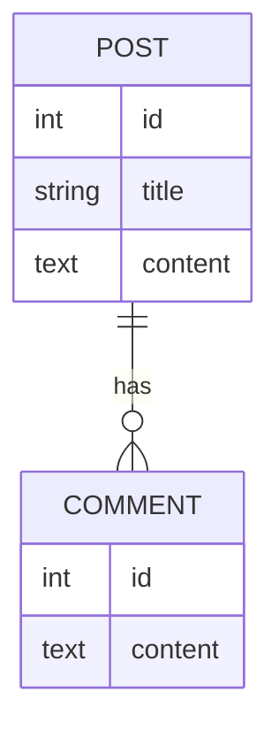

# 🤖 Advanced AI Prompting Techniques for Diagram Creation

This guide provides advanced techniques for crafting effective prompts when using AI assistants to generate and modify diagrams in VS Code 1.100+.

## 🧠 Understanding AI Diagram Generation

When using AI to generate diagrams, the quality of your prompts directly affects the quality of the results. Effective prompting is both an art and a science.

### How AI Processes Diagram Requests

AI systems like GitHub Copilot:

1. Interpret your natural language request
2. Convert it to a conceptual representation of the diagram
3. Generate the appropriate syntax (Mermaid, PlantUML, etc.)
4. Validate the syntax for correctness
5. Optimize the layout based on best practices

Understanding this process helps you craft prompts that work with these steps rather than against them.

## Core Prompting Techniques

### 1. The Stepwise Approach

Instead of requesting a complex diagram all at once, break it down:

**Less effective:**

```plaintext
Create a complete system architecture diagram showing our microservices, databases, message queues, and user-facing components with all connections and data flows.
```

**More effective:**

```plaintext
Let's create a system architecture diagram step by step:
1. First, show just the core microservices (user-service, product-service, order-service)
2. Now add the databases each service connects to
3. Next, add the message queue connections between services
4. Finally, add the API gateway and user-facing components
```

### 2. The Structural Framework

Provide a clear structural framework for your diagram:

**Less effective:**

```plaintext
Create a flowchart about user registration.
```

**More effective:**

```plaintext
Create a flowchart for user registration with this structure:
- Begin with a "Start" node
- Show input validation steps
- Include a decision diamond for "User exists?"
- Show the account creation process
- Include email verification steps
- End with either "Account active" or "Registration failed"
- Use LR orientation and standard symbols
```

### 3. The Example-Driven Approach

Show the AI a small example of what you want:

**Less effective:**

```plaintext
Create an entity relationship diagram for a blog system.
```

**More effective:**

```plaintext
Create an entity relationship diagram for a blog system. Here's a partial example of the syntax and style I want:



Please continue this diagram to include AUTHOR, CATEGORY, and TAG entities with appropriate relationships.
```

### 4. The Refinement Loop

Use an iterative process:

```plaintext
1. Initial request: "Create a basic sequence diagram for user authentication"
2. Refinement: "Great, now add error paths for invalid credentials"
3. Refinement: "Add a database component that stores user information"
4. Refinement: "Include timing notes for operations that take > 100ms"
```

### 5. The Constraint Specification

Explicitly state constraints and requirements:

```plaintext
Create a flowchart for order processing with these constraints:
- Maximum 15 nodes for readability
- Must include payment processing and inventory check steps
- Show all possible failure states
- Use standard Mermaid flowchart syntax
- Apply a blue-gray color scheme (#e8f4ff, #c4deff, #6c8eff)
```

## Advanced Techniques for Complex Diagrams

### 1. Multi-perspective Diagramming

Request different views of the same system:

```plaintext
I need three diagrams of our ecommerce system:
1. A context diagram showing the system and external entities
2. A container diagram showing the major components
3. A component diagram of the checkout process

Let's start with the context diagram...
```

### 2. Annotated Generation

Request annotations that explain the diagram:

```plaintext
Generate a class diagram for a banking system, and include comments in the diagram code that explain:
- Design pattern choices
- Key relationships
- Alternative approaches considered
```

### 3. Comparative Diagramming

Ask for diagrams that compare alternatives:

```plaintext
Create two sequence diagrams side by side:
1. Authentication using a traditional username/password flow
2. Authentication using OAuth2

Use the same actors and layout structure so the differences are clear.
```

### 4. Detail Layering

Start simple and progressively add detail:

```plaintext
1. First request: "Create a basic component diagram of the web application"
2. Add interfaces: "Now show the interfaces between components"
3. Add protocols: "Add the communication protocols used"
4. Add data: "Show key data structures passed between components"
```

### 5. Reverse Engineering

Ask the AI to generate diagrams from existing code:

```plaintext
Here's our authentication service code:

```typescript
[paste code here]
```

Generate a sequence diagram showing how the authenticate() method interacts with other components.
```

## Optimization Techniques for Different Diagram Types

### Flowcharts

```plaintext
When creating a flowchart:
- Start with the main happy path first
- Then add decision points one by one
- Use the diamond shape only for true decision points
- Keep labels concise (3-5 words max)
- Group related actions in subgraphs
- Align start and end points horizontally when using LR layout
```

### Sequence Diagrams

```plaintext
When creating a sequence diagram:
- List all participants at the beginning
- Order participants from left to right by their first interaction
- Use activation boxes to show processing time
- Include loop and alt fragments for complex logic
- Add notes for important details
- Consider the use of colors for different types of messages
```

### Class Diagrams

```plaintext
When creating a class diagram:
- Focus on important attributes and methods, not exhaustive lists
- Clearly indicate relationship types (inheritance, composition, etc.)
- Group related classes using namespaces
- Show multiplicity on relationships
- Only include methods relevant to understanding the design
```

### Entity-Relationship Diagrams

```plaintext
When creating an ER diagram:
- Include only key attributes in entities
- Clearly show cardinality constraints
- Use descriptive relationship labels
- Group entities by domain area
- Use colors to distinguish entity types (e.g., core vs. reference entities)
```

## Troubleshooting AI Diagram Generation

### When Diagrams Get Too Complex

```plaintext
I notice this diagram is getting very complex. Let's simplify by:
1. Focusing on just the core components
2. Abstracting detailed logic into separate diagrams
3. Using subgraphs to organize related items
4. Removing redundant connections
```

### When Syntax Is Incorrect

```plaintext
The diagram has a syntax error. Let's fix it by:
1. Checking each connection definition for proper format
2. Ensuring all node IDs are valid
3. Verifying that all brackets and parentheses are balanced
4. Adding proper direction indicators (LR, TD, etc.)
```

### When Layout Is Suboptimal

```plaintext
The diagram layout could be improved. Please:
1. Reduce crossing lines by reordering nodes
2. Group related components closer together
3. Use consistent spacing between elements
4. Apply a clearer visual hierarchy with properly sized components
```

## Creating and Using Prompt Templates

### Template Structure

```plaintext
[Diagram Type] Request Template:

Create a [type] diagram showing [subject] with these components:
- [Component 1]
- [Component 2]
- [Component 3]

Use [orientation/style] and follow these guidelines:
- [Guideline 1]
- [Guideline 2]

Style preferences:
- [Style preference 1]
- [Style preference 2]
```

### Example Templates

**Flowchart Template:**

```plaintext
Create a flowchart diagram showing [process] with these components:
- Starting point: [start]
- Main process steps: [list steps]
- Decision points: [list decisions]
- End points: [list possible endings]

Use LR orientation and follow these guidelines:
- One decision per diamond
- Clear yes/no paths
- Consistent arrow direction

Style preferences:
- Primary color: #4a6ebf
- Secondary color: #6c8eff
- Decision color: #ffd8b1
```

**Sequence Diagram Template:**

```plaintext
Create a sequence diagram showing [interaction] between these participants:
- [Participant 1]
- [Participant 2]
- [Participant 3]

Include these interactions:
- [Interaction 1]
- [Interaction 2]
- [Interaction 3]

Follow these guidelines:
- Show activation boxes for processing
- Include all response messages
- Add notes for complex logic
```

## Integrating with VS Code Custom Instructions

Combine these prompting techniques with VS Code 1.100+ custom instructions:

**Custom Instruction Example:**

```plaintext
When I ask for diagrams, please follow these guidelines:
1. Use Mermaid syntax by default unless I specify another format
2. Apply a consistent visual style across diagram types
3. Break complex diagrams into manageable sub-diagrams
4. Add comments in the code explaining key components
5. Always validate syntax before completing the response
6. Follow diagram best practices for the specific diagram type
```

## Using AI to Improve Existing Diagrams

### Enhancement Requests

```plaintext
Here's my current diagram:

```mermaid
[diagram code]
```

Please improve it by:
1. Optimizing the layout
2. Adding clear labels
3. Using consistent styling
4. Grouping related components
5. Adding appropriate colors
```

### Diagram Analysis

```plaintext
Please analyze this diagram:

```mermaid
[diagram code]
```

Provide feedback on:
1. Readability issues
2. Structural problems
3. Inconsistencies
4. Missing elements
5. Suggestions for improvement
```

## Advanced Applications

### Diagram-Driven Development

Use AI-generated diagrams as a starting point for implementation:

```plaintext
1. Generate a component diagram: "Create a component diagram for a URL shortening service"
2. Get implementation code: "Generate skeleton code for the components in this diagram"
3. Test strategy: "Create test cases for the interfaces in this diagram"
```

### Documentation Generation

Use diagrams as part of automated documentation:

```plaintext
Based on this architecture diagram:

```mermaid
[diagram code]
```

Generate a system overview document that:
1. Explains each component's purpose
2. Describes the data flows
3. Outlines security boundaries
4. Lists technologies used
5. Includes the diagram as a reference
```

### Interactive Diagram Exploration

Use AI to "walk through" a diagram:

```plaintext
Using this sequence diagram:

[diagram code]

Explain what happens when:
1. A user enters invalid credentials
2. The database connection fails
3. The third-party service is unavailable
```

## Best Practices for Diagram Prompting

1. **Be specific about syntax**: Always specify the diagram type and syntax you want
2. **Start simple**: Begin with core components and add complexity incrementally
3. **Provide context**: Explain the purpose and audience for the diagram
4. **Define standards**: Specify any styling or layout standards to follow
5. **Use iterative refinement**: Perfect diagrams through a series of improvements
6. **Include examples**: Show snippets of your preferred style
7. **Set constraints**: Define size, complexity, or focus limits
8. **Ask for explanations**: Request annotations or comments in the diagram code
9. **Validate diagrams**: Ask the AI to check for inconsistencies or errors
10. **Save effective prompts**: Create a library of prompts that work well for your needs

## Conclusion

Mastering AI prompting techniques for diagram creation allows you to leverage VS Code 1.100+ capabilities to their fullest. By combining structured requests, iterative refinement, and domain-specific knowledge, you can create high-quality diagrams that effectively communicate complex systems and processes.

Remember that the best results come from a collaborative process with the AI, where you provide clear guidance and iteratively refine the output until it meets your needs.

## Navigation

- [🏠 Back to Main Page](README.md)
- **Related Documents:**
  - [AI Diagram Generation Guide](ai_diagram_generation_guide.md)
  - [Custom Instructions Guide](custom_instructions_guide.md)
  - [Workflow Example](workflow_example.md)
