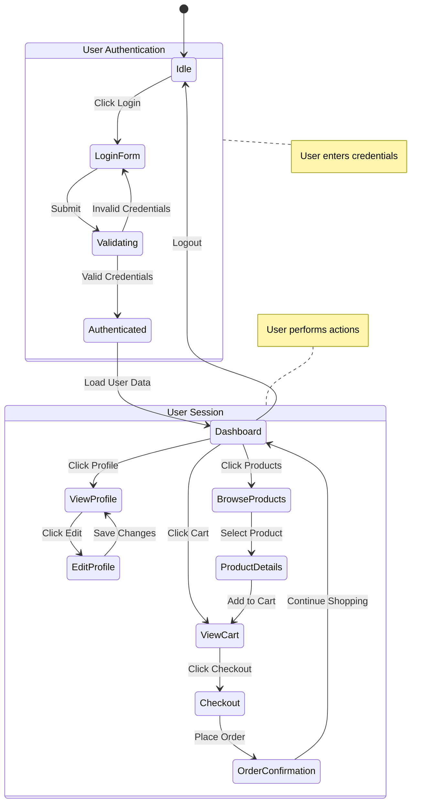
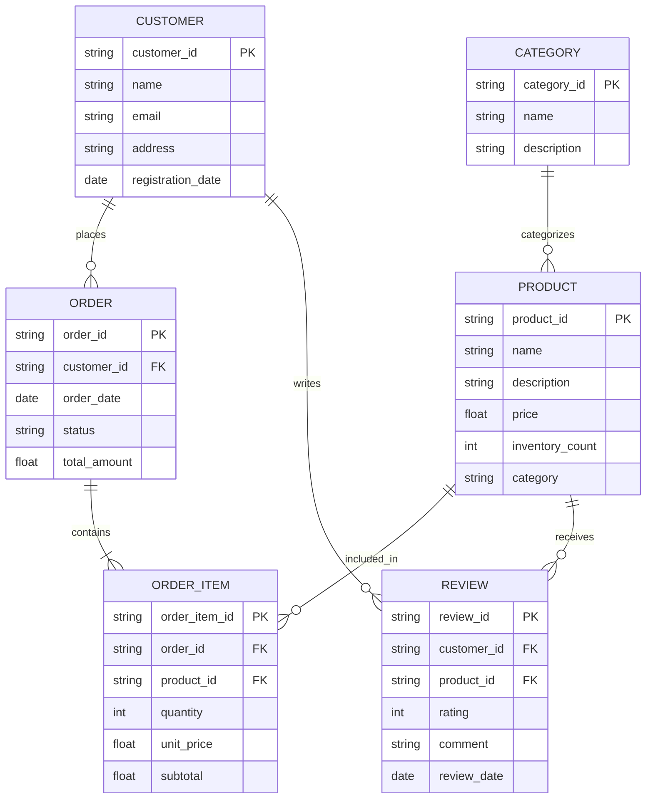
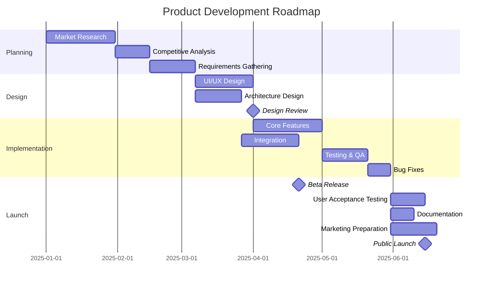
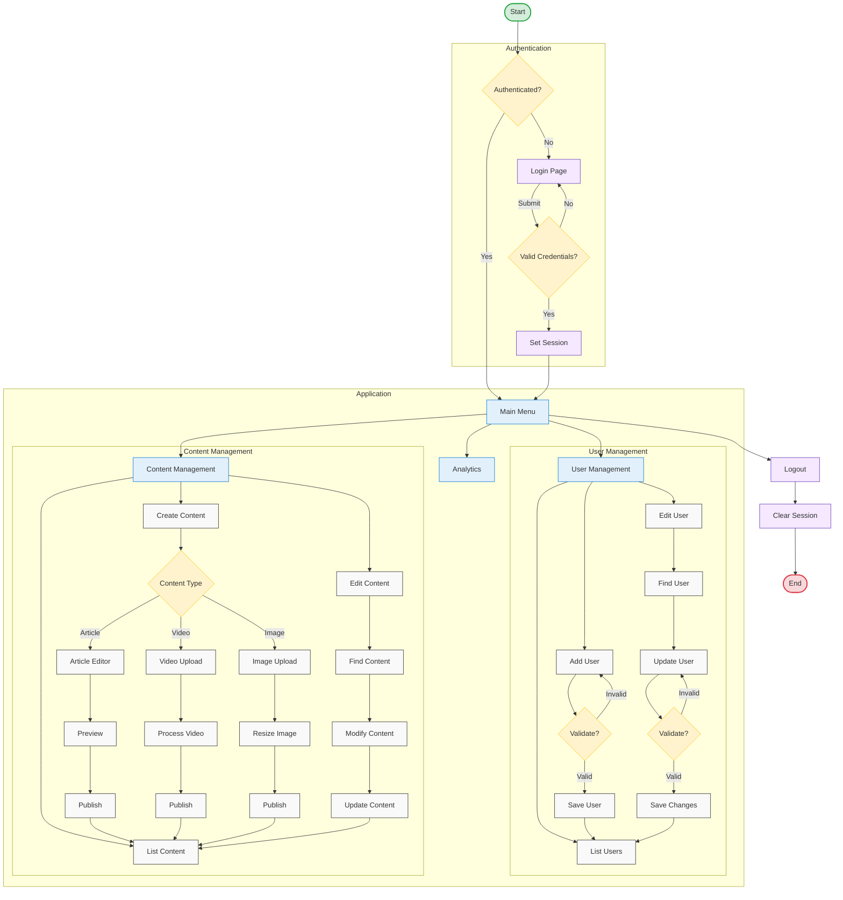
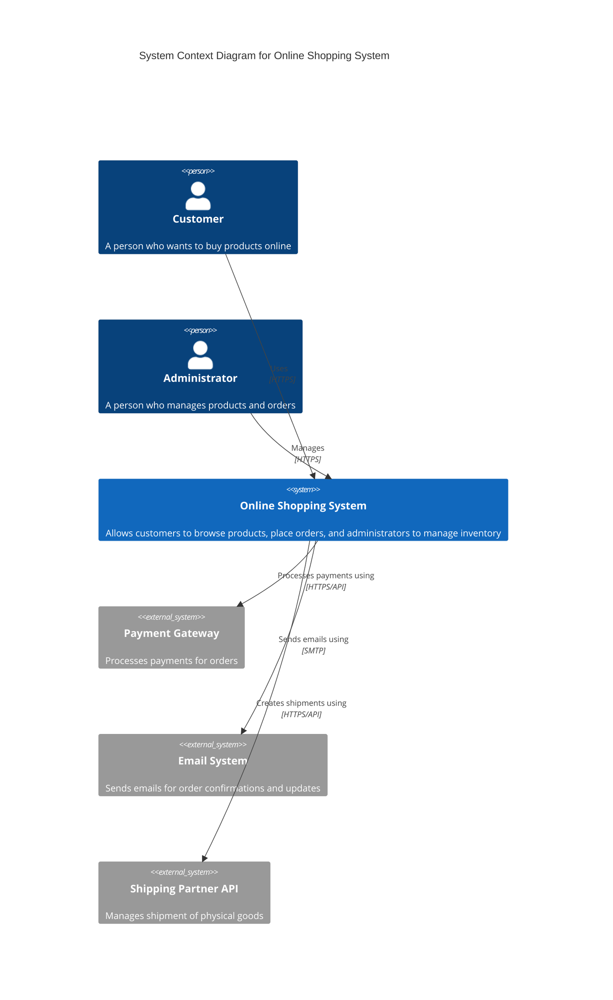
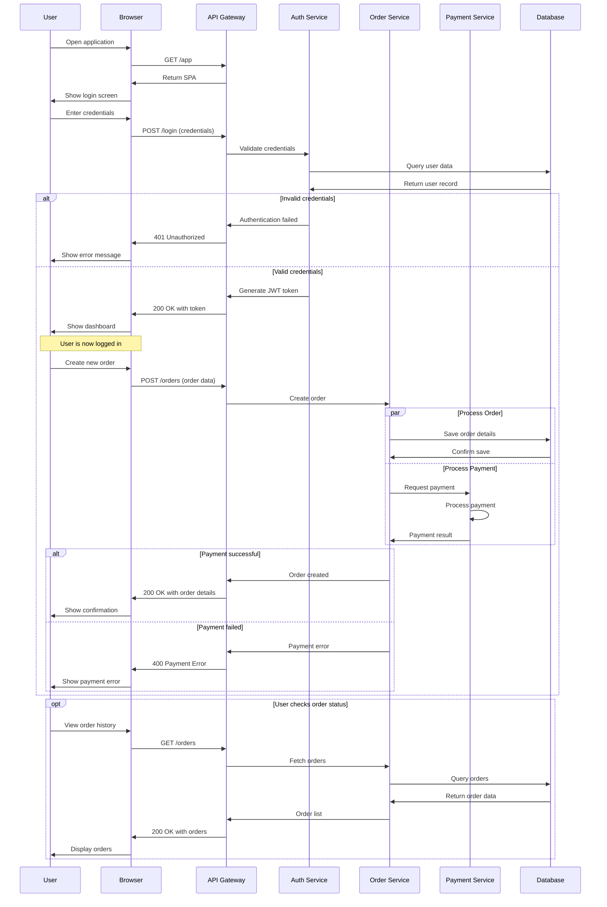

# Advanced Diagram Examples with Mermaid

This document showcases more advanced diagram techniques using Mermaid in VS Code. These examples demonstrate the power and flexibility of code-based diagramming.

## 1. State Diagram Example

State diagrams are useful for showing how a system or component changes states in response to events.

## 2. Entity-Relationship Diagram

ER diagrams help visualize database structure and relationships.

## 3. Gantt Chart for Project Planning

Gantt charts are perfect for visualizing project timelines and dependencies.

## 4. Complex Flowchart with Subgraphs and Styling

Flowcharts can be enhanced with subgraphs, custom styling, and icons.

## 5. C4 Architecture Diagram

C4 model diagrams help visualize software architecture at different levels of abstraction.

## 6. Advanced Sequence Diagram with Notes and Parallel Actions

Sequence diagrams can show complex interactions between system components.

## Combining Multiple Diagram Types

Complex documentation often requires combining different diagram types to fully explain a system. For example:

1. Start with a high-level architecture diagram showing system components
2. Add sequence diagrams to illustrate key interactions
3. Use state diagrams to show component lifecycle
4. Include entity-relationship diagrams to document data model

By using code-based diagrams in VS Code, you can keep all these diagrams in sync and evolve them alongside your code.

## Navigation

- [🏠 Back to Main Page](README.md)
- **Related Documents:**
  - [Class Diagram Example](class_diagram_example.md)
  - [System Architecture Example](system_architecture_example.md)
  - [Practical Mermaid Guide](practical_mermaid_guide.md)
