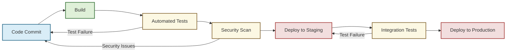
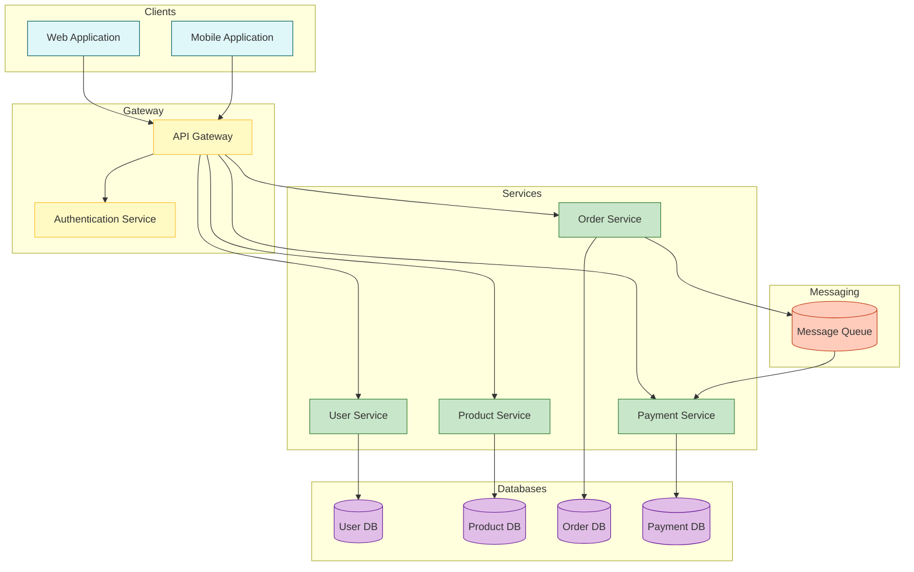

# Using AI to Generate Diagrams in VS Code

This guide demonstrates how to use AI tools like GitHub Copilot to generate diagrams directly in VS Code.

## Example: Using GitHub Copilot to Generate a Mermaid Diagram

GitHub Copilot can help you create diagrams by generating the diagram code based on your descriptions. Here's how to do it:

### Step 1: Describe what you want

Start by writing a comment that describes the diagram you want to create:

```
// Create a diagram showing the CI/CD pipeline with stages for code commit, 
// build, test, security scan, deploy to staging, and deploy to production
```

### Step 2: Let AI generate the code

After writing your description, start writing the opening of a Mermaid code block and let GitHub Copilot complete it:



### Step 3: Refine the generated diagram

You can then refine the generated diagram by:
- Adding more nodes or connections
- Changing the styling
- Adding annotations or notes
- Adjusting the flow direction

### Example: Using AI to Create a Complex Architecture Diagram

For more complex diagrams, you can provide a more detailed description:

```
// Create a microservices architecture diagram showing:
// 1. Frontend services (Web App, Mobile App)
// 2. API Gateway
// 3. Backend services (User Service, Product Service, Order Service, Payment Service)
// 4. Databases for each service
// 5. Message queue for communication between services
// 6. Authentication service
```

The AI might generate something like:



## Tips for Getting Better Diagrams from AI

1. **Be specific in your descriptions** - The more details you provide, the better the diagram will be.
2. **Use technical terminology** - AI tools understand technical terms and can generate more accurate diagrams.
3. **Request specific styling** - Mention colors, shapes, or styles you want to use.
4. **Use an iterative approach** - Start with a basic diagram and then ask for refinements.
5. **Learn from the generated code** - Study the code patterns to improve your own diagram-writing skills.

## Advanced Techniques

### Converting Natural Language to Different Diagram Types

AI can help you translate the same concept into different diagram formats:

1. **Ask for a flowchart** first to understand the basic flow
2. **Request a sequence diagram** to see the interactions between components
3. **Generate a class diagram** to visualize the structure of the system

### Using AI for Diagram Improvements

After generating a basic diagram, you can ask the AI to enhance it:

```
// Enhance the diagram by:
// 1. Adding color coding based on component types
// 2. Including error handling paths
// 3. Adding annotations for key decision points
```

This iterative approach allows you to gradually build more sophisticated and informative diagrams.
