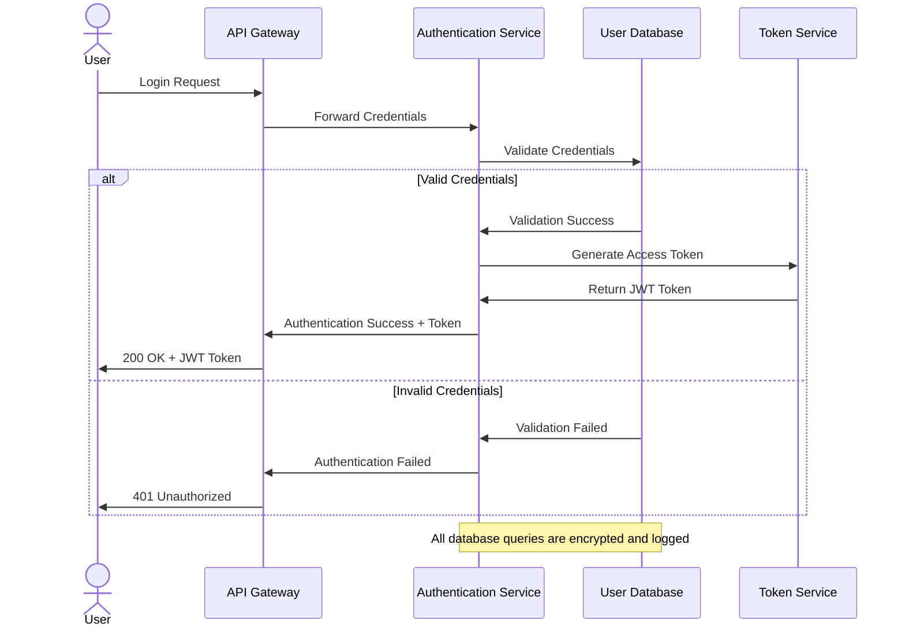

# Case Study: Modernizing Technical Documentation with VS Code and AI

## Overview

This case study examines how a mid-sized software development company transformed their technical documentation process using Visual Studio Code and AI-powered diagramming tools. The team was able to streamline their documentation workflow, improve consistency, and reduce the time spent creating and maintaining technical diagrams.

## Company Background

**TechSolutions Inc.** is a software development company with approximately 120 employees. They develop enterprise software solutions for the financial sector. Their technical documentation team consists of 5 full-time technical writers and numerous developers who contribute to documentation.

## Challenges

Before implementing the VS Code and AI-powered approach, the company faced several challenges:

1. **Inconsistent diagrams**: Different team members used different tools (Visio, Draw.io, Google Drawings, PowerPoint) resulting in inconsistent visual styles.

2. **Version control issues**: Diagrams were stored as binary files in different locations, making it difficult to track changes and maintain version history.

3. **Time-consuming updates**: When the software architecture changed, updating all the relevant diagrams was labor-intensive and often neglected.

4. **Collaboration barriers**: Reviewing and suggesting changes to diagrams required access to specific tools and wasn't integrated with the code review process.

5. **Knowledge silos**: Creating good technical diagrams required specialized skills that only a few team members possessed.

## Solution Implementation

### Phase 1: Tool Selection and Setup

The team evaluated various options and decided on implementing:

- **VS Code** as the primary editor for all documentation
- **Mermaid** for flowcharts and sequence diagrams
- **PlantUML** for UML diagrams
- **Draw.io Integration** for more complex custom diagrams
- **GitHub Copilot** for AI-assisted diagram generation

### Phase 2: Migration and Training

1. **Documentation Migration**: 
   - Converted existing binary diagram files to code-based formats
   - Established a consistent style guide for diagrams
   - Created templates for common diagram types

2. **Training Program**:
   - Conducted workshops on using VS Code for documentation
   - Created internal guides for different diagram types
   - Paired skilled diagram creators with novices for knowledge transfer

3. **AI Integration**:
   - Trained team members on writing effective prompts for AI diagram generation
   - Created a library of successful prompting examples
   - Developed workflows for AI-assisted diagram creation

## Results

After six months of implementation, the company saw significant improvements:

### Quantitative Benefits

- **70% reduction** in time spent creating new technical diagrams
- **85% reduction** in time spent updating existing diagrams
- **100% increase** in the number of team members who regularly contribute diagrams
- **40% increase** in the total number of diagrams included in documentation
- **Near-zero** version control conflicts related to diagram files

### Qualitative Benefits

- **Improved consistency**: All diagrams now follow a consistent style guide
- **Better integration with code**: Diagrams are stored alongside code in the same repositories
- **Enhanced collaboration**: Team members can easily review and suggest changes to diagrams
- **Knowledge democratization**: More team members can create and modify diagrams
- **Higher-quality documentation**: Documentation now contains more visual explanations

## Example Workflow

The team's new diagram creation workflow:

1. **Initiate**: Developer identifies need for a diagram in documentation

2. **Draft with AI**:
   ```
   Developer: "I need a sequence diagram showing how our 
   authentication service processes a login request."
   
   GitHub Copilot: [Generates initial Mermaid sequence diagram code]
   ```

3. **Refine**:
   - Developer reviews the AI-generated diagram
   - Makes necessary corrections to match the actual system
   - Adds styling according to the company's style guide

4. **Review**:
   - Diagram is committed to the repository with the associated documentation
   - Peers review the diagram as part of the normal code review process
   - Suggestions and changes are made through the same PR process

5. **Update**:
   - When the system changes, updating the diagram is as simple as updating the code
   - Changes are tracked in version control like any other code change

## Sample Diagram Before and After

### Before (PowerPoint Diagram)
*[A screenshot of a complex, inconsistently styled PowerPoint diagram with no clear structure]*

### After (Mermaid Code)



## Key Learnings

1. **Start with templates**: Having pre-designed templates for common diagrams accelerates adoption.

2. **Train on prompting**: Effective use of AI for diagram generation requires skill in writing good prompts.

3. **Establish style guides early**: Consistent styling makes diagrams more professional and easier to understand.

4. **Integrate with existing workflows**: Make diagram creation and maintenance part of the normal development process.

5. **Keep diagrams close to code**: Store diagrams with the code they document to ensure they stay in sync.

## Conclusion

By adopting VS Code and AI-powered diagramming tools, TechSolutions Inc. transformed their technical documentation process. The company was able to democratize diagram creation, ensure consistency, improve version control, and significantly reduce the time and effort required to create and maintain technical diagrams.

The integration of AI assistance through GitHub Copilot proved particularly valuable for team members who were less experienced in creating diagrams, allowing them to contribute effectively to the documentation process.

## Navigation

- [🏠 Back to Main Page](README.md)
- **Related Documents:**
  - [Implementation Guide](implementation_guide.md)
  - [Workflow Example](workflow_example.md)
  - [Industry Use Cases](industry_use_cases.md)
