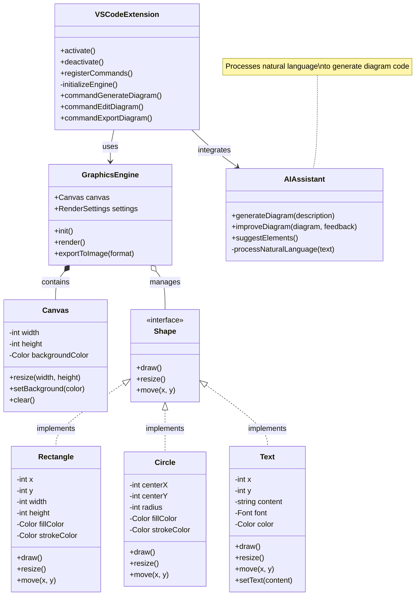

```mermaid
classDiagram
    class GraphicsEngine {
        +Canvas canvas
        +RenderSettings settings
        +init()
        +render()
        +exportToImage(format)
    }
    
    class Canvas {
        -int width
        -int height
        -Color backgroundColor
        +resize(width, height)
        +setBackground(color)
        +clear()
    }
    
    class Shape {
        <<interface>>
        +draw()
        +resize()
        +move(x, y)
    }
    
    class Rectangle {
        -int x
        -int y
        -int width
        -int height
        -Color fillColor
        -Color strokeColor
        +draw()
        +resize()
        +move(x, y)
    }
    
    class Circle {
        -int centerX
        -int centerY
        -int radius
        -Color fillColor
        -Color strokeColor
        +draw()
        +resize()
        +move(x, y)
    }
    
    class Text {
        -int x
        -int y
        -string content
        -Font font
        -Color color
        +draw()
        +resize()
        +move(x, y)
        +setText(content)
    }
    
    class AIAssistant {
        +generateDiagram(description)
        +improveDiagram(diagram, feedback)
        +suggestElements()
        -processNaturalLanguage(text)
    }
    
    class VSCodeExtension {
        +activate()
        +deactivate()
        +registerCommands()
        -initializeEngine()
    }
    
    GraphicsEngine *-- Canvas : contains
    Shape <|.. Rectangle : implements
    Shape <|.. Circle : implements
    Shape <|.. Text : implements
    GraphicsEngine o-- Shape : manages
    VSCodeExtension --> GraphicsEngine : uses
    VSCodeExtension --> AIAssistant : integrates
    
    class VSCodeExtension {
        +commandGenerateDiagram()
        +commandEditDiagram()
        +commandExportDiagram()
    }
    
    note for AIAssistant "Processes natural language\nto generate diagram code"
```
