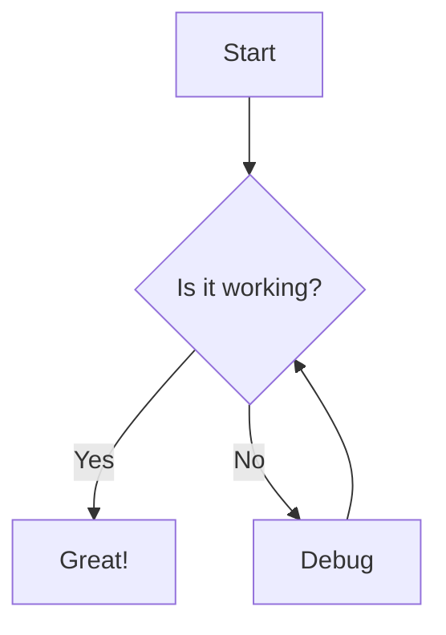
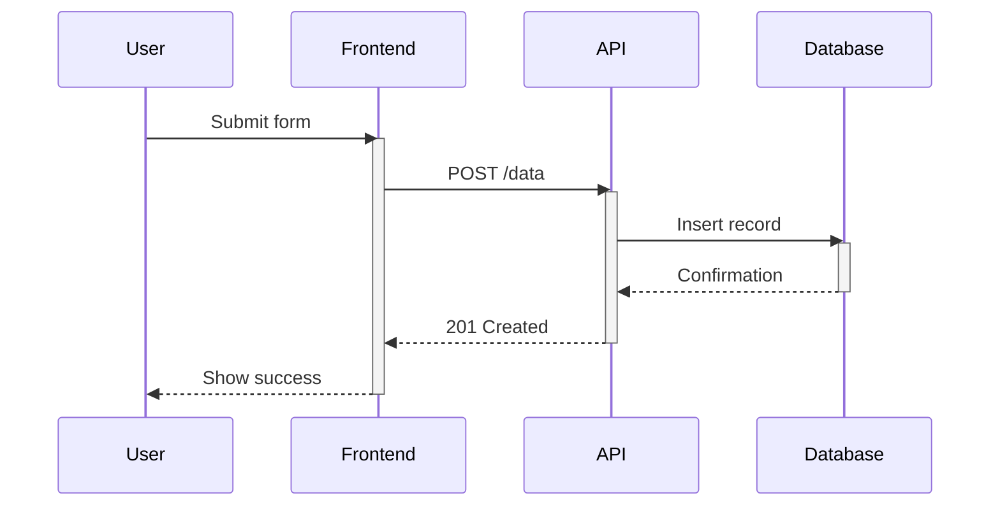
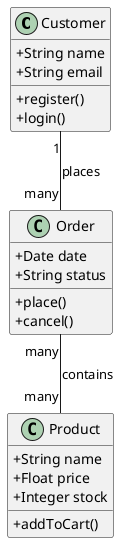
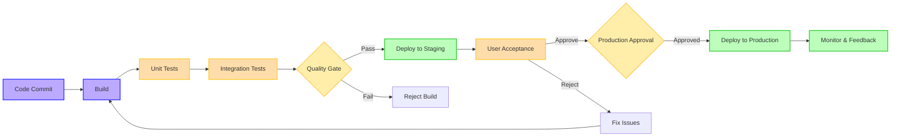
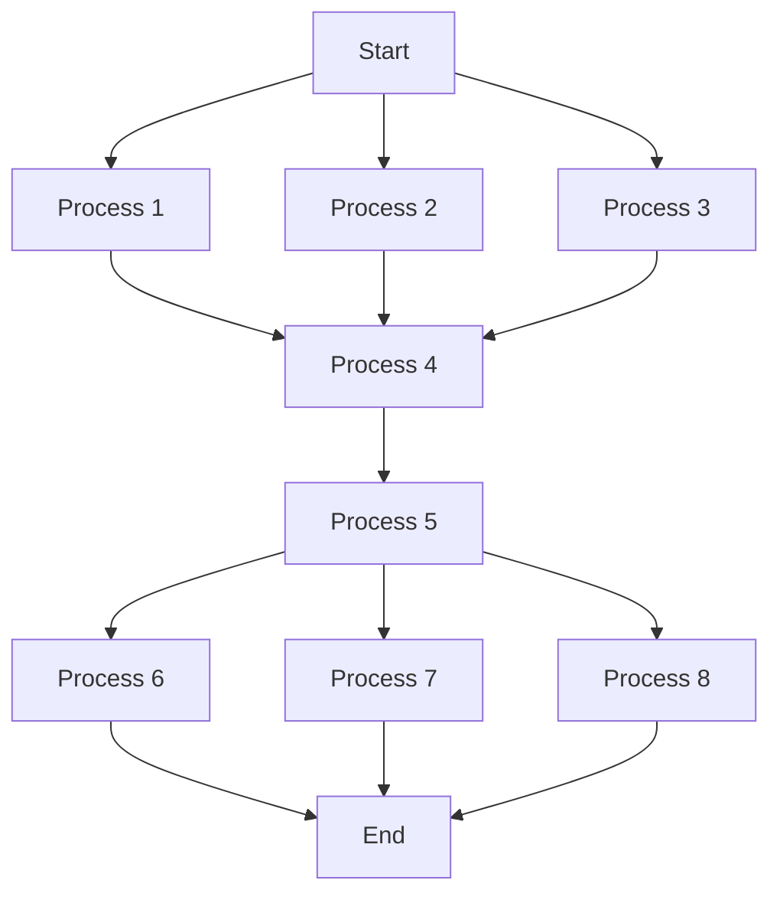
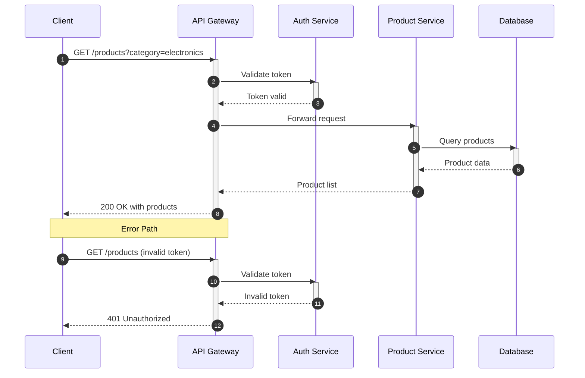
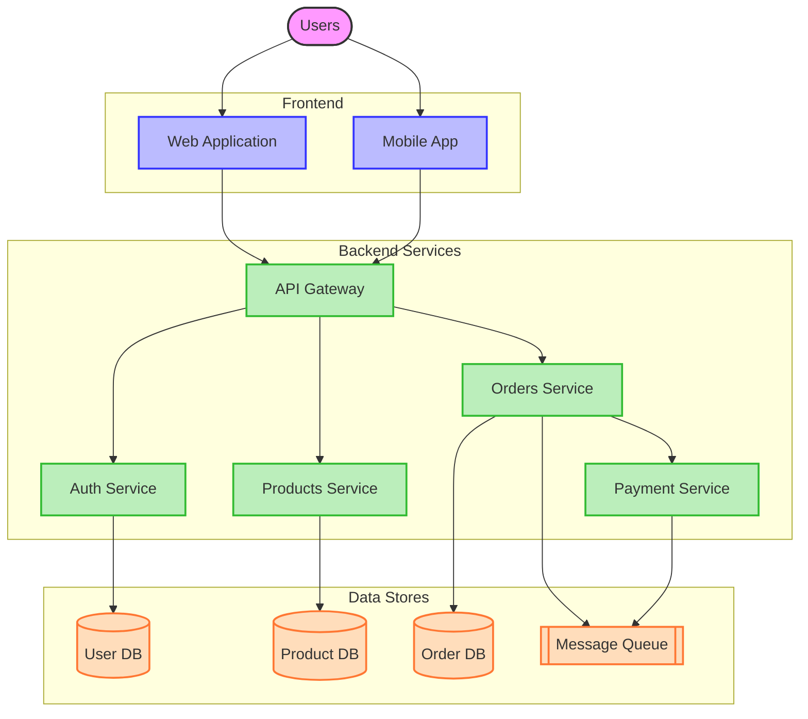
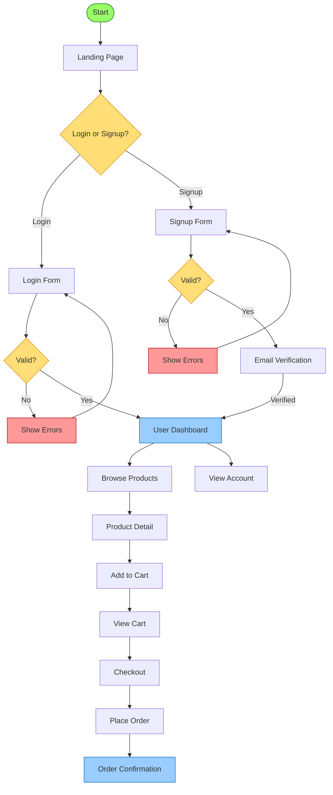
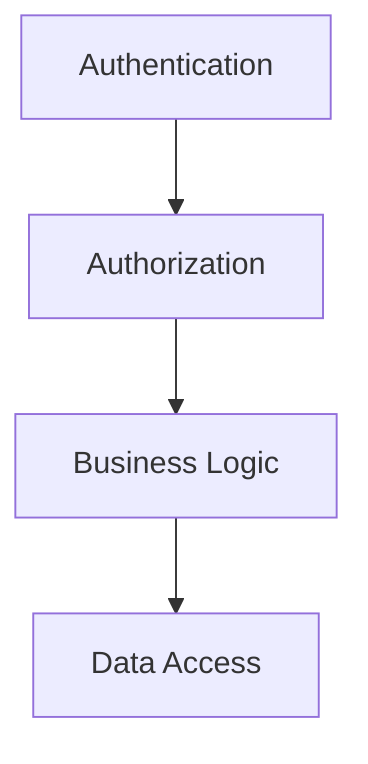

# 🎨 Creating World-Class Graphics with VS Code and AI

In today's digital landscape, compelling visualizations are essential for effective communication. Whether you're a software developer, data scientist, or technical writer, the ability to create clear, professional, and impactful graphics can set your work apart. This article explores how Visual Studio Code (VS Code), combined with AI-powered extensions, can transform your diagramming and visualization workflow.

> **"Visualization is the most powerful way to communicate complex ideas, and now AI makes it accessible to everyone."**

## 📊 At a Glance: The VS Code + AI Graphics Advantage

| Traditional Approach | VS Code + AI Approach | Key Benefits |
|---------------------|----------------------|--------------|
| Complex diagramming tools | Code-based visualizations | Version control, collaboration |
| Manual diagram creation | AI-assisted generation | 10x faster creation time |
| Separate application silos | Integrated development environment | Seamless workflow |
| Static diagrams | Dynamic, code-linked diagrams | Always up-to-date representations |
| High learning curve | Natural language interfaces | Accessibility to non-designers |

## 💪 The Power of Visual Studio Code for Graphics Creation

Visual Studio Code has evolved far beyond a mere code editor. With its extensive marketplace of extensions, VS Code has become a versatile environment for creating various types of graphics:

- 🔄 **Diagrams and Flowcharts**: System architectures, process flows, and decision trees
- 📊 **Data Visualizations**: Charts, graphs, and interactive dashboards
- 📝 **Technical Documentation**: Sequence diagrams, entity-relationship diagrams, and state machines
- 🧠 **Concept Maps**: Mind maps, knowledge graphs, and hierarchical structures

### Why VS Code for Graphics?

1. **Integrated Environment**: Create diagrams while writing code and documentation
2. **Version Control**: Track diagram changes alongside code commits
3. **Markdown Integration**: Embed visualizations directly in documentation
4. **Extensibility**: Customize your graphics creation workflow with extensions
5. **AI Assistance**: Leverage AI tools to generate and refine diagrams

## 🧩 Key VS Code Extensions for Graphics Creation

### 1. Mermaid Support

[Mermaid](https://mermaid.js.org/) has revolutionized technical diagramming by allowing you to create diagrams using markdown-like syntax. The VS Code Mermaid extension provides syntax highlighting, live preview, and export options.

**Installation:**
```bash
ext install bierner.markdown-mermaid
```

**Simple Flowchart Example:**



**Advanced Sequence Diagram Example:**



### 2. Draw.io Integration

The Draw.io Integration extension brings the full power of draw.io (diagrams.net) directly into VS Code. This allows you to create professional diagrams without leaving your development environment.

**Installation:**
```bash
ext install hediet.vscode-drawio
```

**Key Features:**
- Rich graphical editor with drag-and-drop interface
- Extensive shape libraries for all diagram types
- SVG editing capabilities for pixel-perfect diagrams
- Integration with version control systems
- Theme-aware editing that matches your VS Code theme

### 3. PlantUML

PlantUML enables you to quickly create UML diagrams from text descriptions, making it easy to maintain diagrams alongside your code.

**Installation:**
```bash
ext install jebbs.plantuml
```

**Example Class Diagram:**



### 4. Markdown Preview Enhanced

This extension enhances the built-in markdown preview with advanced features, including rendering of mathematical expressions, diagrams, and charts.

**Installation:**
```bash
ext install shd101wyy.markdown-preview-enhanced
```

**Features:**
- Preview Mermaid, PlantUML, and other diagramming formats
- Support for LaTeX mathematical expressions
- Code chunk execution for dynamic content generation
- Export to PDF, HTML, and other formats

## 🤖 AI-Powered Graphics Creation

The real game-changer for creating world-class graphics in VS Code is the integration of AI assistants and tools:

### 1. GitHub Copilot for Diagrams

GitHub Copilot can now help generate diagram code based on natural language descriptions. As of 2025, its capabilities for diagram generation have significantly improved.

**Effective Prompting Techniques:**

| Goal | Example Prompt |
|------|---------------|
| Basic flowchart | "Create a mermaid flowchart showing user registration process" |
| Sequence diagram | "Generate a sequence diagram for OAuth 2.0 authentication flow with user, client app, and auth server" |
| Class diagram | "Write a class diagram for an e-commerce system with User, Product, Order, and Payment classes" |
| Architecture diagram | "Create a system architecture diagram for a microservices-based e-commerce platform" |

**Example Interaction:**

```
User: Create a mermaid flowchart showing the CI/CD pipeline with build, test, deploy stages and approval gates

AI:

```

### 2. AI-Enhanced Visualization Libraries

Extensions that integrate with AI-powered visualization libraries can help:

- **Recommend optimal chart types** based on your data
- **Generate color schemes** that are both aesthetically pleasing and accessible
- **Suggest improvements** to enhance clarity and impact

**Example Tools:**
- **Observable Plot**: AI-assisted data visualization
- **D3.js with AI helpers**: Advanced interactive visualizations
- **Vega-Lite with smart defaults**: Declarative visualization with AI assistance

### 3. Intelligent Diagram Refinement

AI tools can analyze your diagrams and suggest improvements:

- **Identify layout issues** that affect readability
- **Highlight inconsistencies** in notation or terminology
- **Suggest simplifications** for complex diagrams

**Example:**

Before AI refinement:


After AI refinement:
```mermaid
graph TD
    A[Start] --> B[Initial Processes]
    B --> E[Process 4]
    E --> F[Process 5]
    F --> J[End]
    
    subgraph "Initial Processes"
        B1[Process 1]
        B2[Process 2]
        B3[Process 3]
    end
    
    subgraph "Final Processes"
        F1[Process 6]
        F2[Process 7]
        F3[Process 8]
    end
    
    A --> B1
    A --> B2
    A --> B3
    B1 --> E
    B2 --> E
    B3 --> E
    F --> F1
    F --> F2
    F --> F3
    F1 --> J
    F2 --> J
    F3 --> J
    
    classDef start fill:#6fd66f,stroke:#009900;
    classDef process fill:#99ccff,stroke:#3366ff;
    classDef end fill:#ffcc99,stroke:#ff9933;
    
    class A start;
    class B1,B2,B3,E,F,F1,F2,F3 process;
    class J end;
```

## 🛠️ Practical Workflow: Creating Graphics with VS Code and AI

### Step 1: Define Your Communication Goal

Before creating any graphic, clearly define:
- The key message you want to convey
- Your target audience and their level of technical understanding
- The context in which the graphic will be used

**Communication Planning Table:**

| Aspect | Questions to Answer |
|--------|---------------------|
| Purpose | What decision or action should this graphic inform? |
| Audience | Who will view this? What's their technical knowledge? |
| Key Message | What's the single most important takeaway? |
| Context | Where will this be viewed? (Presentation, documentation, etc.) |
| Constraints | Time limits? Space constraints? Technical limitations? |

### Step 2: Choose the Right Visualization Type

Based on your goal, select the appropriate type of visualization:

| Information Type | Recommended Visualization | VS Code Tool |
|------------------|--------------------------|-------------|
| Process explanation | Flowcharts or sequence diagrams | Mermaid |
| System architecture | Component diagrams or C4 models | Draw.io or Mermaid |
| Data relationships | Entity-relationship diagrams | Mermaid or PlantUML |
| Statistical information | Charts and graphs | Markdown Preview Enhanced |
| Code structure | Class diagrams | PlantUML |
| State transitions | State diagrams | Mermaid or PlantUML |
| Project timelines | Gantt charts | Mermaid |
| Conceptual relationships | Mind maps | Draw.io or Markmap |

### Step 3: Leverage AI for Initial Generation

Use GitHub Copilot or other AI assistants to:
- Generate a starting point based on your description
- Provide examples similar to what you're trying to create
- Suggest best practices for your specific diagram type

**AI Prompting Framework:**

1. **Context**: "I need a [diagram type] for [specific purpose]"
2. **Elements**: "It should include [list key components]"
3. **Relationships**: "Show how [describe connections between elements]"
4. **Style**: "Use [color scheme/style] with emphasis on [key elements]"
5. **Refinement**: "Modify the diagram to [specific changes]"

**Example AI Conversation:**

```
You: I need a sequence diagram for a payment processing flow in an e-commerce application.

AI: I'll help you create that. What components should be included in the sequence?

You: Include the user, shopping cart, payment service, payment gateway, and order management system.

AI: [Generates initial diagram]

You: That looks good, but we need to add error handling for payment failure.

AI: [Updates diagram with error paths]

You: Perfect! Now add some styling to highlight the critical payment processing step.

AI: [Updates diagram with styling]
```

### Step 4: Refine with Specialized Extensions

Utilize the appropriate extension for your chosen visualization:
- Mermaid for simple, markdown-integrated diagrams
- Draw.io for complex, highly customized diagrams
- PlantUML for standardized UML diagrams
- D3.js or Chart.js for interactive data visualizations

**Extension Selection Guide:**

| Scenario | Best Extension | Why |
|----------|---------------|-----|
| Documentation | Mermaid | Directly embeds in Markdown |
| Complex layouts | Draw.io | Fine control over positioning |
| Team standardization | PlantUML | Text-based format with strict conventions |
| Live data | Observable | Dynamic data binding capabilities |

### Step 5: Apply Design Best Practices

Even with AI assistance, keep these principles in mind:

- **Simplicity**: Include only essential elements
- **Hierarchy**: Make important information stand out
- **Consistency**: Use uniform styles, colors, and terminology
- **Accessibility**: Ensure your graphics are perceivable by all users

**VSCODE Principle:**
- **Visual Clarity**: Use whitespace effectively; avoid cluttered layouts
- **Semantic Grouping**: Group related elements visually
- **Color Purposefully**: Use color to convey meaning, not just for decoration
- **Optimize Typography**: Choose readable fonts and appropriate text sizes
- **Direction & Flow**: Provide clear reading paths through the diagram
- **Emphasis Deliberately**: Highlight the most important elements

## 💼 Case Studies: Transforming Technical Communication

### Case Study 1: API Documentation Overhaul

**Challenge:** A development team struggled to maintain accurate API documentation as their services evolved.

**Solution:** 
1. Created sequence diagrams using Mermaid that were directly embedded in Markdown documentation
2. Used AI to generate initial diagrams from OpenAPI specifications
3. Implemented Git-based workflow for reviewing diagram changes

**Results:**
- 70% reduction in documentation errors
- 60% less time spent on documentation updates
- Improved onboarding experience for new developers

**Example Implementation:**



### Case Study 2: System Architecture Evolution

**Challenge:** A growing startup needed to document their evolving microservices architecture in a way that technical and non-technical stakeholders could understand.

**Solution:**
1. Created a multi-level C4 model using Draw.io in VS Code
2. Used AI to suggest architectural improvements and identify potential issues
3. Maintained different views for different audiences (technical, business, operations)

**Results:**
- Better alignment between business and technical teams
- Faster onboarding for new engineers
- More informed architectural decisions

**Example Level 1 Diagram:**



### Case Study 3: Collaborative UX Design

**Challenge:** A product team struggled to align on user flows and needed a way to iterate quickly on UX concepts.

**Solution:**
1. Used Mermaid to create user flow diagrams directly in the product requirements documents
2. Implemented AI-assisted generation of flow alternatives
3. Created a Git-based review process for design iterations

**Results:**
- 40% faster design iteration cycles
- Better alignment between designers and developers
- More consistent user experience across the application

**Example User Flow:**



## 🛠️ Advanced Techniques for VS Code Graphics Masters

### 1. Dynamic Diagrams from Code

Create diagrams that automatically update when your code changes:

```javascript
// Install required tools
// npm install -g @mermaid-js/mermaid-cli
// npm install -g dependency-cruiser

// Generate class diagram from TypeScript
function generateClassDiagram() {
  const files = glob.sync('src/**/*.ts');
  const analyzer = new CodeAnalyzer(files);
  return analyzer.generateMermaidClassDiagram();
}

// Write to markdown file
fs.writeFileSync(
  'docs/architecture.md', 
  '```mermaid\n' + generateClassDiagram() + '\n```'
);
```

### 2. Interactive Diagrams

Create clickable diagrams that can navigate to code:



### 3. Custom Styling Systems

Create consistent visual languages across your documentation:

```javascript
// Define a custom theme for your organization
const companyTheme = {
  primaryColor: '#0078D4',
  secondaryColor: '#50E6FF',
  accentColor: '#FFD700',
  errorColor: '#D83B01',
  successColor: '#107C10',
  fontPrimary: 'Segoe UI',
  lineStyle: 'rounded'
};

// Apply to Mermaid config
mermaid.initialize({
  theme: 'base',
  themeVariables: {
    primaryColor: companyTheme.primaryColor,
    primaryTextColor: '#fff',
    primaryBorderColor: companyTheme.primaryColor,
    lineColor: companyTheme.primaryColor,
    secondaryColor: companyTheme.secondaryColor,
    tertiaryColor: companyTheme.accentColor
  }
});
```

### 4. Collaborative Diagramming

Implement workflows for team collaboration on diagrams:

1. **Store diagrams as code** in version control
2. **Implement review processes** for diagram changes
3. **Automate diagram generation** in CI/CD pipelines
4. **Use centralized styling** for consistency across teams

## 🏆 Best Practices for World-Class Graphics

### 1. Start with the Right Questions

Before creating any graphic, ask:
- What decision needs to be made with this information?
- What is the most important relationship to highlight?
- What level of detail is appropriate for my audience?
- How will this graphic be consumed? (Print, screen, presentation)

### 2. Use Progressive Disclosure

Layer information to avoid overwhelming viewers:
- **Level 1**: High-level overview (C4 context diagram)
- **Level 2**: Major components and their relationships
- **Level 3**: Detailed implementation with all components
- **Level 4**: Specific focus areas with maximum detail

### 3. Create Visual Hierarchies

Guide the viewer's attention:
- Use size to indicate importance
- Apply color strategically to highlight key elements
- Group related elements visually
- Use whitespace to separate logical sections

### 4. Choose the Right Level of Abstraction

Match the abstraction level to your audience:
- **Business stakeholders**: High-level concepts, outcomes, and value
- **Product managers**: Features, user flows, and integrations
- **System architects**: Components, interfaces, and data flows
- **Developers**: Classes, methods, and implementation details

### 5. Maintain Living Documentation

Keep your diagrams current:
- Link diagrams to code when possible
- Schedule regular reviews of documentation
- Automate updates when feasible
- Include diagram updates in definition of done

## 🔮 The Future of VS Code Graphics and AI

The integration of AI with VS Code's graphics capabilities is rapidly evolving:

- **Natural language diagram generation**: Creating complex diagrams with conversational interfaces
- **Real-time collaborative diagramming**: Multiple users editing diagrams simultaneously
- **Code-aware diagrams**: Visualizations that understand and represent code semantics
- **Automated diagram optimization**: AI that improves layout and readability
- **Cross-diagram consistency enforcement**: Ensuring visual language remains consistent
- **3D and immersive visualizations**: Moving beyond 2D representations for complex systems

## 🚀 Getting Started Today

1. Install VS Code if you haven't already
2. Add the extensions mentioned in this article
3. Begin with simple diagrams using Mermaid syntax
4. Gradually incorporate AI assistance into your workflow
5. Join communities like VS Code's Discord or GitHub discussions to share techniques and learn from others

The tools and techniques covered in this article aren't just about creating prettier diagrams—they're about fundamentally improving how we communicate technical concepts in an increasingly complex digital world.

## 📚 Resources and Further Learning

| Resource Type | Link | Description |
|---------------|------|-------------|
| Documentation | [Mermaid JS](https://mermaid.js.org/) | Official Mermaid documentation |
| Documentation | [Draw.io](https://www.diagrams.net/doc/) | Draw.io documentation |
| Documentation | [PlantUML](https://plantuml.com/) | PlantUML documentation |
| Tool | [Mermaid Live Editor](https://mermaid.live/) | Online Mermaid editor |
| Community | [VS Code Discord](https://discord.gg/vscode) | Official VS Code Discord |
| Book | [The Visual Display of Quantitative Information](https://www.edwardtufte.com/tufte/books_vdqi) | Classic book on information visualization |
| Examples | [Awesome Mermaid](https://github.com/mermaid-js/awesome-mermaid) | Collection of Mermaid examples |

## Navigation

- [🏠 Back to Main Page](README.md)
- **Related Documents:**
  - [Implementation Guide](implementation_guide.md)
  - [VS Code Setup Guide](vscode_setup_guide.md)
  - [Diagram Best Practices](diagram_best_practices.md)
  - [Advanced Diagram Examples](advanced_diagram_examples.md)
  - [AI Diagram Generation Guide](ai_diagram_generation_guide.md)
