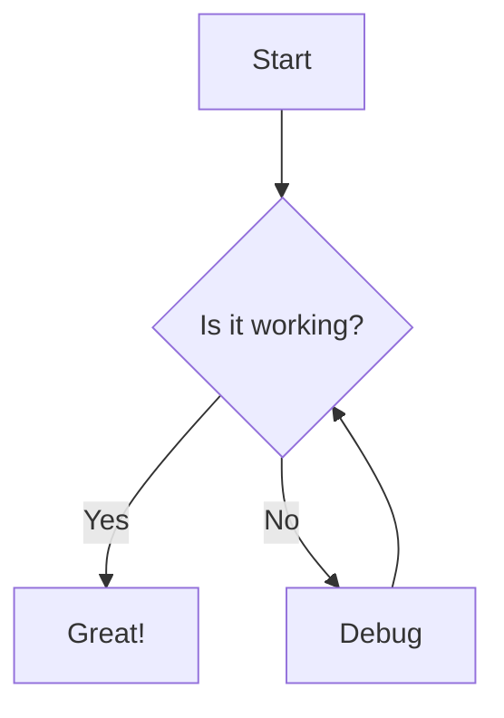

# 🎨 Creating World-Class Graphics with VS Code and AI

In today's digital landscape, compelling visualizations are essential for effective communication. Whether you're a software developer, data scientist, or technical writer, the ability to create clear, professional, and impactful graphics can set your work apart. This article explores how Visual Studio Code (VS Code), combined with AI-powered extensions, can transform your diagramming and visualization workflow.

## 💪 The Power of Visual Studio Code for Graphics Creation

Visual Studio Code has evolved far beyond a mere code editor. With its extensive marketplace of extensions, VS Code has become a versatile environment for creating various types of graphics:

- 🔄 **Diagrams and Flowcharts**: System architectures, process flows, and decision trees
- 📊 **Data Visualizations**: Charts, graphs, and interactive dashboards
- 📝 **Technical Documentation**: Sequence diagrams, entity-relationship diagrams, and state machines
- **Concept Maps**: Mind maps, knowledge graphs, and hierarchical structures

## Key VS Code Extensions for Graphics Creation

### 1. Mermaid Support

[Mermaid](https://mermaid.js.org/) has revolutionized technical diagramming by allowing you to create diagrams using markdown-like syntax. The VS Code Mermaid extension provides syntax highlighting, live preview, and export options.

### 2. Draw.io Integration

The Draw.io Integration extension brings the full power of draw.io (diagrams.net) directly into VS Code. This allows you to create professional diagrams without leaving your development environment.

### 3. PlantUML

PlantUML enables you to quickly create UML diagrams from text descriptions, making it easy to maintain diagrams alongside your code.

### 4. Markdown Preview Enhanced

This extension enhances the built-in markdown preview with advanced features, including rendering of mathematical expressions, diagrams, and charts.

## AI-Powered Graphics Creation

The real game-changer for creating world-class graphics in VS Code is the integration of AI assistants and tools:

### 1. GitHub Copilot for Diagrams

GitHub Copilot can now help generate diagram code based on natural language descriptions:

- **Describe what you need**: "Create a sequence diagram showing user authentication flow"
- **Refine with conversation**: "Add error handling steps"
- **Get diagram code**: Copilot generates the appropriate Mermaid or PlantUML syntax

### 2. AI-Enhanced Visualization Libraries

Extensions that integrate with AI-powered visualization libraries can help:

- **Recommend optimal chart types** based on your data
- **Generate color schemes** that are both aesthetically pleasing and accessible
- **Suggest improvements** to enhance clarity and impact

### 3. Intelligent Diagram Refinement

AI tools can analyze your diagrams and suggest improvements:

- **Identify layout issues** that affect readability
- **Highlight inconsistencies** in notation or terminology
- **Suggest simplifications** for complex diagrams

## Practical Workflow: Creating Graphics with VS Code and AI

### Step 1: Define Your Communication Goal

Before creating any graphic, clearly define:
- The key message you want to convey
- Your target audience and their level of technical understanding
- The context in which the graphic will be used

### Step 2: Choose the Right Visualization Type

Based on your goal, select the appropriate type of visualization:
- **Process explanation**: Flowcharts or sequence diagrams
- **System architecture**: Component diagrams or C4 models
- **Data relationships**: Entity-relationship diagrams
- **Statistical information**: Charts and graphs

### Step 3: Leverage AI for Initial Generation

Use GitHub Copilot or other AI assistants to:
- Generate a starting point based on your description
- Provide examples similar to what you're trying to create
- Suggest best practices for your specific diagram type

### Step 4: Refine with Specialized Extensions

Utilize the appropriate extension for your chosen visualization:
- Mermaid for simple, markdown-integrated diagrams
- Draw.io for complex, highly customized diagrams
- PlantUML for standardized UML diagrams
- D3.js or Chart.js for interactive data visualizations

### Step 5: Apply Design Best Practices

Even with AI assistance, keep these principles in mind:
- **Simplicity**: Include only essential elements
- **Hierarchy**: Make important information stand out
- **Consistency**: Use uniform styles, colors, and terminology
- **Accessibility**: Ensure your graphics are perceivable by all users

## Case Study: Transforming a Complex System Architecture

Let's walk through the process of creating a system architecture diagram using VS Code and AI assistance:

1. **Initial Description**: "We need a diagram showing our microservices architecture with authentication, user service, product catalog, and order processing services, including databases and message queues."

2. **AI-Generated Starter**: GitHub Copilot generates initial Mermaid code for the architecture.

3. **Interactive Refinement**: Through conversation with the AI, we add details about service interactions and deployment environments.

4. **Extension-Based Editing**: Using the Mermaid preview extension, we visualize and refine the diagram.

5. **Final Optimization**: Apply consistent styling, add appropriate annotations, and ensure the diagram communicates effectively.

## Conclusion: The Future of Graphics Creation

The combination of VS Code's extensibility and modern AI capabilities represents a paradigm shift in how we create technical graphics. This approach offers several key benefits:

- **Reduced cognitive load**: Focus on content rather than diagramming syntax
- **Version control integration**: Track changes to diagrams alongside code
- **Consistency across teams**: Establish and maintain visual standards
- **Rapid iteration**: Quickly adapt visualizations based on feedback

By embracing this integrated approach to graphics creation, technical professionals can communicate more effectively, document more clearly, and ultimately create more value for their organizations and users.

## Getting Started Today

1. Install VS Code if you haven't already
2. Add the extensions mentioned in this article
3. Begin with simple diagrams using Mermaid syntax
4. Gradually incorporate AI assistance into your workflow
5. Join communities like VS Code's Discord or GitHub discussions to share techniques and learn from others

The tools and techniques covered in this article aren't just about creating prettier diagrams—they're about fundamentally improving how we communicate technical concepts in an increasingly complex digital world.

## Navigation

- [🏠 Back to Main Page](README.md)
- **Related Documents:**
  - [Implementation Guide](implementation_guide.md)
  - [VS Code Setup Guide](vscode_setup_guide.md)
  - [Diagram Best Practices](diagram_best_practices.md)
