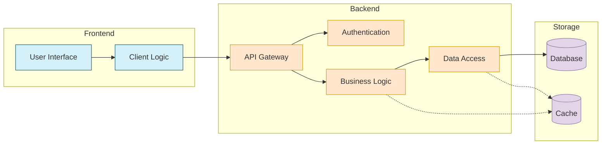

# 💡 Best Practices for Creating Effective Diagrams

Creating clear, effective diagrams is both an art and a science. This guide covers best practices to ensure your diagrams effectively communicate their intended message.

## 1. 👥 Know Your Audience

### Technical Audience
- 🔍 Include more technical details
- 📏 Use standard notations (UML, BPMN, etc.) where appropriate
- 🔤 Can include industry-specific acronyms and terminology

### Non-Technical Audience
- Focus on high-level concepts
- Avoid technical jargon
- Include more explanatory text
- Use familiar metaphors and analogies

### Mixed Audience
- Layer information (core concepts visible, details available but not overwhelming)
- Include a legend explaining symbols and notations
- Provide both technical and business perspectives

## 2. Choose the Right Diagram Type

| Information Type | Recommended Diagram Types |
|------------------|---------------------------|
| Process flow | Flowcharts, Activity diagrams, BPMN diagrams |
| System interactions | Sequence diagrams, Communication diagrams |
| System structure | Component diagrams, Deployment diagrams |
| Data relationships | Entity-relationship diagrams, Class diagrams |
| Hierarchical data | Tree diagrams, Mindmaps |
| Statistical data | Bar charts, Line graphs, Pie charts |
| Conceptual relationships | Concept maps, Mind maps |
| Decision logic | Decision trees, State diagrams |

## 3. Follow Visual Design Principles

### Hierarchy
- Most important elements should be most prominent
- Use size, color, and positioning to establish hierarchy
- Group related elements visually

### Simplicity
- Include only necessary elements
- Break complex diagrams into multiple simpler diagrams
- Use consistent, simple shapes

### Consistency
- Maintain consistent styling throughout (colors, shapes, fonts)
- Use the same symbol for the same concept across all diagrams
- Follow established conventions for your diagram type

### Flow
- Provide clear directional flow (typically left-to-right or top-to-bottom)
- Avoid crossing lines where possible
- Use appropriate arrows to indicate direction and relationship type

### Accessibility
- Ensure sufficient color contrast
- Don't rely solely on color to convey information
- Use patterns or labels in addition to colors
- Consider colorblind-friendly palettes

## 4. Optimize Content

### Text
- Use brief, clear labels
- Keep text horizontal for readability
- Use a legible font size and type
- Be consistent with capitalization and terminology

### Annotations
- Add notes for clarification, not for primary content
- Position notes close to the relevant content
- Use a visually distinct style for notes

### Legends
- Include legends for non-standard or domain-specific symbols
- Position legends where they don't distract from the main content
- Keep legends concise

## 5. Structure Complex Diagrams

### Use Subdiagrams
- Create hierarchical diagrams that allow "drilling down"
- Link overview diagrams to detailed subdiagrams
- Maintain consistent styling across levels

### Apply Layering
- Organize content into logical layers
- Consider interactive diagrams that can show/hide layers
- Create separate views for different audiences or concerns

### Create Visual Boundaries
- Use containers (boxes, backgrounds) to group related elements
- Apply consistent styling to elements within the same group
- Add clear labels to groups

## 6. Iterate and Refine

### Get Feedback
- Show diagrams to target audience members
- Ask specific questions about comprehension
- Be open to fundamental redesigns

### Test Understanding
- Ask viewers to explain the diagram back to you
- Identify points of confusion or misinterpretation
- Clarify based on feedback

### Revise Regularly
- Update diagrams when systems or processes change
- Periodically review for relevance and accuracy
- Version control your diagrams

## 7. Diagram-Specific Best Practices

### Flowcharts
- Use standard shapes (rectangles for processes, diamonds for decisions)
- Keep the flow direction consistent
- Limit branches and merges for clarity

### Sequence Diagrams
- Order participants logically (typically left-to-right)
- Group related interactions
- Add activation bars to show object lifespan
- Include return messages for clarity

### Class Diagrams
- Show only relevant attributes and methods
- Group related classes
- Use appropriate relationship types (inheritance, composition, etc.)
- Include multiplicity indicators

### Architecture Diagrams
- Use consistent levels of abstraction
- Show key components and their relationships
- Include external systems and boundaries
- Highlight critical paths or components

## 8. Using AI for Diagram Creation

### Effective Prompting
- Be specific about diagram type and purpose
- Include key elements that must be present
- Specify preferred styling
- Mention the intended audience

### Refining AI-Generated Diagrams
- Check for technical accuracy
- Simplify overly complex sections
- Add missing context or labels
- Ensure consistency with your documentation style

### Iterative Improvement
- Start with a basic diagram request
- Review and identify gaps
- Request specific improvements
- Combine multiple AI-generated components if needed

## Example: Before and After

### Before (Cluttered Diagram)
```
[Cluttered diagram with crossing lines, inconsistent symbols,
and too many elements competing for attention]
```

### After (Improved Diagram)


## Conclusion

Creating effective diagrams is an iterative process that requires attention to both technical accuracy and visual clarity. By applying these best practices and leveraging AI tools, you can create diagrams that communicate complex information clearly and effectively.

## Navigation

- [🏠 Back to Main Page](README.md)
- **Related Documents:**
  - [Implementation Guide](implementation_guide.md)
  - [Practical Mermaid Guide](practical_mermaid_guide.md)
  - [Advanced Diagram Examples](advanced_diagram_examples.md)
