# 💡 Best Practices for Creating Effective Diagrams

Creating clear, effective diagrams is both an art and a science. This guide covers best practices to ensure your diagrams effectively communicate their intended message, with practical examples for implementation in VS Code using Mermaid.

> **"A picture is worth a thousand words, but only if it's the right picture."**

## 📋 Quick Reference Guide

| Goal | Key Practice | Example |
|------|--------------|---------|
| 🎯 Clarity | Keep it simple | Use 5-7 elements per diagram level |
| 🧩 Organization | Group related items | Use subgraphs and color coding |
| 📈 Flow | Consistent direction | Left→Right or Top→Bottom |
| 🔍 Focus | Highlight important parts | Use size, color, and bold text |
| 🎨 Aesthetics | Consistent styling | Maintain color scheme across diagrams |
| ♿ Accessibility | Don't rely only on color | Use shapes, patterns and labels too |

## 1. 👥 Know Your Audience

Understanding your audience is the foundation of effective diagramming.

### Technical Audience

- 🔍 Include more technical details
- 📏 Use standard notations (UML, BPMN, etc.) where appropriate
- 🔤 Can include industry-specific acronyms and terminology

**Example for Technical Audience:**

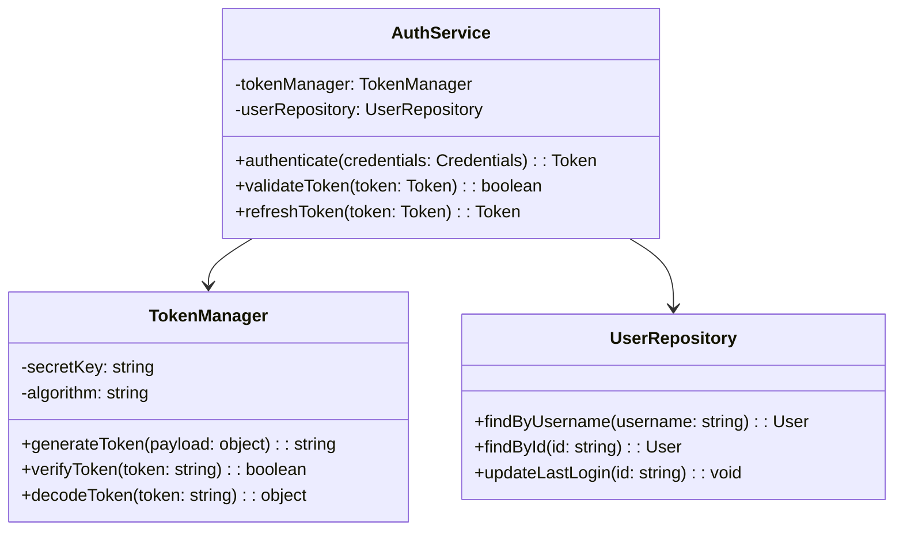

### Non-Technical Audience

- Focus on high-level concepts
- Avoid technical jargon
- Include more explanatory text
- Use familiar metaphors and analogies

**Example for Non-Technical Audience:**

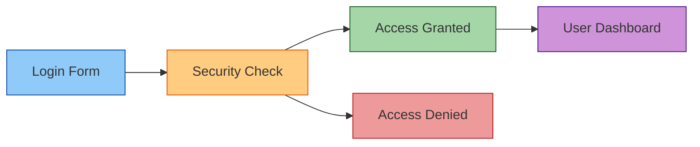

### Mixed Audience

- Layer information (core concepts visible, details available but not overwhelming)
- Include a legend explaining symbols and notations
- Provide both technical and business perspectives

**Example for Mixed Audience:**

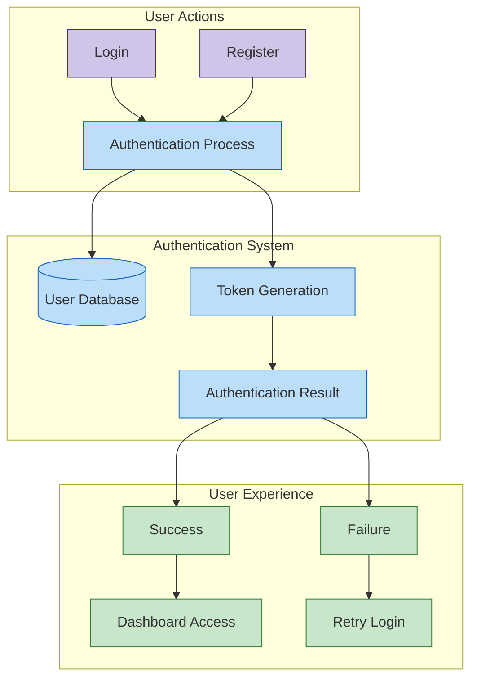

## 2. 🎯 Choose the Right Diagram Type

Selecting the appropriate diagram type is crucial for effectively communicating your information.

| Information Type | Recommended Diagram Types | Best For |
|------------------|---------------------------|----------|
| Process flow | Flowcharts, Activity diagrams, BPMN diagrams | Step-by-step procedures, algorithms, workflows |
| System interactions | Sequence diagrams, Communication diagrams | API interactions, message flows, timing dependencies |
| System structure | Component diagrams, Deployment diagrams | System architecture, infrastructure layouts |
| Data relationships | Entity-relationship diagrams, Class diagrams | Database schemas, object models |
| Hierarchical data | Tree diagrams, Mindmaps | Organizational charts, classification systems |
| Statistical data | Bar charts, Line graphs, Pie charts | Trends, distributions, proportions |
| Conceptual relationships | Concept maps, Mind maps | Ideas, knowledge domains, brainstorming |
| Decision logic | Decision trees, State diagrams | Algorithms, state machines, business rules |

### Example: When to Use a Flowchart vs. Sequence Diagram

**Flowchart** (Process with decisions):

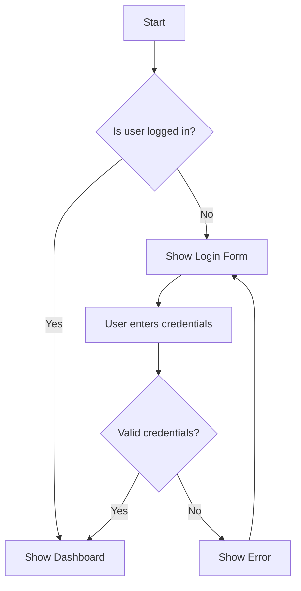

**Sequence Diagram** (Interaction between components):

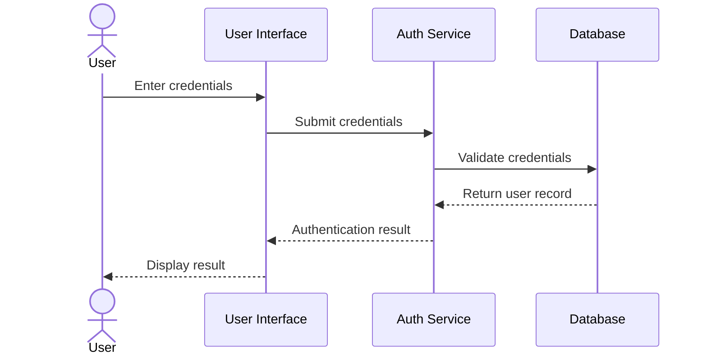

## 3. 🎨 Follow Visual Design Principles

Well-designed diagrams follow established design principles that enhance clarity and comprehension.

### Hierarchy

- Most important elements should be most prominent
- Use size, color, and positioning to establish hierarchy
- Group related elements visually

**Example of Visual Hierarchy:**

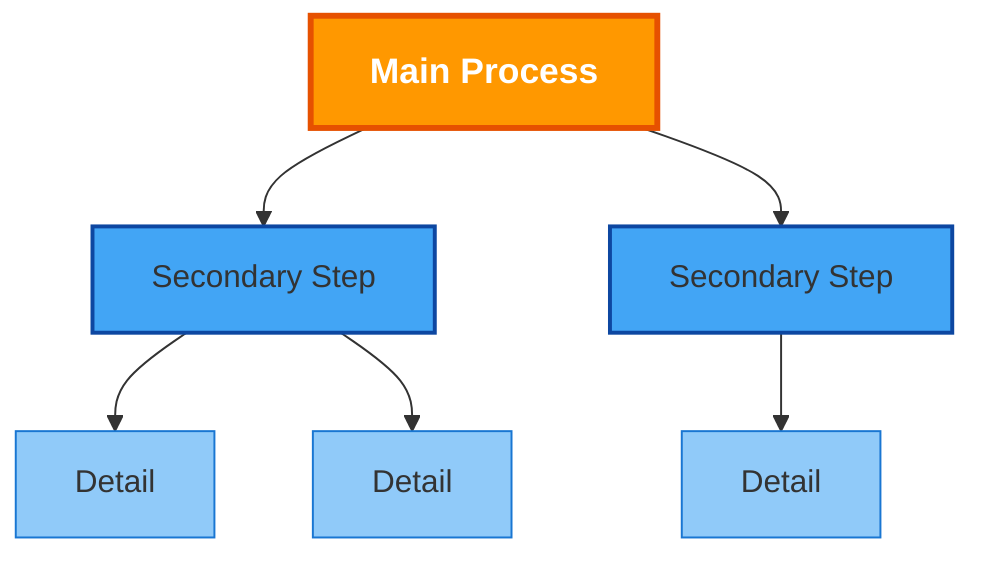

### Simplicity

- Include only necessary elements
- Break complex diagrams into multiple simpler diagrams
- Use consistent, simple shapes

**Before (Too Complex):**

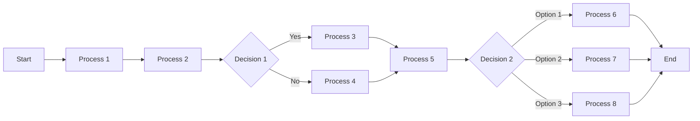

**After (Simplified into Multiple Diagrams):**

*Overview:*
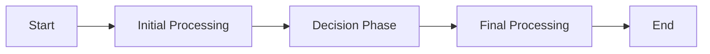

*Detail of Decision Phase:*
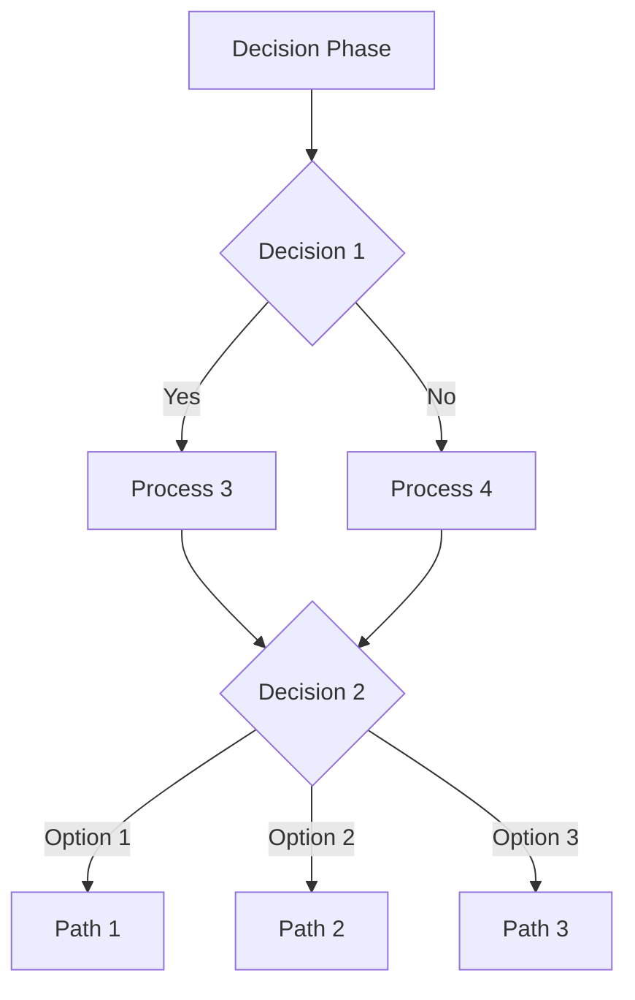

### Consistency

- Maintain consistent styling throughout (colors, shapes, fonts)
- Use the same symbol for the same concept across all diagrams
- Follow established conventions for your diagram type

### Flow

- Provide clear directional flow (typically left-to-right or top-to-bottom)
- Avoid crossing lines where possible
- Use appropriate arrows to indicate direction and relationship type

**Example of Clear Flow:**

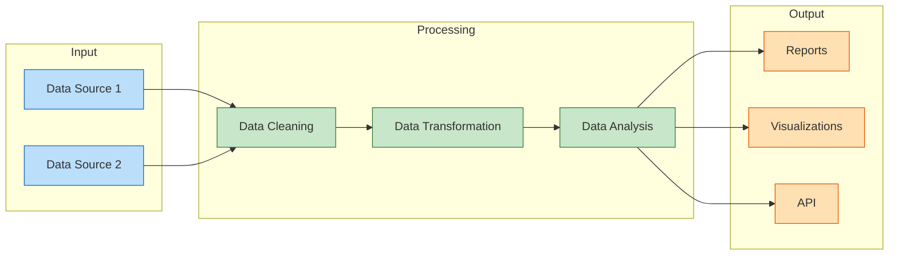

### Accessibility

- Ensure sufficient color contrast
- Don't rely solely on color to convey information
- Use patterns or labels in addition to colors
- Consider colorblind-friendly palettes

**Example of Accessible Design:**

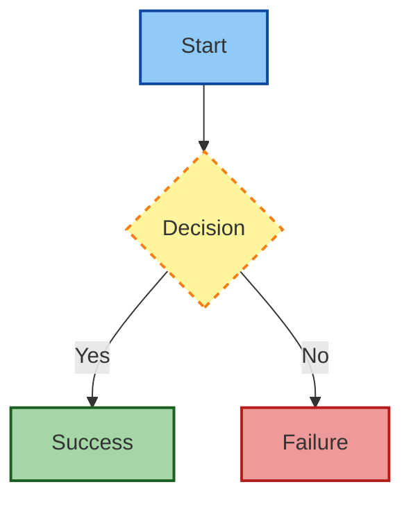

## 4. 📝 Optimize Content

The content within your diagram should be clear, concise, and purposeful.

### Text

- Use brief, clear labels
- Keep text horizontal for readability
- Use a legible font size and type
- Be consistent with capitalization and terminology

**Example of Good Text Usage:**

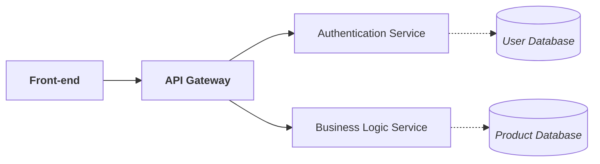

### Annotations

- Add notes for clarification, not for primary content
- Position notes close to the relevant content
- Use a visually distinct style for notes

**Example with Annotations:**

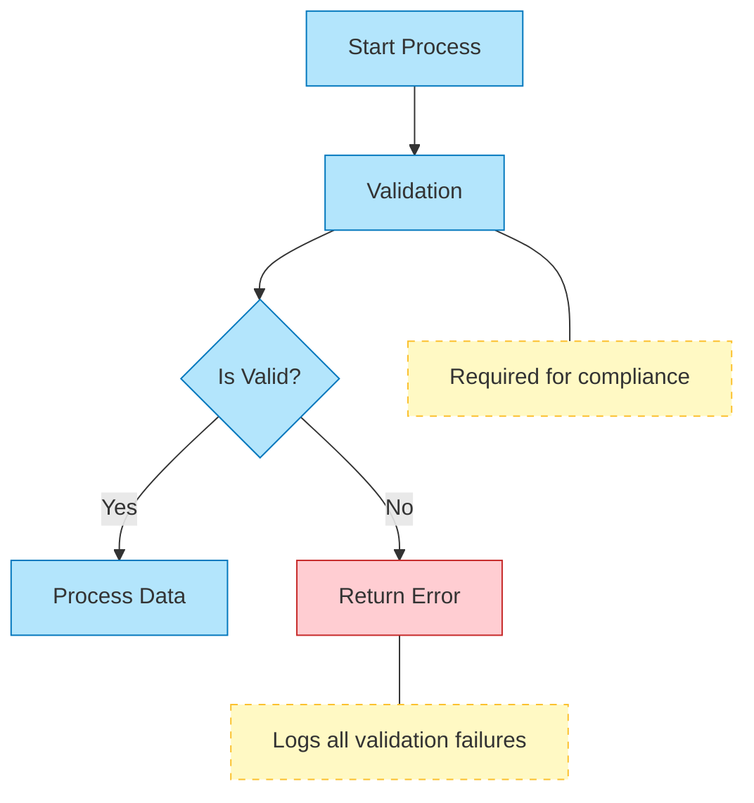

### Legends

- Include legends for non-standard or domain-specific symbols
- Position legends where they don't distract from the main content
- Keep legends concise

**Example with Legend:**

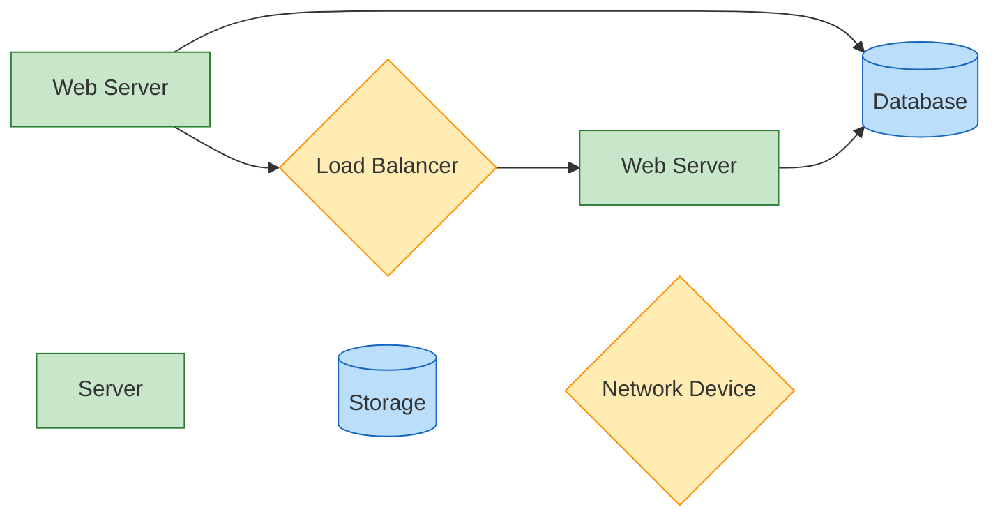

## 5. 🧩 Structure Complex Diagrams

Large, complex systems often require special approaches to keep diagrams manageable.

### Use Subdiagrams

- Create hierarchical diagrams that allow "drilling down"
- Link overview diagrams to detailed subdiagrams
- Maintain consistent styling across levels

**Overview Diagram:**

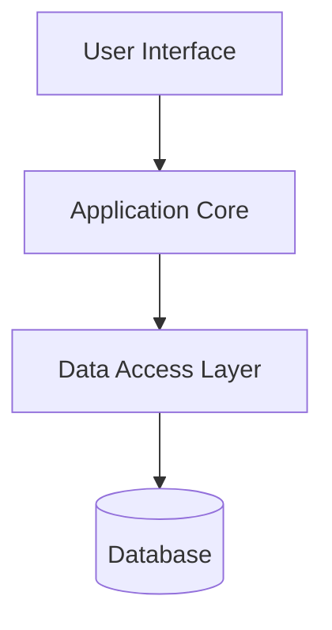

**Detail of Application Core:**

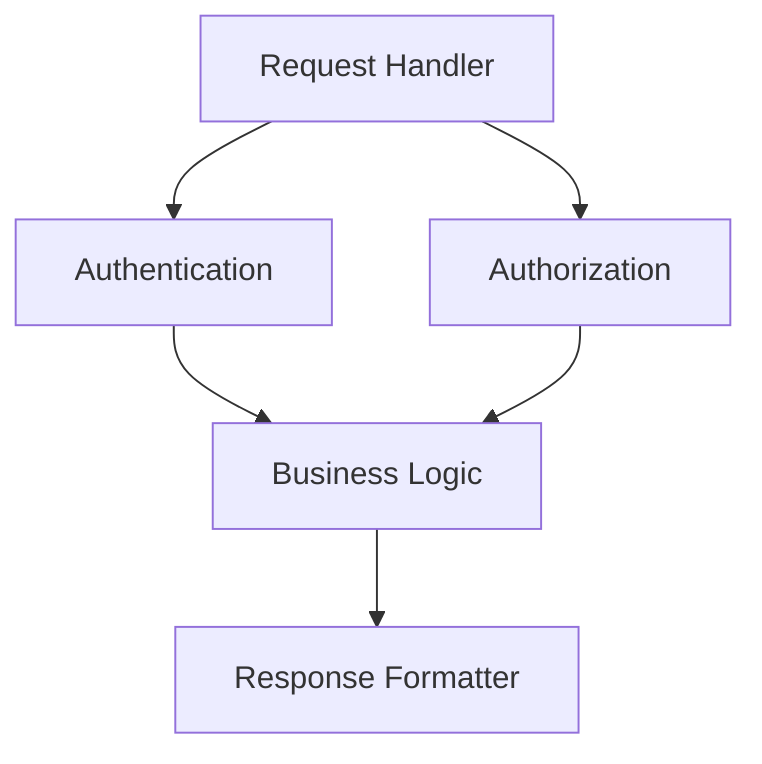

### Apply Layering

- Organize content into logical layers
- Consider interactive diagrams that can show/hide layers
- Create separate views for different audiences or concerns

**Example of Layered View:**

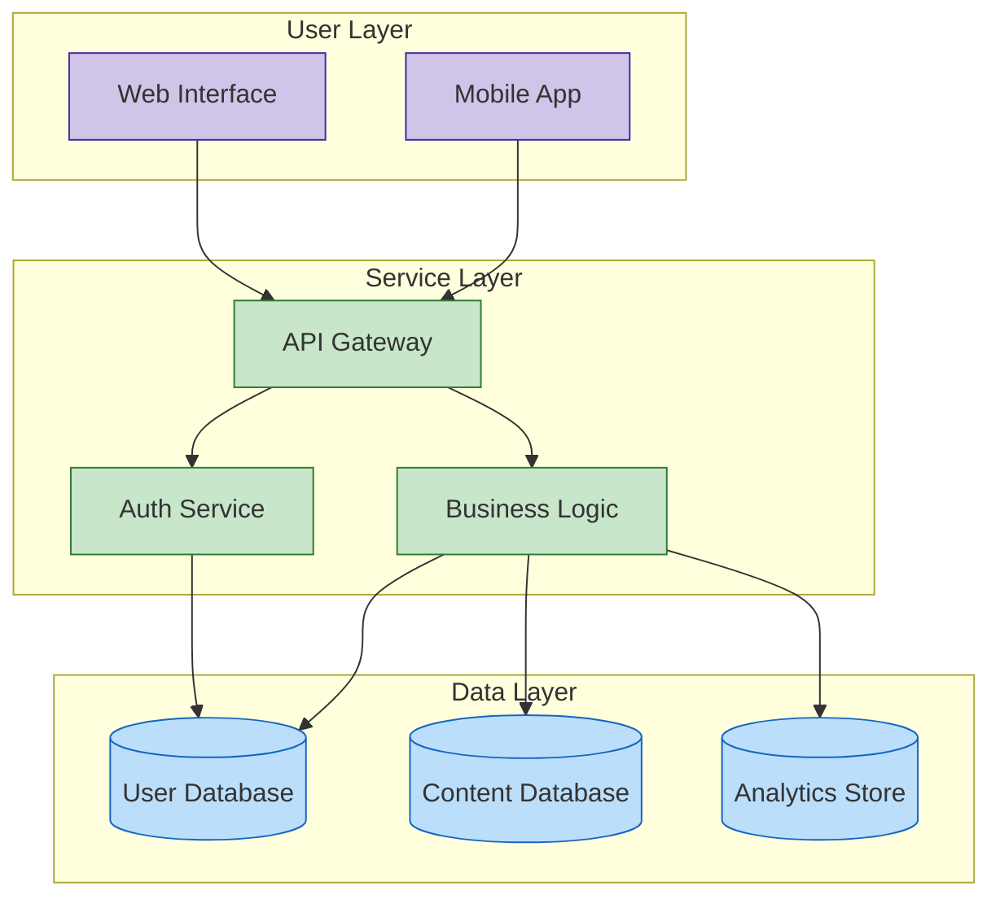

### Create Visual Boundaries

- Use containers (boxes, backgrounds) to group related elements
- Apply consistent styling to elements within the same group
- Add clear labels to groups

## 6. 🔄 Iterate and Refine

Creating effective diagrams is an iterative process.

### Get Feedback

- Show diagrams to target audience members
- Ask specific questions about comprehension
- Be open to fundamental redesigns

### Test Understanding

- Ask viewers to explain the diagram back to you
- Identify points of confusion or misinterpretation
- Clarify based on feedback

### Revise Regularly

- Update diagrams when systems or processes change
- Periodically review for relevance and accuracy
- Version control your diagrams

**Diagram Lifecycle Management:**

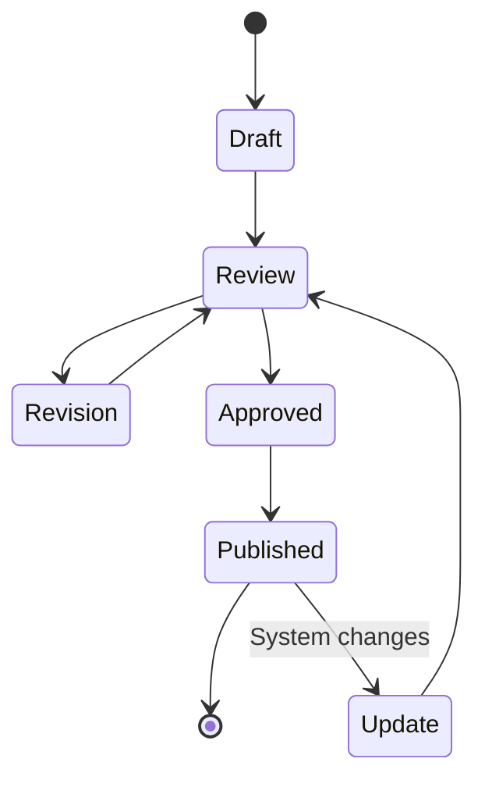

## 7. 📊 Diagram-Specific Best Practices

Different diagram types have their own conventions and best practices.

### Flowcharts

- Use standard shapes (rectangles for processes, diamonds for decisions)
- Keep the flow direction consistent
- Limit branches and merges for clarity

**Effective Flowchart:**

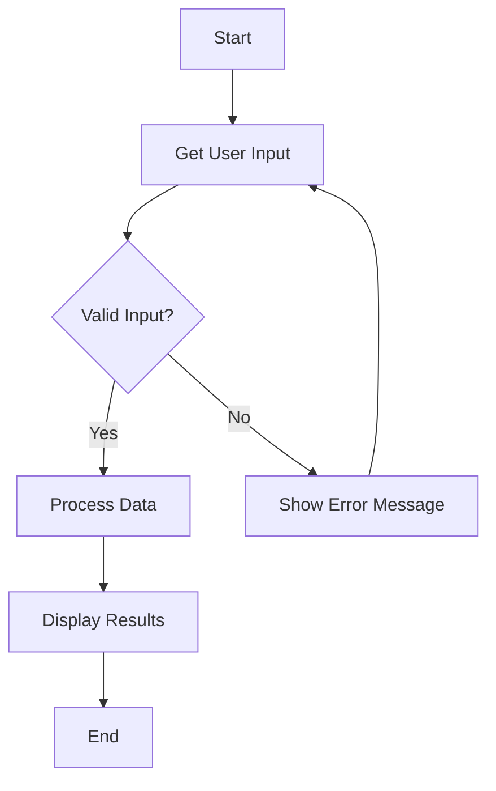

### Sequence Diagrams

- Order participants logically (typically left-to-right)
- Group related interactions
- Add activation bars to show object lifespan
- Include return messages for clarity

**Example Sequence Diagram:**

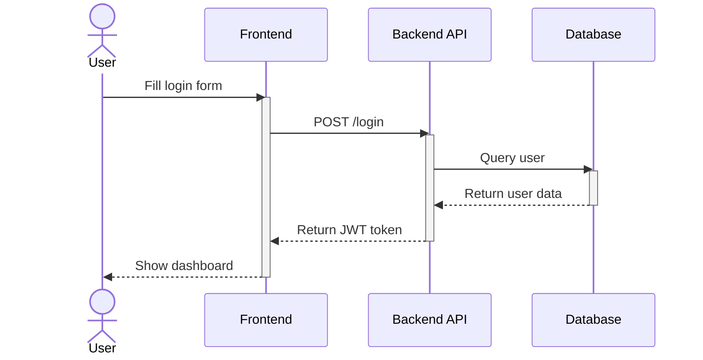

### Class Diagrams

- Show only relevant attributes and methods
- Group related classes
- Use appropriate relationship types (inheritance, composition, etc.)
- Include multiplicity indicators

**Example Class Diagram:**

```mermaid
classDiagram
    class User {
        -id: string
        -name: string
        -email: string
        +getUserProfile(): Profile
        +updateProfile(data: ProfileData): void
    }
    
    class Profile {
        -userId: string
        -biography: string
        -socialLinks: string[]
        +getPictureUrl(): string
        +updateBiography(text: string): void
    }
    
    class Post {
        -id: string
        -authorId: string
        -content: string
        -timestamp: Date
        +edit(content: string): void
        +delete(): void
    }
    
    User "1" -- "1" Profile
    User "1" -- "many" Post
```

### Architecture Diagrams

- Use consistent levels of abstraction
- Show key components and their relationships
- Include external systems and boundaries
- Highlight critical paths or components

**Example Architecture Diagram:**

```mermaid
flowchart LR
    subgraph User Devices
        Browser["Web Browser"]
        MobileApp["Mobile App"]
    end
    
    subgraph Frontend
        WebUI["Web UI"]
        MobileBackend["Mobile Backend"]
    end
    
    subgraph Backend Services
        Auth["Auth Service"]
        API["API Gateway"]
        UserService["User Service"]
        ContentService["Content Service"]
        AnalyticsService["Analytics"]
    end
    
    subgraph Data Storage
        UserDB[(User DB)]
        ContentDB[(Content DB)]
        AnalyticsDB[(Analytics DB)]
    end
    
    Browser --> WebUI
    MobileApp --> MobileBackend
    WebUI --> API
    MobileBackend --> API
    API --> Auth
    API --> UserService
    API --> ContentService
    API --> AnalyticsService
    UserService --> UserDB
    ContentService --> ContentDB
    AnalyticsService --> AnalyticsDB
    
    classDef client fill:#d1c4e9,stroke:#4527a0
    classDef frontend fill:#ffcc80,stroke:#ef6c00
    classDef backend fill:#a5d6a7,stroke:#2e7d32
    classDef storage fill:#90caf9,stroke:#1565c0
    
    class Browser,MobileApp client
    class WebUI,MobileBackend frontend
    class Auth,API,UserService,ContentService,AnalyticsService backend
    class UserDB,ContentDB,AnalyticsDB storage
```

## 8. 🤖 Using AI for Diagram Creation

Leverage AI tools like GitHub Copilot to assist in creating and refining diagrams.

### Effective Prompting

- Be specific about diagram type and purpose
- Include key elements that must be present
- Specify preferred styling
- Mention the intended audience

**Example of a Good AI Prompt:**

```
Create a sequence diagram for a user authentication flow with the following components:
1. User
2. Frontend Client
3. Authentication API
4. User Database

Include: login attempt, credential validation, token generation, and error handling.
Style it with consistent colors and appropriate notations for a technical audience.
```

### Refining AI-Generated Diagrams

- Check for technical accuracy
- Simplify overly complex sections
- Add missing context or labels
- Ensure consistency with your documentation style

### Iterative Improvement

- Start with a basic diagram request
- Review and identify gaps
- Request specific improvements
- Combine multiple AI-generated components if needed

## 9. 🛠️ VS Code Integration Tools for Diagrams

Enhance your diagramming workflow with these VS Code tools and extensions.

### Essential Extensions

| Extension | Purpose | Key Features |
|-----------|---------|-------------|
| Markdown Preview Mermaid Support | Basic preview support | Built-in to recent VS Code versions |
| Mermaid Preview | Dedicated previewing | Live preview, export options |
| Markdown Preview Enhanced | Comprehensive Markdown | Multiple diagram types, custom themes |
| Draw.io Integration | Rich graphic editor | WYSIWYG editing, extensive shapes |

### Keyboard Shortcuts

Create snippets for common diagram structures:

```json
"Mermaid Flowchart": {
    "prefix": "mermflow",
    "body": [
        "```mermaid",
        "flowchart ${1:TD}",
        "    ${2:A}[${3:Start}] --> ${4:B}[${5:End}]",
        "```"
    ],
    "description": "Insert a basic Mermaid flowchart"
}
```

### Version Control Tips

- Store diagrams as code in your repository
- Review diagram changes along with code changes
- Consider using tools like Git LFS for binary diagram exports

## 10. 🌟 Common Pitfalls to Avoid

| Pitfall | Solution |
|---------|----------|
| Diagram overload | Break into multiple focused diagrams |
| Inconsistent styling | Create and apply a style guide |
| Poor layout planning | Sketch on paper before coding |
| Unclear relationships | Use appropriate arrow types and labels |
| Text-heavy diagrams | Replace text with visual elements |
| Undocumented assumptions | Add context and legends |

## Example: Before and After

### Before (Cluttered Diagram)

```
[Cluttered diagram with crossing lines, inconsistent symbols,
and too many elements competing for attention]
```

### After (Improved Diagram)

```mermaid
flowchart LR
    subgraph Frontend
        UI[User Interface]
        Logic[Client Logic]
    end
    subgraph Backend
        API[API Gateway]
        Service1[Authentication]
        Service2[Business Logic]
        Service3[Data Access]
    end
    subgraph Storage
        DB[(Database)]
        Cache[(Cache)]
    end
    
    UI --> Logic
    Logic --> API
    API --> Service1
    API --> Service2
    Service2 --> Service3
    Service3 --> DB
    Service2 -.-> Cache
    Service3 -.-> Cache
    
    classDef frontend fill:#d4f1f9,stroke:#0e5d73;
    classDef backend fill:#ffe6cc,stroke:#d79b00;
    classDef storage fill:#e1d5e7,stroke:#9673a6;
    
    class UI,Logic frontend;
    class API,Service1,Service2,Service3 backend;
    class DB,Cache storage;
```

## 11. 📚 Resources and Further Reading

- [Mermaid.js Documentation](https://mermaid.js.org/)
- [VS Code Markdown Guide](https://code.visualstudio.com/docs/languages/markdown)
- [The Visual Display of Quantitative Information](https://www.edwardtufte.com/tufte/books_vdqi) by Edward Tufte
- [UML Distilled](https://martinfowler.com/books/uml.html) by Martin Fowler

## Conclusion

Creating effective diagrams is an iterative process that requires attention to both technical accuracy and visual clarity. By applying these best practices and leveraging AI tools, you can create diagrams that communicate complex information clearly and effectively.

## Navigation

- [🏠 Back to Main Page](README.md)
- **Related Documents:**
  - [Implementation Guide](implementation_guide.md)
  - [Practical Mermaid Guide](practical_mermaid_guide.md)
  - [Advanced Diagram Examples](advanced_diagram_examples.md)
  - [Troubleshooting Guide](troubleshooting_guide.md)
