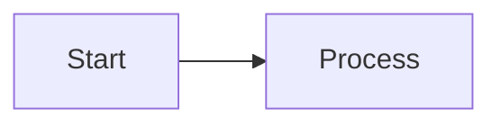
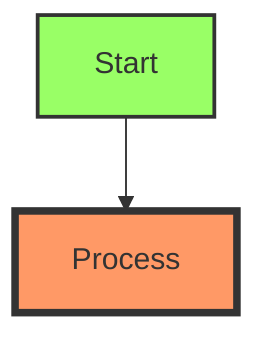

# Frequently Asked Questions: VS Code Diagram Creation

This document addresses common questions about creating and managing diagrams in VS Code.

## General Questions

### Q: Which diagram syntax should I use - Mermaid, PlantUML, or something else?

**A:** The best choice depends on your specific needs:
- **Mermaid** - Best for simple flowcharts, sequence diagrams, and general documentation needs. Built-in to VS Code's Markdown preview and widely supported in documentation platforms.
- **PlantUML** - Superior for detailed UML diagrams (class diagrams, component diagrams). Requires Java installation.
- **Draw.io/diagrams.net** - Best for complex custom diagrams or when you need a visual editor.

### Q: How do I include diagrams in my documentation?

**A:** You have several options:
1. **Markdown with Mermaid** - Include Mermaid code directly in Markdown files
2. **SVG/PNG exports** - Export diagrams and reference them in documentation
3. **HTML embedding** - For web documentation, embed interactive diagrams

### Q: How do I maintain diagrams alongside my code?

**A:** Best practices include:
1. Store diagram source code (.md, .mmd, .puml files) in your repo
2. Place diagrams close to the code they describe
3. Review diagram changes during code reviews
4. Add diagrams to your documentation build pipeline

### Q: How do I automatically generate diagrams from my code?

**A:** Several approaches are available:
1. Use extensions like PlantUML's class diagram generator
2. Create custom scripts with tools like mermaid-cli
3. Use AI tools like GitHub Copilot to analyze and generate diagram code
4. Consider tools like Code2Flow for code-to-flowchart conversion

## VS Code Specific

### Q: Why isn't my diagram showing up in the preview?

**A:** Common causes include:
- Syntax errors in your diagram code
- Missing or improperly formatted code fence (use \```mermaid)
- Extension not activated
- Preview needs refreshing (try closing/reopening)

### Q: How do I export my diagrams to share with others?

**A:** Export options include:
- Right-click in preview → "Copy Image"
- Use extension-specific export options (SVG, PNG)
- Use Markdown PDF extension to export entire documents
- For PlantUML, use "Export diagram" command

### Q: Can I create custom themes for my diagrams?

**A:** Yes, you can:
- For Mermaid: Use the `%%{init: {'theme':'...}}%%` directive
- For PlantUML: Create skinparam files
- For both: Define styles inline for elements

## AI and Diagram Generation

### Q: How accurate are AI-generated diagrams?

**A:** AI tools like GitHub Copilot produce good starting points but often need refinement. They're best at:
- Creating diagram templates
- Converting natural language to diagram code
- Suggesting improvements to existing diagrams
- Fixing syntax errors

For complex systems, use AI as an assistant rather than the primary creator.

### Q: How can I improve AI-generated diagrams?

**A:** Best practices include:
1. Provide clear, detailed prompts
2. Start with simple diagrams and add complexity iteratively
3. Review and edit AI-generated diagrams for accuracy
4. Teach the AI by showing examples of your preferred style

### Q: How do I use Copilot's custom instructions for diagram creation?

**A:** Set up custom instructions as described in our [Custom Instructions Guide](custom_instructions_guide.md). Include specific preferences regarding:
- Diagram style and color schemes
- Preferred layout conventions
- Terminology specific to your domain
- Level of detail you prefer

## Mermaid-Specific Questions

### Q: How do I create clickable links in Mermaid diagrams?

**A:** Use the click directive:



### Q: How do I resize Mermaid diagrams?

**A:** Use the width and height directives:

```
%%{init: {"flowchart": {"htmlLabels": true}, "theme": "default", "themeVariables": {"fontSize": "16px"}, "width": "800px", "height": "600px"}}%%
```

### Q: How do I use custom colors and styles?

**A:** Use classDef and class statements:



## PlantUML-Specific Questions

### Q: Why does PlantUML not render in VS Code?

**A:** PlantUML requires:
1. Java runtime installed
2. Graphviz installed (for certain diagram types)
3. Correct configuration in VS Code settings

### Q: How do I create custom styles in PlantUML?

**A:** Use skinparams:

```plantuml
@startuml
skinparam classFontSize 14
skinparam classFontColor red
skinparam classFontName Helvetica
skinparam backgroundColor #EEEBDC
skinparam roundcorner 20

class Example
@enduml
```



### Q: How do I include PlantUML files in my Markdown?

**A:** Use the include directive:

```
@startuml
!include path/to/your/file.puml
@enduml
```

## Performance and Optimization

### Q: How do I optimize large diagrams?

**A:** For better performance:
- Split complex diagrams into smaller, linked diagrams
- Use subgraphs to organize elements
- Minimize crossing lines
- For Mermaid, consider the `maxTextSize` initialization parameter
- For PlantUML, use preprocessor directives like `!pragma`

### Q: How do I troubleshoot slow rendering?

**A:** Try these steps:
1. Simplify the diagram temporarily
2. Update your extensions
3. For PlantUML, check Java memory allocation
4. For complex diagrams, generate them pre-build rather than on-demand

## Collaborative Diagramming

### Q: How do we maintain consistency across team diagrams?

**A:** Consider:
1. Creating template files for common diagram types
2. Establishing a style guide with color schemes, fonts, and layouts
3. Using custom instructions in Git repositories
4. Creating shared extension settings (.vscode folder)
5. Using pre-commit hooks to validate diagram syntax

### Q: How do we review diagram changes?

**A:** Best practices:
1. Include rendered images in pull requests
2. Use "before/after" screenshots for significant changes
3. Focus on accuracy rather than just aesthetics
4. Validate against architecture and code

If you have additional questions not covered here, please refer to our [Troubleshooting Guide](troubleshooting_guide.md) or submit an issue.

## Navigation

- [🏠 Back to Main Page](README.md)
- **Related Documents:**
  - [Troubleshooting Guide](troubleshooting_guide.md)
  - [Diagram Validation Guide](diagram_validation_guide.md)
  - [Practical Mermaid Guide](practical_mermaid_guide.md)
