# 🧰 VS Code Extensions for Graphics Creation: Comparison

> "Choosing the right tool makes all the difference in creating effective visualizations."

## 🔍 Quick Reference Guide

| Extension | Best For | Installation Command | Complexity |
|-----------|----------|----------------------|------------|
| 📊 **Mermaid Preview** | Code-as-diagram, version control | `ext install bierner.markdown-mermaid` | ��⭐☆☆☆ |
| 🔄 **Draw.io Integration** | Complex visual diagrams | `ext install hediet.vscode-drawio` | ⭐⭐⭐☆☆ |
| 📝 **PlantUML** | Standardized UML diagrams | `ext install jebbs.plantuml` | ⭐⭐⭐⭐☆ |
| 📈 **Markdown Preview Enhanced** | Data visualization, math | `ext install shd101wyy.markdown-preview-enhanced` | ⭐⭐⭐☆☆ |
| 🗺️ **CodeSee Maps** | Code visualization | `ext install codesee.codesee` | ⭐☆☆☆☆ |
| ✏️ **Excalidraw VS Code** | Sketches, wireframes | `ext install pomdtr.excalidraw-editor` | ⭐☆☆☆☆ |
| 🤖 **GitHub Copilot Chat** | AI-generated diagrams | `ext install github.copilot-chat` | ⭐⭐☆☆☆ |
| 🔍 **Graphviz Interactive Preview** | Network graphs | `ext install tintinweb.graphviz-interactive-preview` | ⭐⭐⭐☆☆ |

## 📋 Detailed Comparison

| Extension | Type of Graphics | Key Features | Integration with AI | Learning Curve | Suitable For |
|-----------|------------------|--------------|---------------------|---------------|--------------|
| 📊 **Mermaid Preview** | Flowcharts, Sequence diagrams, Class diagrams, State diagrams, ER diagrams | - Text-based diagram creation - Live preview - Integrates with Markdown - Version control friendly | High - Works well with Copilot for code generation | Medium - Requires learning syntax but logical structure | Developers, Technical writers |
| 🔄 **Draw.io Integration** | General diagrams, Flowcharts, Network diagrams, UML | - Visual diagram editor - Extensive shape libraries - Export to various formats - Custom templates | Medium - Manually apply AI suggestions | Low - Familiar drag-and-drop interface | All users, Non-technical stakeholders |
| 📠**PlantUML** | UML diagrams, Sequence diagrams, Use case diagrams, Class diagrams | - Text-based UML creation - Standardized notation - Can generate diagrams from code | High - Works well with Copilot for UML generation | Medium-High - UML knowledge required | Software architects, System designers |
| 📈 **Markdown Preview Enhanced** | Charts, Graphs, Math formulas, Mermaid integration | - Extended markdown capabilities - Multiple chart libraries support - Math equation rendering - Code chunks | Medium - AI can generate code for charts | Medium - Requires knowledge of specific chart libraries | Data scientists, Technical writers |
| 🗺️ **CodeSee Maps** | Code visualization, dependency maps | - Visualizes codebases - Shows dependencies - Review changes impact | Low - Currently limited AI integration | Low - Automated visualization | Developers working with large codebases |
| ✏️ **Excalidraw VS Code** | Sketches, Wireframes, Hand-drawn style diagrams | - Hand-drawn aesthetic - Collaborative drawing - Lightweight interface | Medium - Can implement AI suggestions | Very Low - Intuitive drawing interface | UI designers, Brainstorming sessions |
| 🤖 **GitHub Copilot Chat** | All diagram types through code generation | - Natural language to diagram code - Contextual suggestions - Multiple diagram format support | Very High - Core functionality is AI-based | Low - Uses natural language | All users |
| 🔠**Graphviz Interactive Preview** | Directed and undirected graphs | - DOT language support - Interactive preview - Node/edge customization | Medium - AI can generate DOT syntax | Medium - Requires learning DOT language | Data scientists, Algorithm visualization |

## 📊 Visual Comparison

## 🤔 Key Considerations When Choosing an Extension

### 🎯 Diagram Type Needs

<table>
  <tr>
    <th>If You Need</th>
    <th>Best Choice</th>
    <th>Runner-Up</th>
  </tr>
  <tr>
    <td>Process Flowcharts</td>
    <td>📊 Mermaid Preview</td>
    <td>🔄 Draw.io Integration</td>
  </tr>
  <tr>
    <td>Software Architecture</td>
    <td>📝 PlantUML</td>
    <td>📊 Mermaid Preview</td>
  </tr>
  <tr>
    <td>Data Visualization</td>
    <td>📈 Markdown Preview Enhanced</td>
    <td>🔄 Draw.io Integration</td>
  </tr>
  <tr>
    <td>Code Relationships</td>
    <td>🗺️ CodeSee Maps</td>
    <td>🔍 Graphviz Interactive</td>
  </tr>
  <tr>
    <td>Wireframes/UI Design</td>
    <td>✏️ Excalidraw VS Code</td>
    <td>🔄 Draw.io Integration</td>
  </tr>
  <tr>
    <td>Quick Prototypes</td>
    <td>🤖 GitHub Copilot Chat</td>
    <td>📊 Mermaid Preview</td>
  </tr>
</table>

### 👥 User Type Considerations

<table>
  <tr>
    <th>For</th>
    <th>Primary Choice</th>
    <th>Why</th>
  </tr>
  <tr>
    <td>Developers</td>
    <td>📊 Mermaid Preview</td>
    <td>Code-like syntax, version control integration</td>
  </tr>
  <tr>
    <td>Technical Writers</td>
    <td>📈 Markdown Preview Enhanced</td>
    <td>Comprehensive document + diagram solution</td>
  </tr>
  <tr>
    <td>Product Managers</td>
    <td>🔄 Draw.io Integration</td>
    <td>Accessible interface, professional output</td>
  </tr>
  <tr>
    <td>Data Scientists</td>
    <td>📈 Markdown Preview Enhanced</td>
    <td>Statistical charts, code + visualization integration</td>
  </tr>
  <tr>
    <td>Architects</td>
    <td>📝 PlantUML</td>
    <td>Standard notation, comprehensive UML support</td>
  </tr>
  <tr>
    <td>UI/UX Designers</td>
    <td>✏️ Excalidraw VS Code</td>
    <td>Sketching capability, wireframing toolset</td>
  </tr>
</table>

## 🧠 Best Practices for Using AI with Graphics Extensions

1. **Start with clear descriptions**: Provide detailed prompts about what you want to visualize
2. **Iterative refinement**: Use AI to generate initial diagrams, then refine manually
3. **Learn from AI-generated code**: Study the patterns in AI-generated diagram code to improve your skills
4. **Combine approaches**: Use AI for complex structure, then enhance with manual tools
5. **Validate accuracy**: Always verify that AI-generated diagrams correctly represent your intended concepts

## 🔮 Future Trends

As AI continues to evolve, we can expect:

- More sophisticated natural language understanding for diagram generation
- Real-time collaborative diagramming with AI assistance
- Automatic conversion between different diagram types
- AI that can suggest improvements to diagram clarity and aesthetics
- Code-to-diagram and diagram-to-code bidirectional transformations

## 🧭 Extension Selection Flowchart

```mermaid
flowchart TD
    Start([Start Selection]) --> Q1{Need Code Version Control?}
    Q1 -->|Yes| Q2{UML Specific?}
    Q1 -->|No| Q3{Complex Custom Diagrams?}
    
    Q2 -->|Yes| PlantUML[📝 PlantUML]
    Q2 -->|No| Mermaid[📊 Mermaid Preview]
    
    Q3 -->|Yes| DrawIO[🔄 Draw.io Integration]
    Q3 -->|No| Q4{Sketching/Wireframes?}
    
    Q4 -->|Yes| Excalidraw[✏️ Excalidraw VS Code]
    Q4 -->|No| Q5{Data Visualization?}
    
    Q5 -->|Yes| MPE[📈 Markdown Preview Enhanced]
    Q5 -->|No| Q6{Code Visualization?}
    
    Q6 -->|Yes| CodeSee[🗺️ CodeSee Maps]
    Q6 -->|No| Q7{AI Generation?}
    
    Q7 -->|Yes| Copilot[🤖 GitHub Copilot Chat]
    Q7 -->|No| Graphviz[🔍 Graphviz Interactive]
    
    classDef start fill:#6fd66f,stroke:#009900,color:white;
    classDef question fill:#ffcc80,stroke:#e65100;
    classDef solution fill:#90caf9,stroke:#0d47a1;
    
    class Start start;
    class Q1,Q2,Q3,Q4,Q5,Q6,Q7 question;
    class Mermaid,PlantUML,DrawIO,Excalidraw,MPE,CodeSee,Copilot,Graphviz solution;
```

## 🔄 Navigation

- [🏠 Back to Main Page](README.md)
- **Related Documents:**
  - [VS Code Setup Guide](vscode_setup_guide.md)
  - [Implementation Guide](implementation_guide.md)
  - [Practical Mermaid Guide](practical_mermaid_guide.md)
  - [Diagram Best Practices](diagram_best_practices.md)
