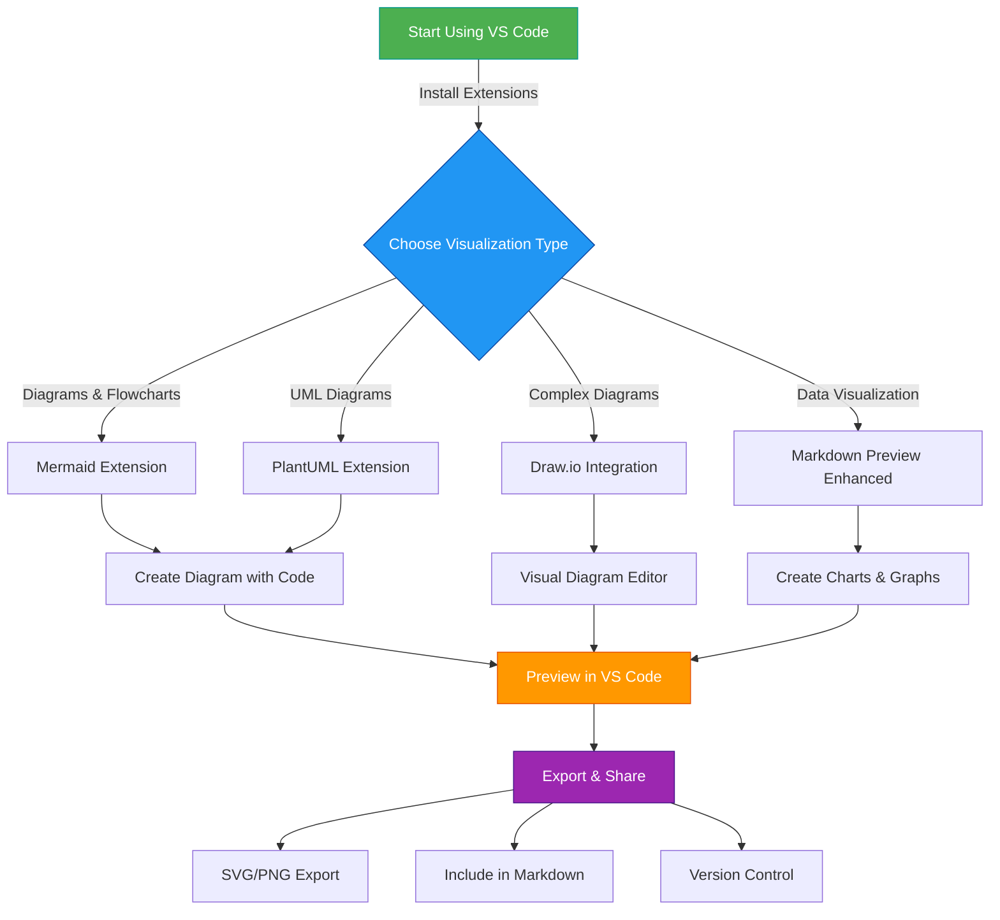

# 🔄 Flowchart Example: VS Code Diagram Workflow

This example demonstrates a basic flowchart created using Mermaid syntax, showing the workflow for creating diagrams in VS Code.

## 📊 Diagram

## Navigation

- [🏠 Back to Main Page](README.md)
- **Related Documents:**
  - [Sequence Diagram Example](sequence_diagram_example.md)
  - [Implementation Guide](implementation_guide.md)
  - [Practical Mermaid Guide](practical_mermaid_guide.md)
