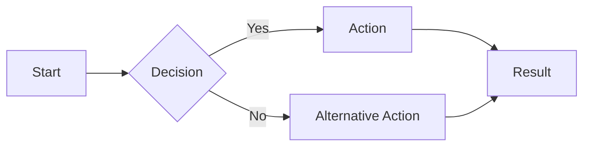

# Implementation Guide: Creating Graphics in VS Code

This guide provides step-by-step instructions on how to create professional diagrams and graphics using VS Code and AI-powered tools.

## Prerequisites

1. Install Visual Studio Code (VS Code)
2. Install the necessary extensions:
   - Mermaid Preview (for Mermaid diagrams)
   - Draw.io Integration (for complex diagrams)
   - PlantUML (for UML diagrams)
   - Markdown Preview Enhanced (for additional visualization features)

## Creating Your First Diagram with Mermaid

Mermaid is a powerful diagram generation tool that allows you to create diagrams using a markdown-like syntax.

### Step 1: Create a new Markdown file

Create a new file with a `.md` extension in VS Code.

### Step 2: Add a Mermaid code block

Include your Mermaid diagram code inside a code block:

````

````

### Step 3: Preview the diagram

You can use the Mermaid preview extension to see your diagram in real-time as you edit the code.

## Using AI to Generate Diagrams

GitHub Copilot and similar AI tools can help you create diagrams faster:

1. Describe the diagram you want to create in comments
2. Ask the AI to generate the appropriate code
3. Refine the generated code based on your needs

Example prompt:
```
// Create a flowchart showing the user authentication process with registration, login, 
// password reset, and 2FA verification stages
```

## Tips for Creating Professional Graphics

1. **Keep it simple**: Include only essential elements in your diagram
2. **Use consistent styling**: Maintain uniform colors, shapes, and terminology
3. **Add visual hierarchy**: Make important elements stand out
4. **Include clear labels**: Make sure all components are properly labeled
5. **Use colors strategically**: Color-code related components or highlight critical paths

## Exporting and Sharing Your Diagrams

Once your diagram is complete, you can:

1. Export as SVG or PNG using the extension's export features
2. Include the diagram in documentation by keeping the Mermaid code in markdown files
3. Share the diagram code with colleagues who can render it themselves
4. Version control your diagrams alongside your code

## Advanced Features

- **Interactive diagrams**: Some extensions support creating interactive diagrams with clickable elements
- **Automatic layouts**: Let the rendering engine optimize the layout of complex diagrams
- **Integration with data sources**: Generate diagrams based on actual data or code structure
- **Custom themes**: Create and apply custom themes to match your organization's branding

## Resources

- [Mermaid Documentation](https://mermaid.js.org/intro/)
- [PlantUML Documentation](https://plantuml.com/)
- [Draw.io Documentation](https://www.diagrams.net/doc/)
- [VS Code Extensions Marketplace](https://marketplace.visualstudio.com/)

## Navigation

- [🏠 Back to Main Page](README.md)
- **Related Documents:**
  - [VS Code Setup Guide](vscode_setup_guide.md)
  - [Diagram Best Practices](diagram_best_practices.md)
  - [AI Diagram Generation Guide](ai_diagram_generation_guide.md)
