# 🚀 Implementation Guide: Creating Graphics in VS Code

This guide provides step-by-step instructions on how to create professional diagrams and graphics using VS Code and AI-powered tools.

> **"The best diagrams combine the clarity of visual thinking with the precision of code."**

## 📋 Quick Start Reference

| Diagram Type | Best Tool | Example Use Case | Complexity |
|--------------|-----------|-----------------|------------|
| Simple flowcharts | 📊 Mermaid | Process workflows, decision trees | ⭐⭐☆☆☆ |
| Sequence diagrams | 📊 Mermaid | API interactions, message flows | ⭐⭐⭐☆☆ |
| Class diagrams | 📊 Mermaid / 📝 PlantUML | Object models, database schemas | ⭐⭐⭐☆☆ |
| ER diagrams | 📊 Mermaid | Database relationships | ⭐⭐⭐☆☆ |
| State diagrams | 📊 Mermaid / 📝 PlantUML | Application states, transitions | ⭐⭐⭐☆☆ |
| Complex diagrams | 🔄 Draw.io | System architectures, network diagrams | ⭐⭐⭐⭐⭐ |
| Timeline charts | 📊 Mermaid | Project timelines, Gantt charts | ⭐⭐⭐☆☆ |

## 🔧 Prerequisites

### 1. Install Visual Studio Code

Download and install the latest version of VS Code from the [official website](https://code.visualstudio.com/).

### 2. Install the Necessary Extensions

| Extension | Purpose | Installation Command |
|-----------|---------|----------------------|
| 📊 **Mermaid Preview** | Preview Mermaid diagrams | `ext install bierner.markdown-mermaid` |
| 🔄 **Draw.io Integration** | Create and edit complex diagrams | `ext install hediet.vscode-drawio` |
| 📝 **PlantUML** | Create UML diagrams | `ext install jebbs.plantuml` |
| **Markdown Preview Enhanced** | Additional visualization features | `ext install shd101wyy.markdown-preview-enhanced` |

To install these extensions:
1. Open VS Code
2. Press `Ctrl+Shift+X` (Windows/Linux) or `Cmd+Shift+X` (Mac) to open the Extensions view
3. Search for each extension name and click "Install"

Alternatively, you can run the installation commands in the VS Code terminal.

## 📊 Creating Diagrams with Mermaid

Mermaid provides a simple, markdown-like syntax for creating diagrams directly in your text files.

### Step 1: Create a new Markdown file

Create a new file with a `.md` extension in VS Code.

### Step 2: Add a Mermaid code block

Include your Mermaid diagram code inside a fenced code block with the `mermaid` language identifier:

````markdown
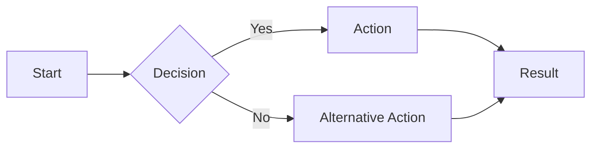
````

### Step 3: Preview the diagram

To preview your diagram:
1. Open the Markdown Preview by clicking the preview icon in the top-right corner of the editor
2. Alternatively, press `Ctrl+K V` (Windows/Linux) or `Cmd+K V` (Mac)

The rendered diagram will look like this:


### Step 4: Customize your diagram

Mermaid offers various styling options:

````markdown
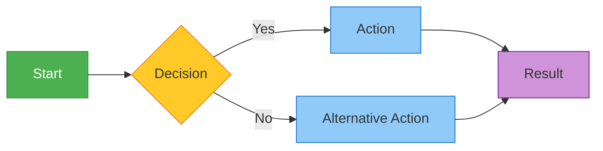
````

Rendered result:


## 📝 Common Mermaid Diagram Types

### Flowcharts

Flowcharts represent processes or workflows with decision points.

````markdown
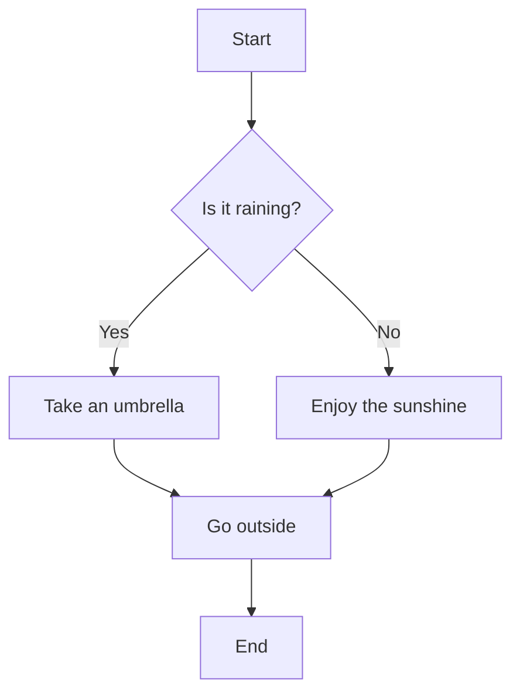
````


### Sequence Diagrams

Sequence diagrams show the flow of actions between actors and systems.

````markdown
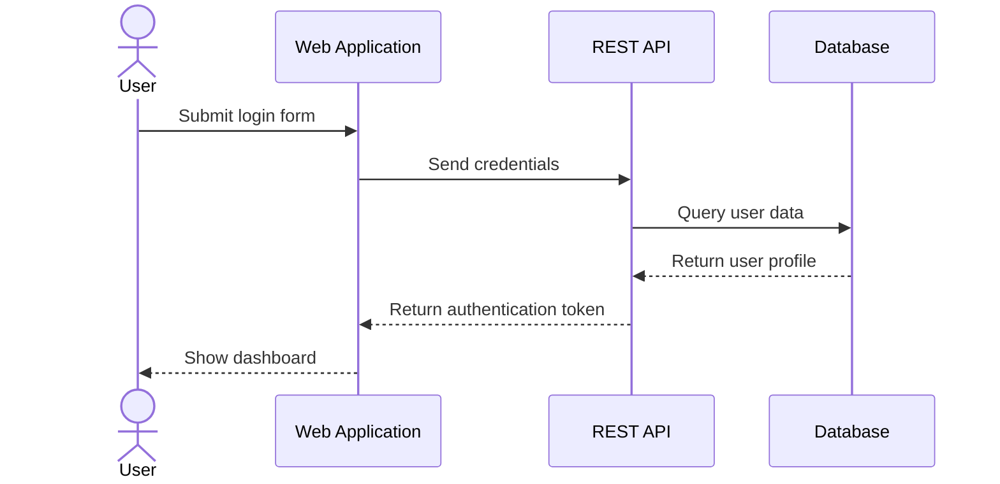
````


### Class Diagrams

Class diagrams show the structure of a system by displaying classes, attributes, methods, and relationships.

````markdown
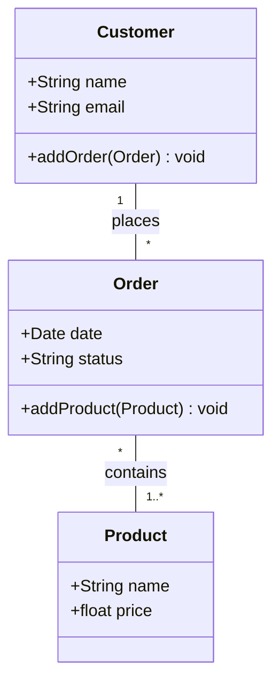
````


### Entity Relationship Diagrams

ER diagrams visualize database schemas and relationships.

````markdown
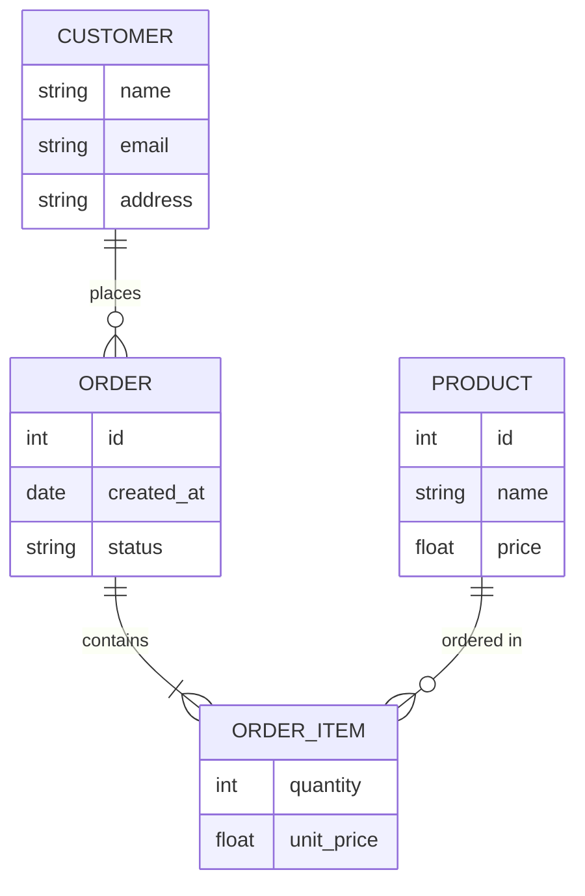
````


### Gantt Charts

Gantt charts illustrate project schedules with tasks and dependencies.

````markdown
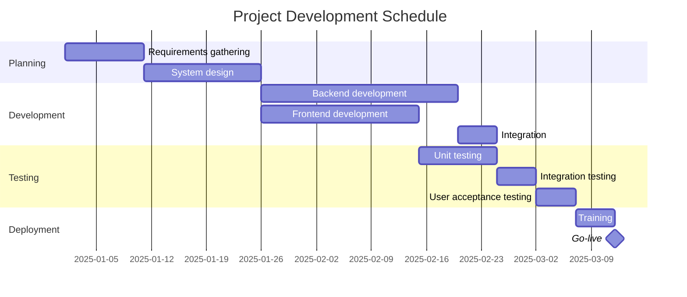
````


### State Diagrams

State diagrams represent the different states of a system and the transitions between them.

````markdown
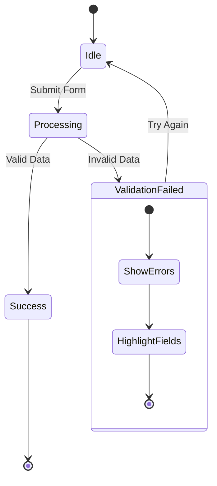
````


## 🔄 Creating Diagrams with Draw.io

For more complex diagrams or when you need pixel-perfect control, Draw.io integration provides a full-featured diagramming solution.

### Step 1: Create a new Draw.io diagram

1. Open the command palette with `Ctrl+Shift+P` (Windows/Linux) or `Cmd+Shift+P` (Mac)
2. Type "Draw.io" and select "Draw.io: New Diagram"
3. Choose a diagram type or start with a blank diagram
4. Save the file with a `.drawio` or `.drawio.svg` extension

### Step 2: Use the Draw.io editor

The Draw.io editor provides a rich set of features:
- Drag and drop shapes from the shape library
- Connect shapes with various connector types
- Format shapes with colors, borders, and text styles
- Use layers to organize complex diagrams
- Add custom images and icons

### Step 3: Export or embed your diagram

To export your Draw.io diagram:
1. Click on "File" > "Export as"
2. Choose your preferred format (PNG, SVG, PDF, etc.)

To embed in Markdown:
1. Export as SVG
2. Reference the SVG file in your Markdown: ``

## 📝 Working with PlantUML

PlantUML provides textual notation for various UML diagram types.

### Step 1: Set up PlantUML

1. Install Java (required for PlantUML)
2. Install Graphviz: `brew install graphviz` (macOS) or download from [Graphviz website](https://www.graphviz.org/download/)
3. Configure the PlantUML extension settings in VS Code

### Step 2: Create a PlantUML file

Create a file with a `.puml` or `.plantuml` extension:

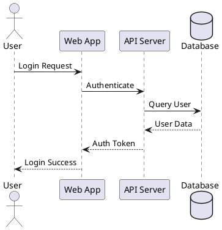

### Step 3: Preview the diagram

1. Press `Alt+D` to open the preview
2. The diagram will render in a new tab

## 🤖 Using AI to Generate Diagrams

AI tools like GitHub Copilot can significantly accelerate diagram creation by generating code based on natural language descriptions.

### Example 1: Generate a basic flowchart

1. Write a comment describing your diagram:
```
// Create a flowchart showing the user registration process with input validation,
// email verification, and account creation steps
```

2. Let GitHub Copilot suggest the Mermaid code:

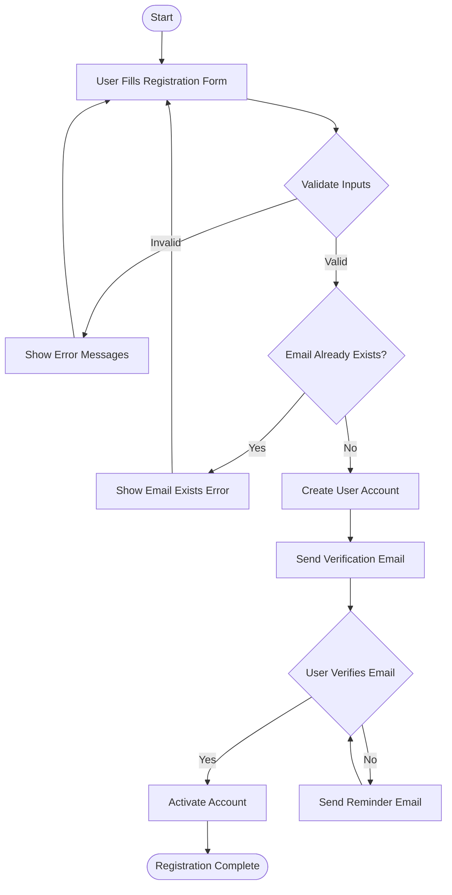

### Example 2: Generate a complex sequence diagram

1. Write a detailed comment:
```
// Create a sequence diagram showing the OAuth 2.0 authorization code flow
// with a user, client application, authorization server, and resource server
```

2. Let GitHub Copilot generate the diagram code:

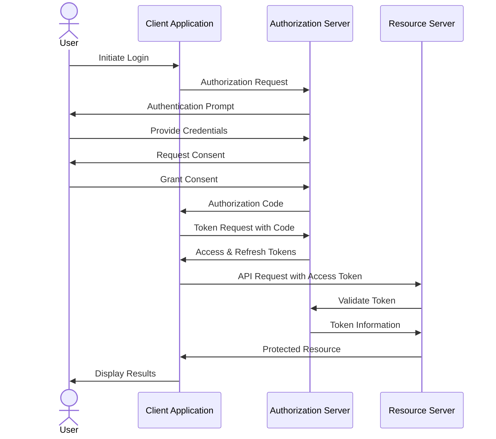

### Tips for Effective AI Prompting

1. **Be specific**: Include all key components and their relationships
2. **Use consistent terminology**: Avoid vague or ambiguous terms
3. **Break down complex diagrams**: Request sections separately
4. **Iterate**: Refine the AI's output and ask for improvements
5. **Specify diagram type**: Explicitly mention the type of diagram you want

## 📤 Exporting and Sharing Your Diagrams

### Export Options by Tool

| Tool | Export Formats | Best For |
|------|---------------|----------|
| Mermaid | PNG, SVG | Documentation, presentations |
| Draw.io | PNG, SVG, PDF, HTML | Detailed diagrams, presentations |
| PlantUML | PNG, SVG, PDF | UML diagrams, technical documentation |

### Export Methods

#### For Mermaid in VS Code:

1. **Using Mermaid Preview extension**:
   - Right-click on the rendered diagram
   - Select "Save as PNG" or "Save as SVG"

2. **Using Markdown Preview Enhanced**:
   - Right-click on the preview
   - Select "HTML Code" > "HTML With Style"
   - Save the HTML file or copy the SVG code

#### For Draw.io:

1. Click "File" > "Export as"
2. Choose your preferred format
3. Set options like resolution and background
4. Save the file

#### For PlantUML:

1. Right-click on the diagram preview
2. Select "Export diagram"
3. Choose your preferred format
4. Save the file

### Sharing Best Practices

1. **For version control**:
   - Store the diagram code directly in Markdown or dedicated files
   - Include diagrams in the same repository as your code
   - Review diagram changes during code reviews

2. **For documentation**:
   - Embed rendered SVGs in Markdown documentation
   - Link to interactive versions when available
   - Keep diagram code and rendered images in sync

3. **For collaboration**:
   - Share the diagram code instead of just images
   - Use consistent naming conventions
   - Include descriptions of significant changes

## 🛠️ Advanced Features and Techniques

### Interactive Diagrams

Some extensions support creating interactive elements:

```html
<div class="mermaid">
flowchart LR
    A[Component 1] --> B[Component 2]
    B --> C[Component 3]
    click A callback "Tooltip for Component 1"
    click B "https://example.com/component2" "Open Component 2 docs"
</div>

<script>
function callback() {
    alert('Component 1 clicked!');
}
</script>
```

### Automatic Diagram Generation

Generate diagrams from existing code or data:

1. **For code structure**:
   - Use tools like `dependency-cruiser` for JavaScript/TypeScript projects
   - Use `pyreverse` for Python projects

2. **For database schemas**:
   - Use tools like `schemaspy` or `dbdiagram.io`
   - Export the schema as Mermaid or PlantUML code

3. **For APIs**:
   - Generate sequence diagrams from OpenAPI specifications
   - Use tools like `swagger-to-uml`

### Custom Themes

Create your own theme for consistent branding:

```javascript
// For Mermaid
mermaid.initialize({
  theme: 'base',
  themeVariables: {
    primaryColor: '#ff0000',
    primaryTextColor: '#ffffff',
    primaryBorderColor: '#800000',
    lineColor: '#333333',
    secondaryColor: '#006699',
    tertiaryColor: '#fff5ad'
  }
});
```

## 🐛 Troubleshooting Common Issues

### Rendering Problems

| Problem | Solution |
|---------|----------|
| Diagram not rendering | Check syntax and ensure proper language identifier in code fence |
| Components misaligned | Try different layout direction (TD, LR, etc.) |
| Text overlapping | Reduce text length or adjust node sizes |
| Missing arrows | Ensure proper connection syntax (-->, ---, -.->)|
| Performance issues | Break complex diagrams into smaller ones |

### Tool-Specific Issues

#### Mermaid:

- **Syntax error messages**: Check [Mermaid syntax documentation](https://mermaid.js.org/syntax/flowchart.html)
- **Preview not updating**: Try toggling the preview closed and reopening it
- **Direction issues**: Be consistent with graph direction (TB, LR, etc.)

#### Draw.io:

- **Extension not loading**: Check Java installation and VS Code permissions
- **SVG export issues**: Try PNG export or use the online version of Draw.io
- **Performance problems**: Reduce complexity or number of elements

#### PlantUML:

- **Java errors**: Ensure Java is installed and configured correctly
- **Graphviz errors**: Verify Graphviz installation path in settings
- **Complex diagrams failing**: Use `!pragma layout smetana` for complex layouts

## 📚 Resources

### Official Documentation

- [Mermaid Documentation](https://mermaid.js.org/intro/)
- [PlantUML Documentation](https://plantuml.com/)
- [Draw.io Documentation](https://www.diagrams.net/doc/)
- [VS Code Extensions Marketplace](https://marketplace.visualstudio.com/)

### Tutorials and Examples

- [Mermaid Live Editor](https://mermaid.live/) - Interactive playground
- [PlantUML Web Server](https://www.plantuml.com/plantuml/) - Online generation
- [Draw.io Examples](https://www.diagrams.net/example-diagrams) - Template gallery

### Learning Resources

- [Visual Code Documentation](https://docs.github.com/en/get-started/writing-on-github/working-with-advanced-formatting/creating-diagrams)
- [UML Distilled](https://martinfowler.com/books/uml.html) by Martin Fowler
- [The Visual Display of Quantitative Information](https://www.edwardtufte.com/tufte/books_vdqi) by Edward Tufte

## 📅 Keeping Current with Updates

- Follow the [Mermaid Blog](https://mermaid.js.org/community/blog.html)
- Check for extension updates regularly in VS Code
- Join the [Mermaid Discord](https://discord.gg/mermaid-js) community

## Navigation

- [🏠 Back to Main Page](README.md)
- **Related Documents:**
  - [VS Code Setup Guide](vscode_setup_guide.md)
  - [Diagram Best Practices](diagram_best_practices.md)
  - [AI Diagram Generation Guide](ai_diagram_generation_guide.md)
  - [Troubleshooting Guide](troubleshooting_guide.md)
