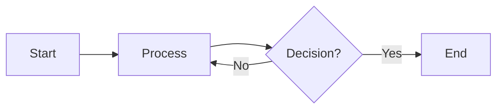
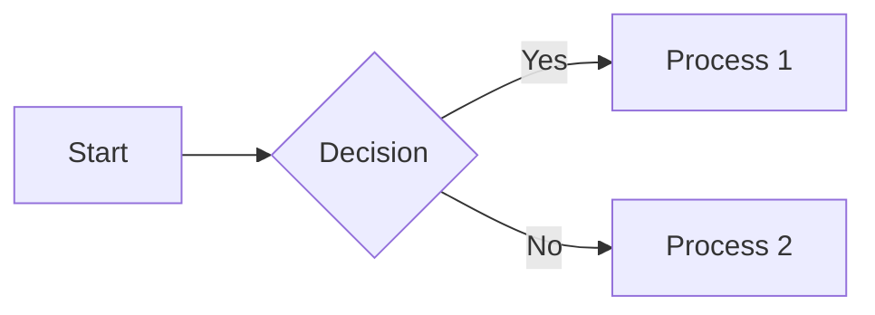
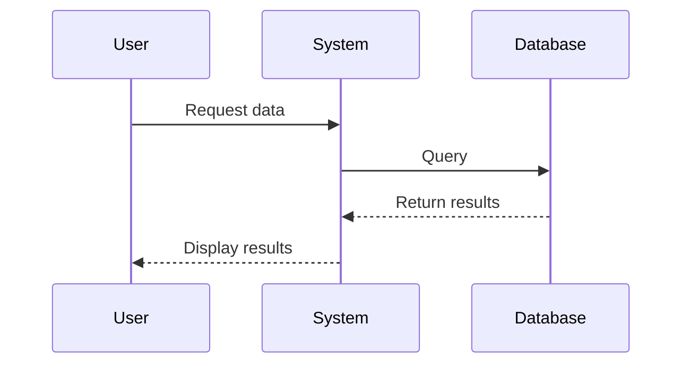
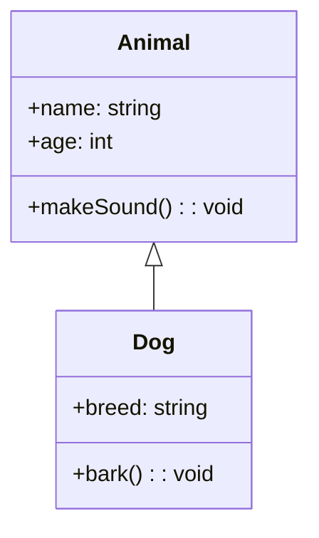
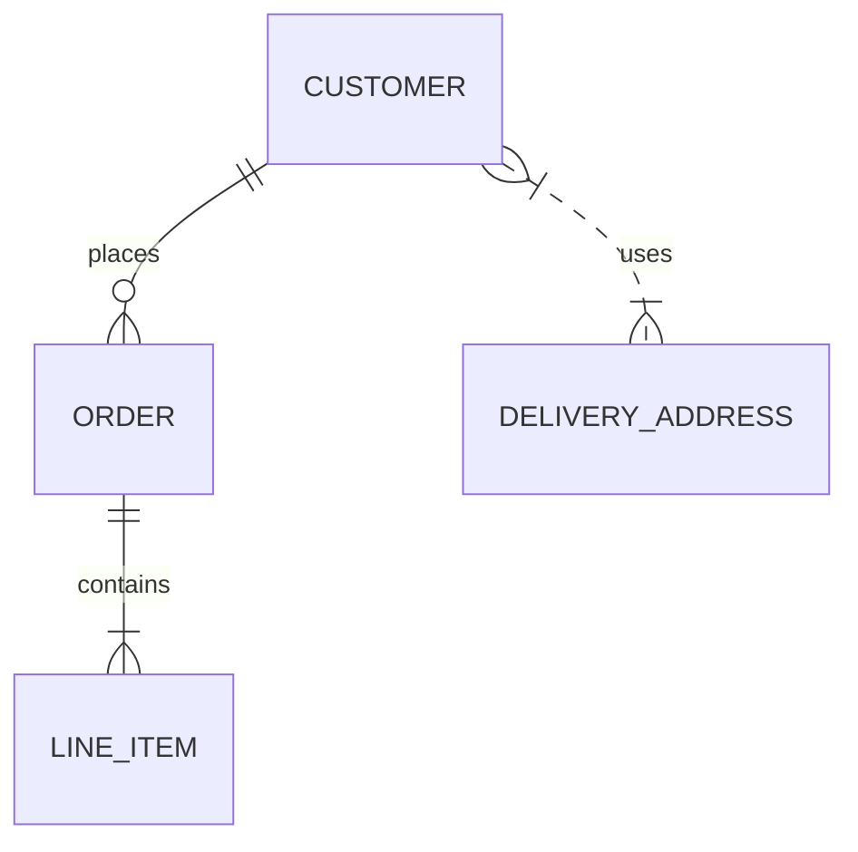
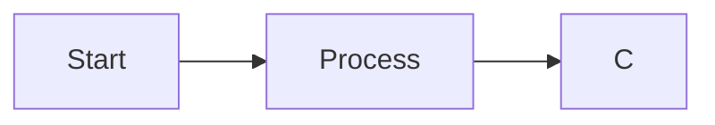

# Practical Mermaid Guide for VS Code Users

This guide provides practical, hands-on instructions for using Mermaid diagrams effectively in Visual Studio Code, with a focus on the workflow and features available in VS Code 1.100+.

## Getting Started with Mermaid in VS Code

### Setup and Installation

1. **Basic Setup**:
   - VS Code has built-in support for Mermaid preview in Markdown files
   - Create a new markdown file (.md) to get started

2. **Enhanced Experience**:
   - Install the "Markdown Preview Mermaid Support" extension for improved previewing
   - Install "Mermaid Preview" extension for a dedicated preview panel

3. **Configuration**:
   ```json
   // settings.json
   "markdown.mermaid.enableMermaid": true
   ```

### Creating Your First Diagram

In a Markdown file, create your first diagram:

```markdown
# My First Diagram


```

Press Ctrl+K V (Cmd+K V on Mac) to open the Markdown preview and see your diagram rendered.

## Using VS Code 1.100+ AI Features with Mermaid

### Setting Up Custom Instructions for Mermaid

1. Open VS Code Chat (View > Command Palette > "Chat: Focus on Chat View")
2. Click the settings icon (⚙️) and select "Custom Instructions"
3. Add Mermaid-specific instructions:

```
When creating Mermaid diagrams:
1. Always use valid Mermaid syntax
2. Follow these diagram conventions:
   - flowchart: LR orientation for processes, TD for hierarchies
   - Use consistent shapes across similar diagrams
   - Apply this color palette: primary=#3b82f6, secondary=#10b981, neutral=#6b7280
3. Keep diagrams focused and readable (max 15-20 nodes for flowcharts)
4. Include comments in the Mermaid code explaining complex parts
```

### Creating Reusable Prompts for Common Diagrams

1. Open Settings (File > Preferences > Settings)
2. Search for "Chat: Reusable Prompts"
3. Click "Edit in settings.json"
4. Add Mermaid-specific prompts:

```json
"chat.reusablePrompts": [
    {
        "name": "Create Process Flowchart",
        "prompt": "Create a Mermaid flowchart diagram for the following process: {{process_description}}. Use LR orientation and include decision points where appropriate."
    },
    {
        "name": "Create Sequence Diagram",
        "prompt": "Generate a Mermaid sequence diagram showing the interaction between {{participants}} for the {{scenario_description}}."
    }
]
```

## Mermaid Diagram Types and VS Code Workflow

### Flowcharts

**Basic Structure**:


**VS Code Workflow**:
1. Type `/Create Process Flowchart` in Chat
2. Describe your process
3. The AI generates the Mermaid code
4. Copy to your Markdown file
5. Preview with Markdown Preview or Mermaid Preview

**Tip**: Use VS Code's "Editor: Column Selection Mode" (Alt+Shift+Mouse drag) to easily indent/format multiple lines of Mermaid code.

### Sequence Diagrams

**Basic Structure**:


**VS Code Workflow**:
1. Use the reusable prompt for sequence diagrams
2. Refine with additional messages to Chat
3. For complex diagrams, break into smaller sections
4. Use VS Code's snippets feature to create custom Mermaid snippets

**Tip**: Create a VS Code snippet for sequence diagram participants:
```json
"Mermaid Sequence Participant": {
    "prefix": "mermaid-participant",
    "body": "participant ${1:Actor}",
    "description": "Add a participant to a Mermaid sequence diagram"
}
```

### Class Diagrams

**Basic Structure**:


**VS Code Workflow**:
1. Use AI to generate class diagrams from existing code
2. Chat: "Generate a class diagram for the code in file X"
3. Refine relationships as needed
4. Keep diagram and code in sync using comments to mark sections

**Tip**: Add special markers in your code comments to identify classes that should be included in diagrams:

```java
/**
 * @diagram Customer class representing system users
 */
class Customer {
    // ...
}
```

### Entity Relationship Diagrams

**Basic Structure**:


**VS Code Workflow**:
1. Create ER diagrams based on database schema
2. Ask Chat to extract entities from SQL files
3. Gradually build and refine relationships
4. Comment entity definitions with their attributes

**Tip**: Use split editor views to keep your schema and diagram side-by-side for easy reference.

## Practical Workflow Techniques

### Diagram-Driven Development

1. **Start with Diagrams**:
   - Create system diagrams before coding
   - Use diagrams to plan and communicate architecture
   - Get feedback on diagrams before implementing

2. **Implementation**:
   - Keep diagrams open in split view while coding
   - Refer to diagrams for component relationships
   - Update diagrams as implementation details emerge

3. **Documentation**:
   - Include finalized diagrams in project documentation
   - Add links from code to relevant diagrams
   - Use diagrams to explain complex systems to new team members

### VS Code Multi-File Workflow

1. **Organizing Diagram Files**:
   - Store diagrams in dedicated directory: `/docs/diagrams/`
   - Use consistent naming: `component_type_diagram.md`
   - Create an index file linking to all diagrams

2. **Workspace Setup**:
   ```json
   // .vscode/settings.json
   {
     "workbench.editorAssociations": {
       "*.mmd": "mermaidPreview.mermaidPreview"
     }
   }
   ```

3. **Using Workspace Symbols**:
   - Add special comment markers for important diagrams
   - Use VS Code's "Go to Symbol in Workspace" to quickly find diagrams

### Version Control Integration

1. **Git Workflow**:
   - Commit diagrams alongside related code changes
   - Include diagram changes in PR descriptions
   - Use Git history to track diagram evolution

2. **Collaborative Editing**:
   - Use VS Code's Live Share feature for real-time collaboration on diagrams
   - Add comments in the Mermaid code for team communication
   - Review diagram changes separately from code changes

## Advanced Mermaid Techniques in VS Code

### Styling and Theming

**Custom Theme Setup**:
```javascript
%%{init: { 
  'theme': 'base',
  'themeVariables': {
    'primaryColor': '#5a67d8',
    'primaryTextColor': '#fff',
    'primaryBorderColor': '#4c51bf',
    'lineColor': '#6b7280',
    'secondaryColor': '#edf2f7',
    'tertiaryColor': '#f7fafc'
  }
}%%
```

**VS Code Tips**:
- Create snippets for common theme configurations
- Store theme configurations in separate files and include them
- Use VS Code color picker to select and insert colors

### Linking Diagrams

**Creating Clickable Areas**:


**VS Code Integration**:
- Link to other files in the workspace using relative paths
- Link to specific sections in documentation
- Link to GitHub issues or other external resources

### Live Editing and Updating

1. **Live Preview**:
   - Use VS Code's "Open Preview to Side" for Markdown files
   - See diagram changes instantly as you type
   - Use split view to see code and rendered diagram simultaneously

2. **Auto-generated Diagrams**:
   - Create scripts that generate Mermaid diagrams from code
   - Use AI to analyze code and suggest diagram updates
   - Automate diagram generation as part of build process

## Troubleshooting Common Mermaid Issues in VS Code

### Syntax Errors

**Common Problems**:
- Missing direction specifiers (LR, TD, etc.)
- Incorrect arrow syntax
- Unescaped characters in labels

**VS Code Solutions**:
- Use the "Problems" panel to identify syntax issues
- Ask Chat to fix diagram syntax errors
- Install "Mermaid Diagram Analyzer" extension for static analysis

### Rendering Issues

**Common Problems**:
- Diagrams too complex to render
- Layout issues with crossing lines
- Text overlapping with shapes

**VS Code Solutions**:
- Simplify complex diagrams or split into multiple
- Use direction hints and layout adjustments
- Ask Chat for layout optimization suggestions

## Putting It All Together: The Ultimate VS Code Mermaid Workflow

1. **Planning Phase**:
   - Use Chat with custom instructions to brainstorm diagram types
   - Create rough diagram drafts with AI assistance
   - Get early feedback on diagram structure

2. **Development Phase**:
   - Keep diagrams and code in sync
   - Use Chat to generate diagrams from implemented code
   - Refine diagrams as the implementation evolves

3. **Documentation Phase**:
   - Finalize diagrams with proper styling and comments
   - Include diagrams in Markdown documentation
   - Create links between diagrams for a complete system view

4. **Maintenance Phase**:
   - Update diagrams when code changes
   - Use version control to track diagram evolution
   - Ensure new team members understand the diagrams

## Additional Resources

- **VS Code Extensions**:
  - [Markdown Preview Enhanced](https://marketplace.visualstudio.com/items?itemName=shd101wyy.markdown-preview-enhanced)
  - [Mermaid Preview](https://marketplace.visualstudio.com/items?itemName=bierner.markdown-mermaid)
  - [Markdown All in One](https://marketplace.visualstudio.com/items?itemName=yzhang.markdown-all-in-one)

- **Mermaid Resources**:
  - [Official Mermaid Documentation](https://mermaid-js.github.io/mermaid/)
  - [Mermaid Live Editor](https://mermaid.live/)
  - [GitHub Mermaid Wiki](https://github.com/mermaid-js/mermaid/wiki)

- **Diagram Examples**:
  - More examples available in other files in this project

By following this guide, you'll be able to create, maintain, and collaborate on Mermaid diagrams efficiently within VS Code, leveraging the latest AI features in VS Code 1.100+ to streamline your diagramming workflow.
