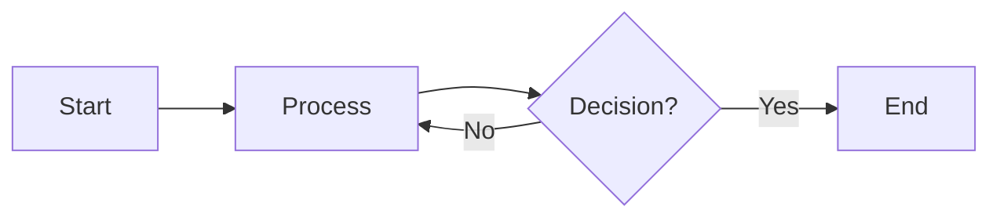
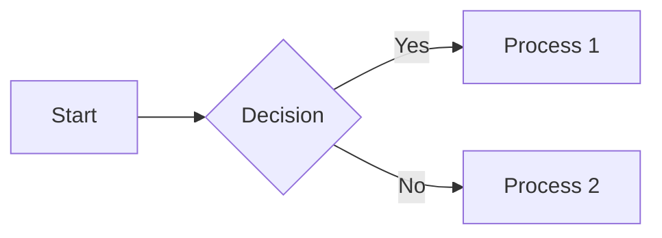
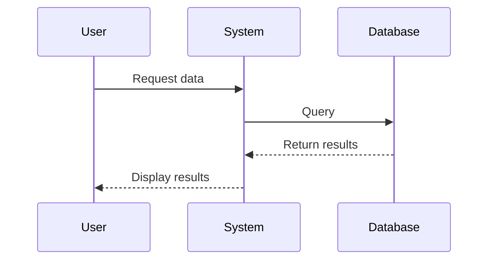
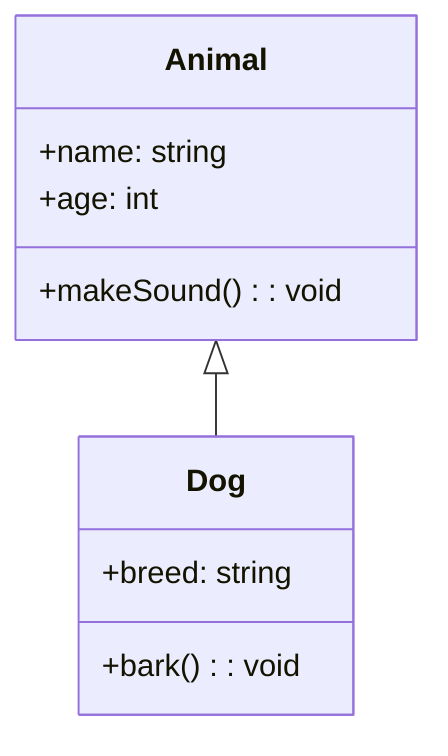
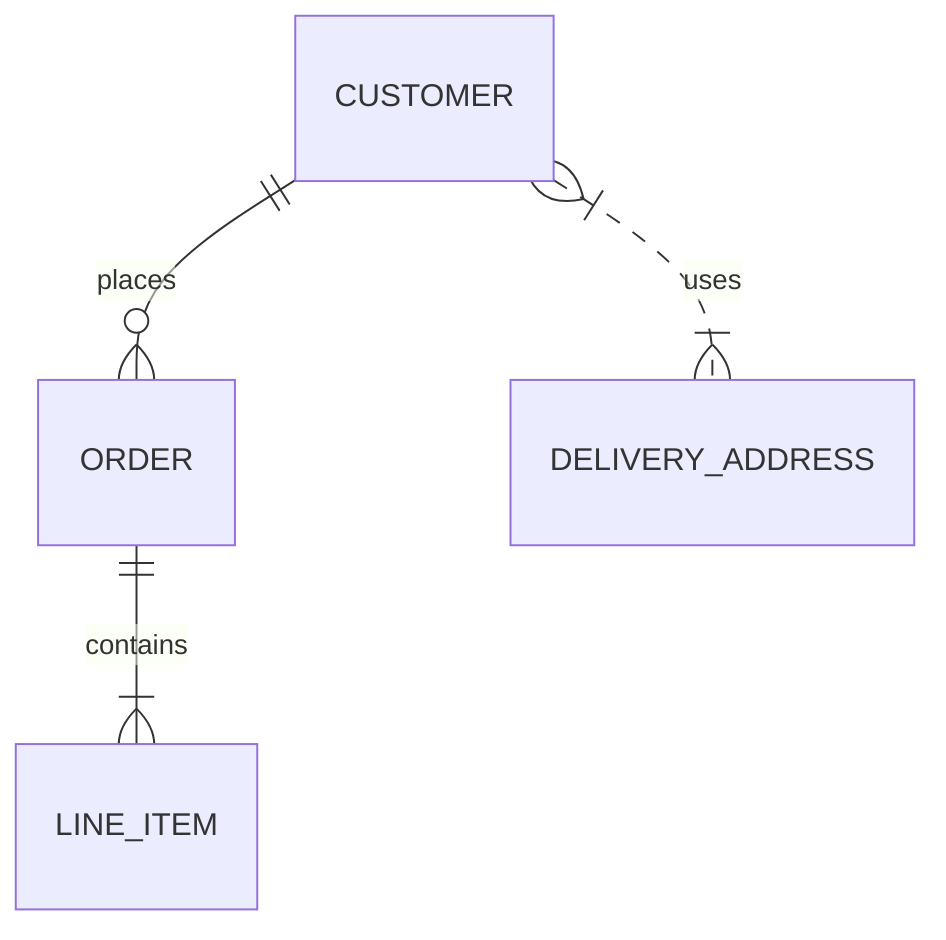
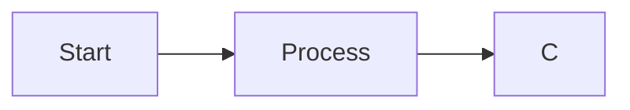

# 📊 Practical Mermaid Guide for VS Code Users

> This guide provides practical, hands-on instructions for using Mermaid diagrams effectively in Visual Studio Code, with a focus on the workflow and features available in VS Code 1.100+.

[](https://code.visualstudio.com/)
[](https://mermaid.js.org/)
[](https://www.markdownguide.org/)

## 🚀 Getting Started with Mermaid in VS Code

### 🔧 Setup and Installation

| Step | Description | Details |
|------|-------------|---------|
| 1️⃣ **Basic Setup** | VS Code's built-in support | ✅ VS Code has built-in support for Mermaid preview in Markdown files<br>📄 Create a new markdown file (.md) to get started |
| 2️⃣ **Enhanced Experience** | Recommended extensions | 🧩 Install the "Markdown Preview Mermaid Support" extension<br>🔍 Install "Mermaid Preview" for a dedicated preview panel |
| 3️⃣ **Configuration** | Enable in settings.json | See configuration below |

```json
// settings.json
"markdown.mermaid.enableMermaid": true
```

> 💡 **Pro Tip:** Once you've installed the extensions, you can preview Mermaid diagrams with `Ctrl+K V` (Windows/Linux) or `Cmd+K V` (macOS)

### 📝 Creating Your First Diagram


In a Markdown file, create your first diagram:

```markdown
# My First Diagram


```

Press Ctrl+K V (Cmd+K V on Mac) to open the Markdown preview and see your diagram rendered.

## 🤖 Using VS Code 1.100+ AI Features with Mermaid


### ⚙️ Setting Up Custom Instructions for Mermaid

| Step | Action |
|------|--------|
| 1️⃣ | Open VS Code Chat (View > Command Palette > "Chat: Focus on Chat View") |
| 2️⃣ | Click the settings icon (⚙️) and select "Custom Instructions" |
| 3️⃣ | Add Mermaid-specific instructions as shown below |

```text
When creating Mermaid diagrams:

1. Always use valid Mermaid syntax

2. Follow these diagram conventions:
   - flowchart: LR orientation for processes, TD for hierarchies
   - Use consistent shapes across similar diagrams
   - Apply this color palette: primary=#3b82f6, secondary=#10b981, neutral=#6b7280

3. Keep diagrams focused and readable (max 15-20 nodes for flowcharts)

4. Include comments in the Mermaid code explaining complex parts
```

### 📋 Creating Reusable Prompts for Common Diagrams


| Step | Action |
|------|--------|
| 1️⃣ | Open Settings (File > Preferences > Settings) |
| 2️⃣ | Search for "Chat: Reusable Prompts" |
| 3️⃣ | Click "Edit in settings.json" |
| 4️⃣ | Add Mermaid-specific prompts as shown below |

```json
"chat.reusablePrompts": [
    {
        "name": "Create Process Flowchart",
        "prompt": "Create a Mermaid flowchart diagram for the following process: {{process_description}}. Use LR orientation and include decision points where appropriate."
    },
    {
        "name": "Create Sequence Diagram",
        "prompt": "Generate a Mermaid sequence diagram showing the interaction between {{participants}} for the {{scenario_description}}."
    }
]
```

> 💡 **Pro Tip:** Create different prompts for various diagram types and complexity levels to quickly generate diagrams for different purposes

## 📊 Mermaid Diagram Types and VS Code Workflow


### 🔄 Flowcharts

**Basic Structure**:



**VS Code Workflow**:

| Step | Action |
|------|--------|
| 1️⃣ | Type `/Create Process Flowchart` in Chat |
| 2️⃣ | Describe your process in natural language |
| 3️⃣ | The AI generates the Mermaid code |
| 4️⃣ | Copy to your Markdown file |
| 5️⃣ | Preview with Markdown Preview or Mermaid Preview |

> 💡 **Pro Tip**: Use VS Code's "Editor: Column Selection Mode" (Alt+Shift+Mouse drag) to easily indent/format multiple lines of Mermaid code.

### ⏱️ Sequence Diagrams


**Basic Structure**:



**VS Code Workflow**:

| Step | Action |
|------|--------|
| 1️⃣ | Use the reusable prompt for sequence diagrams |
| 2️⃣ | Refine with additional messages to Chat |
| 3️⃣ | For complex diagrams, break into smaller sections |
| 4️⃣ | Use VS Code's snippets feature to create custom snippets |

> 💡 **Pro Tip**: Create a VS Code snippet for sequence diagram participants:

```json
"Mermaid Sequence Participant": {
    "prefix": "mermaid-participant",
    "body": "participant ${1:Actor}",
    "description": "Add a participant to a Mermaid sequence diagram"
}
```

### 📦 Class Diagrams


**Basic Structure**:



**VS Code Workflow**:

| Step | Action |
|------|--------|
| 1️⃣ | Use AI to generate class diagrams from existing code |
| 2️⃣ | Use prompt: "Generate a class diagram for the code in file X" |
| 3️⃣ | Refine relationships as needed |
| 4️⃣ | Keep diagram and code in sync using comments to mark sections |

> 💡 **Pro Tip**: Add special comment markers in your code to help the AI identify important classes and relationships that should be included in the diagram

**Tip**: Add special markers in your code comments to identify classes that should be included in diagrams:

```java
/**
 * @diagram Customer class representing system users
 */
class Customer {
    // ...
}
```

### Entity Relationship Diagrams

**Basic Structure**:


**VS Code Workflow**:
1. Create ER diagrams based on database schema
2. Ask Chat to extract entities from SQL files
3. Gradually build and refine relationships
4. Comment entity definitions with their attributes

**Tip**: Use split editor views to keep your schema and diagram side-by-side for easy reference.

## Practical Workflow Techniques

### Diagram-Driven Development

1. **Start with Diagrams**:
   - Create system diagrams before coding
   - Use diagrams to plan and communicate architecture
   - Get feedback on diagrams before implementing

2. **Implementation**:
   - Keep diagrams open in split view while coding
   - Refer to diagrams for component relationships
   - Update diagrams as implementation details emerge

3. **Documentation**:
   - Include finalized diagrams in project documentation
   - Add links from code to relevant diagrams
   - Use diagrams to explain complex systems to new team members

### VS Code Multi-File Workflow

1. **Organizing Diagram Files**:
   - Store diagrams in dedicated directory: `/docs/diagrams/`
   - Use consistent naming: `component_type_diagram.md`
   - Create an index file linking to all diagrams

2. **Workspace Setup**:
   ```json
   // .vscode/settings.json
   {
     "workbench.editorAssociations": {
       "*.mmd": "mermaidPreview.mermaidPreview"
     }
   }
   ```

3. **Using Workspace Symbols**:
   - Add special comment markers for important diagrams
   - Use VS Code's "Go to Symbol in Workspace" to quickly find diagrams

### Version Control Integration

1. **Git Workflow**:
   - Commit diagrams alongside related code changes
   - Include diagram changes in PR descriptions
   - Use Git history to track diagram evolution

2. **Collaborative Editing**:
   - Use VS Code's Live Share feature for real-time collaboration on diagrams
   - Add comments in the Mermaid code for team communication
   - Review diagram changes separately from code changes

## Advanced Mermaid Techniques in VS Code

### Styling and Theming

**Custom Theme Setup**:
```javascript
%%{init: { 
  'theme': 'base',
  'themeVariables': {
    'primaryColor': '#5a67d8',
    'primaryTextColor': '#fff',
    'primaryBorderColor': '#4c51bf',
    'lineColor': '#6b7280',
    'secondaryColor': '#edf2f7',
    'tertiaryColor': '#f7fafc'
  }
}%%
```

**VS Code Tips**:
- Create snippets for common theme configurations
- Store theme configurations in separate files and include them
- Use VS Code color picker to select and insert colors

### Linking Diagrams

**Creating Clickable Areas**:


**VS Code Integration**:
- Link to other files in the workspace using relative paths
- Link to specific sections in documentation
- Link to GitHub issues or other external resources

### Live Editing and Updating

1. **Live Preview**:
   - Use VS Code's "Open Preview to Side" for Markdown files
   - See diagram changes instantly as you type
   - Use split view to see code and rendered diagram simultaneously

2. **Auto-generated Diagrams**:
   - Create scripts that generate Mermaid diagrams from code
   - Use AI to analyze code and suggest diagram updates
   - Automate diagram generation as part of build process

## Troubleshooting Common Mermaid Issues in VS Code

### Syntax Errors

**Common Problems**:
- Missing direction specifiers (LR, TD, etc.)
- Incorrect arrow syntax
- Unescaped characters in labels

**VS Code Solutions**:
- Use the "Problems" panel to identify syntax issues
- Ask Chat to fix diagram syntax errors
- Install "Mermaid Diagram Analyzer" extension for static analysis

### Rendering Issues

**Common Problems**:
- Diagrams too complex to render
- Layout issues with crossing lines
- Text overlapping with shapes

**VS Code Solutions**:
- Simplify complex diagrams or split into multiple
- Use direction hints and layout adjustments
- Ask Chat for layout optimization suggestions

## 🧩 Putting It All Together: The Ultimate VS Code Mermaid Workflow


### 🔄 Complete Diagramming Lifecycle

| Phase | Activities | Tools & Techniques |
|-------|------------|-------------------|
| 📝 **Planning** | <ul><li>Brainstorm diagram types</li><li>Create rough drafts</li><li>Get early feedback</li></ul> | <ul><li>VS Code Chat with custom instructions</li><li>AI-assisted generation</li><li>Reusable prompts</li></ul> |
| 🛠️ **Development** | <ul><li>Keep diagrams and code in sync</li><li>Generate diagrams from code</li><li>Refine as implementation evolves</li></ul> | <ul><li>Code comments with Mermaid markers</li><li>AI code analysis</li><li>Split pane editing</li></ul> |
| 📋 **Documentation** | <ul><li>Add styling and comments</li><li>Include in Markdown docs</li><li>Create diagram navigation</li></ul> | <ul><li>Custom themes</li><li>Markdown integration</li><li>Cross-references</li></ul> |
| 🔄 **Maintenance** | <ul><li>Update with code changes</li><li>Track diagram evolution</li><li>Onboard new team members</li></ul> | <ul><li>Git version control</li><li>Diagram diffs</li><li>Documentation links</li></ul> |

> 💡 **Pro Tip:** Create a `.vscode/diagram-templates.md` file with common diagram templates for your project that team members can copy and customize

## 📚 Additional Resources


### 🧩 VS Code Extensions

| Extension | Description |
|-----------|-------------|
| [Markdown Preview Enhanced](https://marketplace.visualstudio.com/items?itemName=shd101wyy.markdown-preview-enhanced) | Enhanced preview with additional features |
| [Mermaid Preview](https://marketplace.visualstudio.com/items?itemName=bierner.markdown-mermaid) | Dedicated Mermaid diagram preview |
| [Markdown All in One](https://marketplace.visualstudio.com/items?itemName=yzhang.markdown-all-in-one) | Complete Markdown editing tools |

### 🔗 Mermaid Resources

| Resource | Description |
|----------|-------------|
| [Official Mermaid Documentation](https://mermaid-js.github.io/mermaid/) | Complete syntax reference and guides |
| [Mermaid Live Editor](https://mermaid.live/) | Online editor for testing diagrams |
| [GitHub Mermaid Wiki](https://github.com/mermaid-js/mermaid/wiki) | Community examples and best practices |

### 📊 Diagram Examples

Browse additional examples in this project:

| Example Type | File |
|-------------|------|
| Flowcharts | [Flowchart Examples](flowchart_example.md) |
| Sequence Diagrams | [Sequence Diagram Examples](sequence_diagram_example.md) |
| Class Diagrams | [Class Diagram Examples](class_diagram_example.md) |
| System Architecture | [System Architecture Examples](system_architecture_example.md) |

By following this guide, you'll be able to create, maintain, and collaborate on Mermaid diagrams efficiently within VS Code, leveraging the latest AI features in VS Code 1.100+ to streamline your diagramming workflow.

## 🧭 Navigation


| Document | Description |
|----------|-------------|
| [🏠 Main Page](README.md) | Return to the main documentation hub |
| [❓ Diagram FAQ](diagram_faq.md) | Frequently asked questions about diagramming |
| [📊 Advanced Diagram Examples](advanced_diagram_examples.md) | See complex diagram examples |
| [🛠️ Troubleshooting Guide](troubleshooting_guide.md) | Solve common diagram problems |
| [🔍 Diagram Validation Guide](diagram_validation_guide.md) | Learn to validate your diagrams |

### 🔗 Key Resources

| Resource | Description |
|----------|-------------|
| [Mermaid.js Website](https://mermaid-js.github.io/) | Official Mermaid documentation |
| [VS Code Mermaid Extensions](https://marketplace.visualstudio.com/search?term=mermaid&target=VSCode) | Extensions for Mermaid in VS Code |
| [GitHub Mermaid Support](https://docs.github.com/en/get-started/writing-on-github/working-with-advanced-formatting/creating-diagrams) | Using Mermaid in GitHub |
