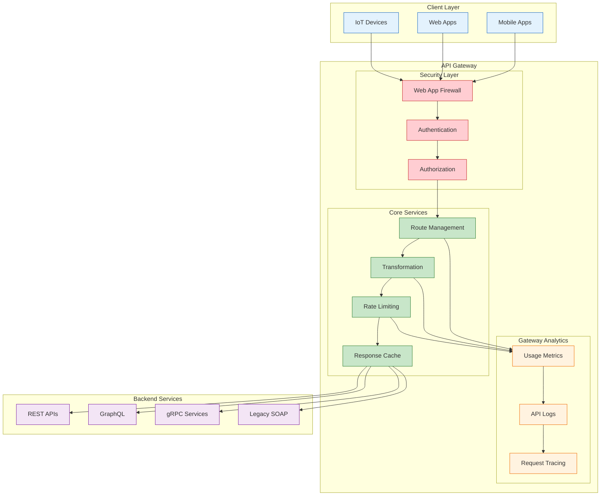

<!--
mode: auto
tools: vscode-markdown, mermaid-preview
-->

# 🔌 API Gateway Integration Patterns Template

Create a comprehensive diagram showing API gateway patterns and integrations.

## Requirements

- Gateway type: [cloud/on-premise/hybrid]
- Integration patterns: [synchronous/asynchronous/hybrid]
- Security requirements: [OAuth/API Key/Custom]
- Scalability needs: [low/medium/high]

## Components

Define the following:
1. Gateway Services
   - Route management
   - Authentication
   - Rate limiting
   - Transformations

2. Backend Services
   - API endpoints
   - Microservices
   - Legacy systems
   - External services

3. Security Layers
   - Authentication
   - Authorization
   - Encryption
   - Threat protection

4. Monitoring & Analytics
   - Usage metrics
   - Performance data
   - Error tracking
   - Business analytics

## Styling Guidelines

- Color code by service type
- Show request flows
- Indicate security checkpoints
- Mark rate limits
- Highlight transformations

## Expected Output

A detailed Mermaid diagram showing the API gateway architecture.

## Example Format

## Additional Context

1. Integration Patterns
   - Request/Response
   - Event-driven
   - Circuit breaking
   - Fallback strategies

2. Performance Optimization
   - Caching strategies
   - Request batching
   - Response compression
   - Connection pooling

3. Security Configuration
   - Authentication methods
   - Authorization rules
   - Rate limit policies
   - IP filtering

4. Monitoring Setup
   - Performance metrics
   - Error tracking
   - Usage analytics
   - Alert configuration

5. Deployment Considerations
   - High availability
   - Load balancing
   - Failover setup
   - Scaling policies
