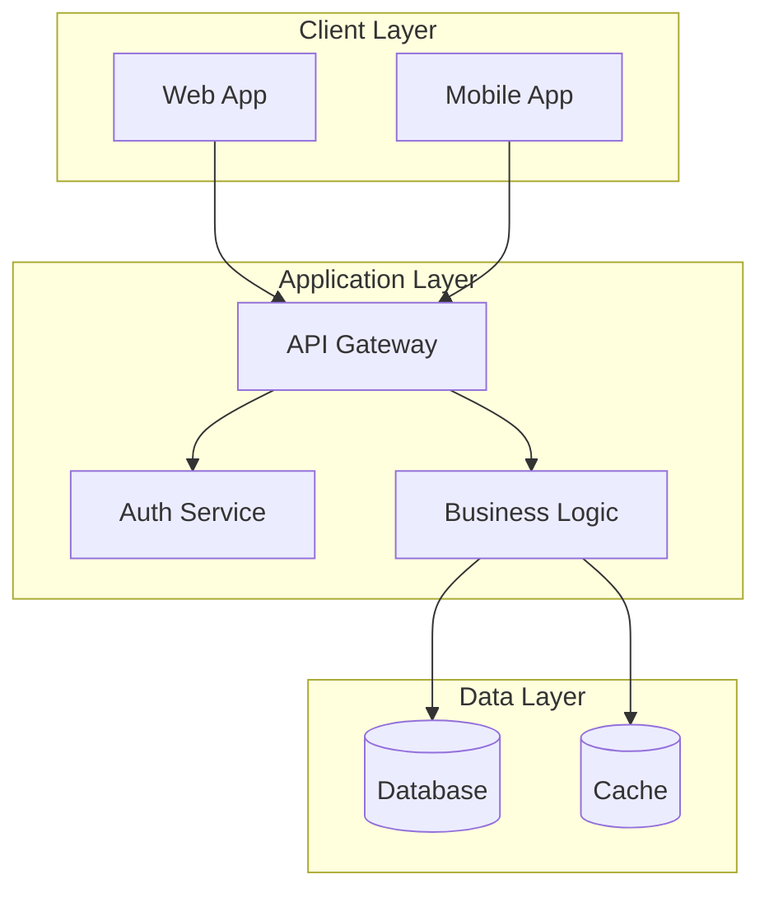

<!--
mode: auto
tools: vscode-markdown, mermaid-preview
-->

# Basic Architecture Diagram Template

Create an architecture diagram showing system structure and component relationships with these specifications:

## Requirements

- Architecture scope: [application/system/enterprise]
- Component types: [services/modules/infrastructure]
- Detail level: [high-level/detailed]

## Components

Define the following:
1. Services: [list main components]
2. Connections: [specify interactions]
3. Data flows: [describe exchanges]
4. Technologies: [list platforms/tools]

## Styling Guidelines

- Use clear component names
- Show proper interaction paths
- Include technology stack labels
- Group related services

## Expected Output

A complete Mermaid architecture diagram showing the system structure.

## Example Format

## Additional Context

Specify any architectural patterns, security requirements, or scalability considerations.
