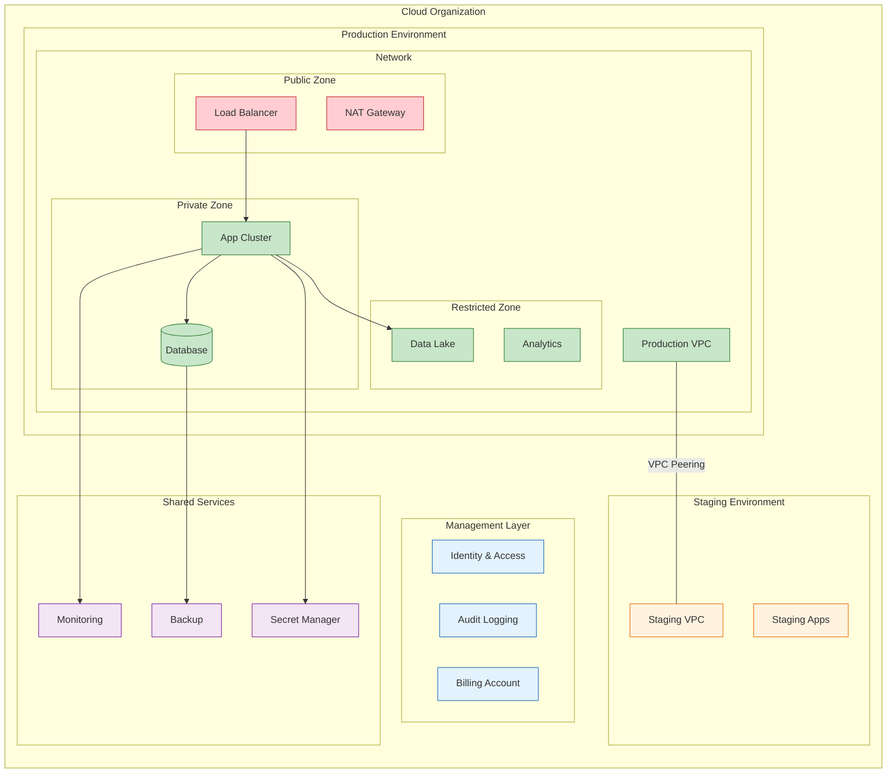

<!--
mode: auto
tools: vscode-markdown, mermaid-preview
-->

# ☁️ Cloud Resource Organization Template

Create a comprehensive diagram showing cloud resource organization and relationships.

## Requirements

- Cloud scope: [single region/multi-region/global]
- Resource structure: [production/staging/development]
- Security zones: [public/private/restricted]
- Compliance needs: [standard/high-security/regulated]

## Components

Define the following:
1. Resource Hierarchy
   - Organization structure
   - Project organization
   - Resource groups
   - Resource tags

2. Network Topology
   - VPC/VNET design
   - Subnet organization
   - Peering connections
   - Transit routing

3. Security Architecture
   - IAM structure
   - Security groups
   - Network policies
   - Compliance controls

4. Service Organization
   - Service dependencies
   - API connections
   - Data flows
   - Management services

## Styling Guidelines

- Color code by security zone
- Group by resource type
- Show network connections
- Indicate compliance scope
- Highlight critical resources

## Expected Output

A detailed Mermaid diagram showing the cloud resource organization.

## Example Format

## Additional Context

1. Resource Management
   - Naming conventions
   - Tagging strategy
   - Cost allocation
   - Resource lifecycle

2. Security Controls
   - Access management
   - Network security
   - Data protection
   - Compliance controls

3. Network Design
   - IP addressing
   - Route tables
   - Security zones
   - Connectivity options

4. Service Dependencies
   - Service accounts
   - API permissions
   - Resource sharing
   - Cross-project access

5. Operational Considerations
   - Monitoring setup
   - Backup strategy
   - Disaster recovery
   - Change management
