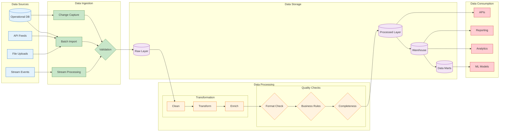

<!--
mode: auto
tools: vscode-markdown, mermaid-preview
-->

# 🔄 Data Pipeline Architecture Template

Create a comprehensive diagram showing data pipeline architecture and data flows.

## Requirements

- Pipeline type: [batch/streaming/hybrid]
- Data volume: [small/medium/large-scale]
- Processing needs: [real-time/near-real-time/batch]
- Quality requirements: [basic/advanced/regulatory]

## Components

Define the following:
1. Data Sources
   - Source systems
   - Input formats
   - Ingestion methods
   - Source validation

2. Processing Stages
   - Data transformation
   - Enrichment steps
   - Quality checks
   - Business rules

3. Storage Layers
   - Raw storage
   - Processed data
   - Data warehouse
   - Data marts

4. Output Channels
   - Analytics systems
   - Reporting tools
   - API endpoints
   - Export formats

## Styling Guidelines

- Color code by stage type
- Show data flows
- Indicate processing steps
- Mark quality gates
- Highlight critical paths

## Expected Output

A detailed Mermaid diagram showing the data pipeline architecture.

## Example Format

## Additional Context

1. Data Management
   - Data governance
   - Metadata management
   - Data catalog
   - Lineage tracking

2. Quality Control
   - Validation rules
   - Error handling
   - Data profiling
   - Quality metrics

3. Performance
   - Scalability design
   - Processing windows
   - Resource allocation
   - Optimization points

4. Operational Aspects
   - Monitoring setup
   - Error recovery
   - SLA management
   - Maintenance windows

5. Security & Compliance
   - Data protection
   - Access control
   - Audit logging
   - Retention policies
