<!--
mode: auto
tools: vscode-markdown, mermaid-preview
-->

# 🏗️ Domain-Driven Design Architecture Template

Create a comprehensive diagram illustrating Domain-Driven Design (DDD) architectural patterns and relationships.

## Requirements

1. Domain Structure
   - Bounded contexts
   - Aggregates
   - Entities
   - Value objects

2. Domain Relationships
   - Context mapping
   - Integration patterns
   - Domain events
   - Anti-corruption layers

3. Strategic Design
   - Core domain
   - Supporting domains
   - Generic domains
   - Domain vision

4. Tactical Design
   - Aggregates
   - Repositories
   - Factories
   - Domain services

## Components

Define the following:

1. Core Components
   - Domain model
   - Business rules
   - Domain services
   - Domain events

2. Technical Components
   - Application services
   - Infrastructure services
   - External interfaces
   - Persistence layer

3. Integration Components
   - Anti-corruption layers
   - Event buses
   - Shared kernels
   - Open host services

4. Supporting Components
   - Validation services
   - Notification services
   - Logging services
   - Monitoring services

## Styling Guidelines

- Group by bounded context
- Show context relationships
- Indicate domain events
- Mark aggregate boundaries
- Highlight core domain

## Example Format

```mermaid
graph TB
    subgraph Core["Core Domain"]
        direction TB
        subgraph OrderContext["Order Context"]
            ORD[Order Aggregate]
            ITEM[OrderItem Entity]
            PRICE[Price ValueObject]
            ORDSERV[Order Service]
        end
        
        subgraph CustomerContext["Customer Context"]
            CUST[Customer Aggregate]
            ADDR[Address ValueObject]
            PREF[Preferences Entity]
            CUSTSERV[Customer Service]
        end
    end

    subgraph Support["Supporting Domains"]
        direction TB
        subgraph BillingContext["Billing Context"]
            INV[Invoice Aggregate]
            PAY[Payment Entity]
            BILL[Billing Service]
        end
        
        subgraph ShippingContext["Shipping Context"]
            SHIP[Shipment Aggregate]
            TRACK[Tracking Entity]
            LOG[Logistics Service]
        end
    end

    subgraph Generic["Generic Domains"]
        direction TB
        subgraph NotificationContext["Notification Context"]
            NOTIF[Notification Service]
            TEMP[Template Engine]
        end
        
        subgraph AnalyticsContext["Analytics Context"]
            ANAL[Analytics Service]
            REPORT[Reporting Engine]
        end
    end

    subgraph Integration["Integration Layer"]
        direction TB
        EVENT[Event Bus]
        ACL[Anti-corruption Layer]
        SHARED[Shared Kernel]
    end

    %% Core Domain Relations
    ORD --> ITEM
    ORD --> PRICE
    ORD --> ORDSERV
    CUST --> ADDR
    CUST --> PREF
    CUST --> CUSTSERV

    %% Supporting Domain Relations
    INV --> PAY
    INV --> BILL
    SHIP --> TRACK
    SHIP --> LOG

    %% Generic Domain Relations
    NOTIF --> TEMP
    ANAL --> REPORT

    %% Integration Relations
    ORD & CUST --> EVENT
    INV & SHIP --> EVENT
    EVENT --> NOTIF
    EVENT --> ANAL
    ACL --> EVENT
    SHARED --> ACL

    classDef core fill:#e3f2fd,stroke:#1565c0
    classDef support fill:#f3e5f5,stroke:#7b1fa2
    classDef generic fill:#e8f5e9,stroke:#2e7d32
    classDef integration fill:#fff3e0,stroke:#ef6c00

    class ORD,ITEM,PRICE,ORDSERV,CUST,ADDR,PREF,CUSTSERV core
    class INV,PAY,BILL,SHIP,TRACK,LOG support
    class NOTIF,TEMP,ANAL,REPORT generic
    class EVENT,ACL,SHARED integration
```

## Additional Context

1. DDD Principles
   - Ubiquitous language
   - Bounded contexts
   - Context mapping
   - Aggregates

2. Design Patterns
   - Repository pattern
   - Factory pattern
   - Specification pattern
   - Event sourcing

3. Implementation Guidelines
   - Rich domain models
   - Anemic domain models
   - CQRS integration
   - Event-driven architecture

4. Architectural Patterns
   - Layered architecture
   - Hexagonal architecture
   - Clean architecture
   - Event-sourced architecture

5. Best Practices
   - Domain modeling
   - Context boundaries
   - Event modeling
   - Integration patterns
