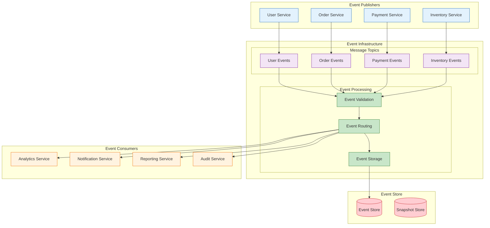

<!--
mode: auto
tools: vscode-markdown, mermaid-preview
-->

# 🔄 Event-Driven Architecture Pattern Template

Create a comprehensive diagram showing event-driven system architecture and patterns.

## Requirements

- Event patterns: [pub-sub/event-streaming/CQRS]
- Messaging system: [Kafka/RabbitMQ/Custom]
- Consistency model: [eventual/strong]
- Scale requirements: [low/medium/high]

## Components

Define the following:
1. Event Sources
   - Publishers
   - Event types
   - Generation patterns
   - Source systems

2. Event Processing
   - Consumers
   - Event handlers
   - Processing logic
   - State management

3. Message Infrastructure
   - Message brokers
   - Topics/Queues
   - Partitioning
   - Replication

4. Integration Points
   - External systems
   - APIs
   - Databases
   - Legacy systems

## Styling Guidelines

- Color code by event type
- Show message flow
- Indicate processing stages
- Mark persistence points
- Highlight critical paths

## Expected Output

A detailed Mermaid diagram showing the event-driven architecture.

## Example Format

## Additional Context

1. Event Design
   - Event schema
   - Versioning
   - Compatibility
   - Documentation

2. Processing Patterns
   - Event sourcing
   - CQRS
   - Saga patterns
   - Event replay

3. Reliability
   - Message persistence
   - Error handling
   - Dead letter queues
   - Retry policies

4. Scalability
   - Partitioning
   - Consumer groups
   - Load balancing
   - Back pressure

5. Monitoring
   - Event tracking
   - Performance metrics
   - Error detection
   - Flow visualization
