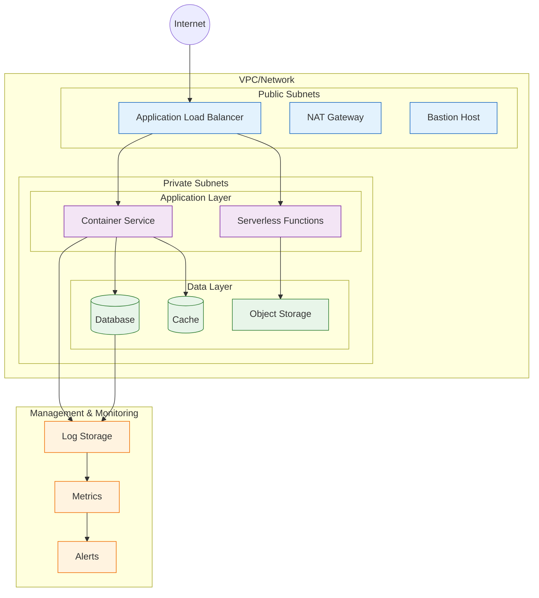

<!--
mode: auto
tools: vscode-markdown, mermaid-preview
-->

# ☁️ Infrastructure as Code Architecture Template

Create a comprehensive IaC architecture diagram showing cloud resources and their relationships.

## Requirements

- Cloud provider: [AWS/Azure/GCP/Multi-cloud]
- Environment type: [production/staging/development]
- Resource scope: [single service/full stack]
- Management tools: [Terraform/CloudFormation/Pulumi]

## Components

Define the following:
1. Network Architecture
   - VPC/VNET structure
   - Subnet organization
   - Security groups
   - Network ACLs

2. Compute Resources
   - Instance types
   - Auto-scaling groups
   - Container services
   - Serverless functions

3. Storage Solutions
   - Object storage
   - Block storage
   - File systems
   - Database instances

4. Management & Monitoring
   - Logging setup
   - Monitoring tools
   - Backup systems
   - Access control

## Styling Guidelines

- Color code by resource type
- Group by network segments
- Show data flow directions
- Indicate high availability
- Mark managed services

## Expected Output

A detailed Mermaid infrastructure diagram.

## Example Format

## Additional Context

1. Resource Management
   - Provisioning workflows
   - State management
   - Version control
   - Change tracking

2. Security Considerations
   - IAM configurations
   - Security groups
   - Key management
   - Compliance requirements

3. High Availability
   - Multi-AZ setup
   - Failover configurations
   - Backup strategies
   - Disaster recovery

4. Cost Optimization
   - Resource sizing
   - Auto-scaling policies
   - Reserved instances
   - Spot instances

5. Operations
   - Deployment strategies
   - Monitoring setup
   - Alerting configuration
   - Maintenance windows
