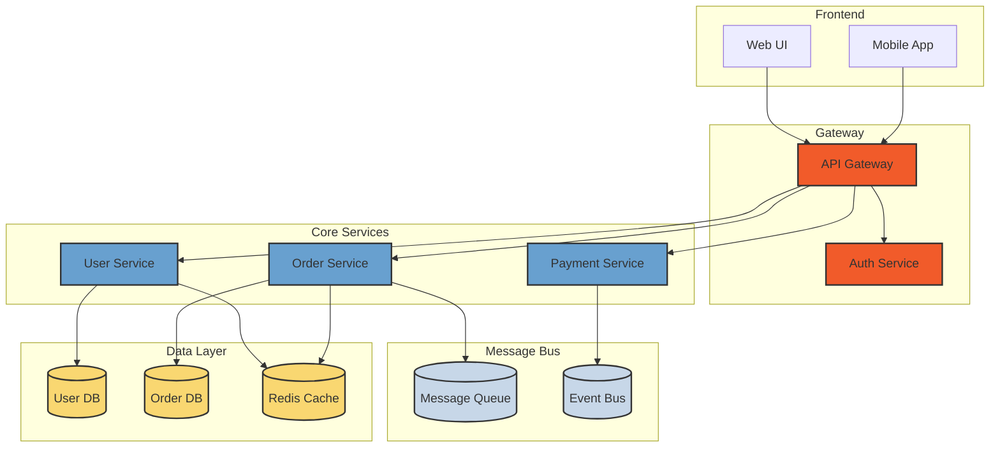

<!--
mode: auto
tools: vscode-markdown, mermaid-preview
-->

# 🏗️ Microservices Architecture Template

Create a detailed architecture diagram for microservices-based systems.

## Requirements

- System scope: [bounded context/full system]
- Service types: [sync/async/hybrid]
- Communication patterns: [REST/Event-driven/gRPC]
- Deployment environment: [cloud/hybrid/on-premise]

## Components

Define the following:
1. Microservices
   - Service name and purpose
   - Technologies used
   - Data store types
2. Communication Patterns
   - Synchronous calls
   - Message queues
   - Event buses
3. External Systems
   - Third-party services
   - Legacy systems
4. Infrastructure
   - Load balancers
   - API gateways
   - Service discovery

## Styling Guidelines

- Color code by service domain
- Use distinct shapes for different component types
- Show communication protocols
- Group related services
- Indicate scalability points

## Expected Output

A complete Mermaid architecture diagram showing the microservices ecosystem.

## Example Format

## Additional Context

- Include scaling indicators
- Note security boundaries
- Show data consistency patterns
- Indicate monitoring points
- Document failover paths
- Specify SLA requirements
