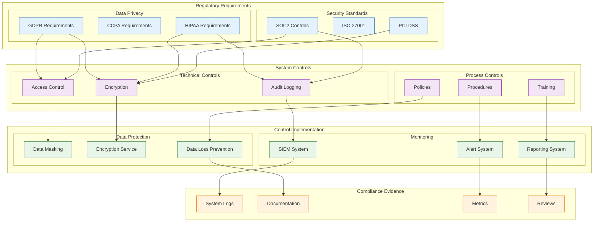

<!--
mode: auto
tools: vscode-markdown, mermaid-preview
-->

# 📋 Regulatory Compliance Mapping Template

Create a comprehensive diagram mapping system components to regulatory requirements and controls.

## Requirements

1. Compliance Frameworks
   - Regulatory standards
   - Industry requirements
   - Internal policies
   - Audit controls

2. System Components
   - Data processing
   - Security controls
   - Access management
   - Audit logging

3. Risk Management
   - Risk assessment
   - Control mapping
   - Gap analysis
   - Remediation plans

4. Documentation
   - Policy documents
   - Procedures
   - Evidence collection
   - Audit trails

## Components

Define the following:

1. Regulatory Requirements
   - Standards (e.g., GDPR, HIPAA)
   - Controls & objectives
   - Compliance criteria
   - Reporting requirements

2. System Controls
   - Technical controls
   - Administrative controls
   - Physical controls
   - Compensating controls

3. Monitoring Systems
   - Compliance monitoring
   - Control effectiveness
   - Policy enforcement
   - Violation detection

4. Reporting Systems
   - Compliance reports
   - Audit evidence
   - Status dashboards
   - Risk registers

## Styling Guidelines

- Group by requirement domain
- Show control mappings
- Indicate control status
- Mark audit points
- Highlight gaps

## Example Format

## Additional Context

1. Compliance Strategy
   - Framework selection
   - Control design
   - Implementation planning
   - Continuous monitoring

2. Documentation Requirements
   - Policy documentation
   - Procedure manuals
   - Evidence collection
   - Audit preparation

3. Risk Assessment
   - Risk identification
   - Impact analysis
   - Control effectiveness
   - Gap remediation

4. Monitoring Program
   - Control testing
   - Compliance scanning
   - Policy enforcement
   - Incident response

5. Best Practices
   - Control automation
   - Evidence collection
   - Documentation updates
   - Staff training
