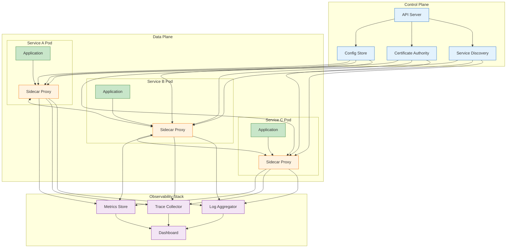

<!--
mode: auto
tools: vscode-markdown, mermaid-preview
-->

# 🌐 Service Mesh Architecture Template

Create a comprehensive diagram showing service mesh architecture and traffic management.

## Requirements

- Mesh type: [sidecar/proxyless]
- Platform: [Kubernetes/VMs/hybrid]
- Features: [traffic management/security/observability]
- Scale: [small/medium/large cluster]

## Components

Define the following:
1. Data Plane
   - Service proxies
   - Sidecar containers
   - Traffic routing
   - Load balancing

2. Control Plane
   - Configuration API
   - Service discovery
   - Certificate management
   - Policy enforcement

3. Observability Stack
   - Metrics collection
   - Distributed tracing
   - Access logging
   - Health monitoring

4. Security Features
   - mTLS setup
   - Authentication
   - Authorization
   - Certificate rotation

## Styling Guidelines

- Color code by plane type
- Show traffic flows
- Indicate security boundaries
- Mark monitoring points
- Highlight control paths

## Expected Output

A detailed Mermaid diagram showing the service mesh architecture.

## Example Format

## Additional Context

1. Traffic Management
   - Routing rules
   - Load balancing
   - Circuit breaking
   - Fault injection

2. Security Configuration
   - Identity management
   - Access policies
   - Encryption setup
   - Certificate management

3. Observability Setup
   - Metric collection
   - Trace sampling
   - Log aggregation
   - Dashboard configuration

4. Deployment Considerations
   - Proxy injection
   - Resource requirements
   - High availability
   - Upgrade strategy

5. Performance Impact
   - Latency overhead
   - Resource usage
   - Cache optimization
   - Connection pooling
