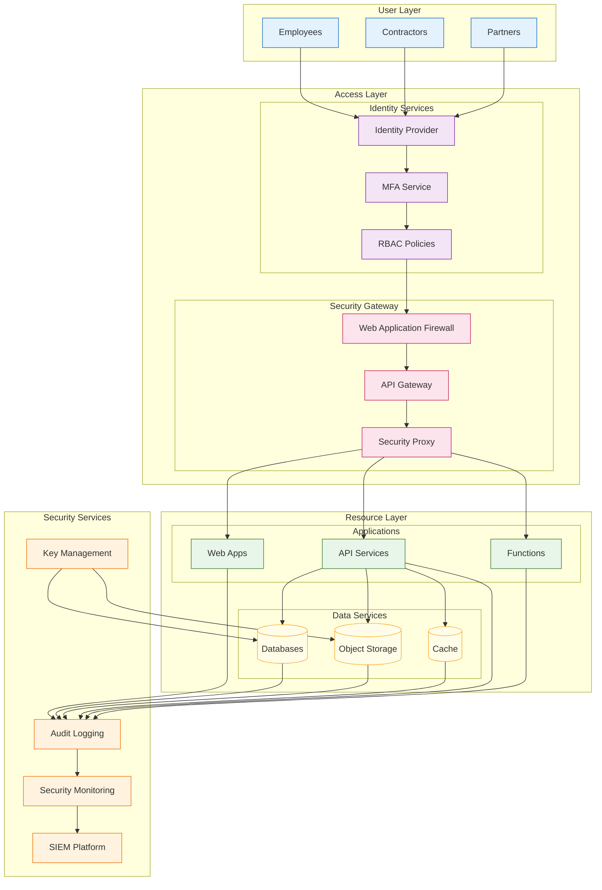

<!--
mode: auto
tools: vscode-markdown, mermaid-preview
-->

# 🔐 Zero Trust Security Architecture Template

Create a comprehensive diagram illustrating a Zero Trust security model for enterprise applications.

## Requirements

1. Security Boundaries
   - Network segmentation
   - Identity perimeter
   - Resource isolation

2. Access Controls
   - Authentication methods
   - Authorization policies
   - Session management

3. Monitoring & Telemetry
   - Logging points
   - Analytics collection
   - Threat detection

4. Data Protection
   - Encryption layers
   - Key management
   - Data classification

## Components

Define the following:

1. Identity & Access
   - Identity providers
   - MFA systems
   - Policy engines
   - Access gateways

2. Network Security
   - Micro-segmentation
   - Traffic inspection
   - VPN/network isolation
   - DDoS protection

3. Resource Protection
   - API gateways
   - Service meshes
   - Workload isolation
   - Secret management

4. Security Operations
   - SIEM integration
   - Audit logging
   - Compliance monitoring
   - Incident response

## Styling Guidelines

- Use clear boundary indicators
- Color code trust zones
- Show security checkpoints
- Mark data classifications
- Indicate encryption points

## Example Format

## Additional Context

1. Zero Trust Principles
   - Never trust, always verify
   - Least privilege access
   - Assume breach
   - Explicit trust verification

2. Implementation Guidelines
   - Strong identity foundation
   - Device-based trust conditions
   - Context-based access controls
   - Dynamic policy enforcement

3. Key Features
   - End-to-end encryption
   - Continuous monitoring
   - Automated response
   - Compliance controls

4. Security Layers
   - User identity verification
   - Device security posture
   - Network security controls
   - Application security
   - Data security

5. Best Practices
   - Regular policy reviews
   - Security telemetry
   - Automated remediation
   - Incident response plans
