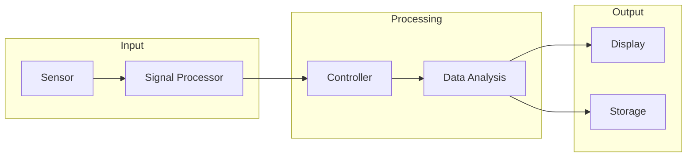

<!--
mode: auto
tools: vscode-markdown, mermaid-preview
-->

# Basic Block Diagram Template

Create a block diagram showing system components and their connections with these specifications:

## Requirements

- System scope: [subsystem/full system]
- Connection types: [data flow/control flow/both]
- Detail level: [overview/detailed]

## Components

Define the following:
1. Blocks: [list main components]
2. Connections: [list relationships]
3. Interfaces: [specify interaction points]
4. Labels: [connection descriptions]

## Styling Guidelines

- Use descriptive block names
- Show clear connection paths
- Include interface descriptions
- Group related components

## Expected Output

A complete Mermaid block diagram showing the system structure.

## Example Format

## Additional Context

Specify any system constraints, interface requirements, or architectural considerations.
