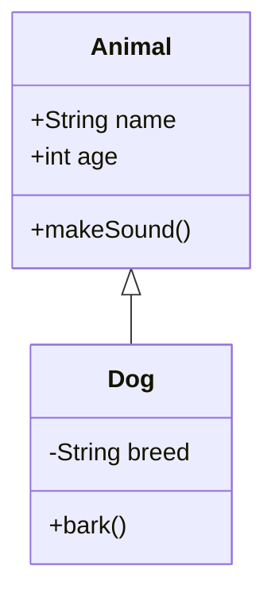

<!--
mode: auto
tools: vscode-markdown, mermaid-preview
-->

# Basic Class Diagram Template

Create a class diagram showing the structure and relationships between classes with these specifications:

## Requirements

- Diagram scope: [single class/multiple classes/package]
- Relationship types: [inheritance/composition/aggregation]
- Detail level: [basic/detailed/complete]

## Components

Define the following:
1. Classes: [list main classes]
2. Attributes: [list key properties]
3. Methods: [list important operations]
4. Relationships: [describe connections between classes]

## Styling Guidelines

- Use proper UML notation
- Show appropriate visibility modifiers (+, -, #)
- Include meaningful relationship labels
- Group related classes together

## Expected Output

A complete Mermaid class diagram showing the class structure and relationships.

## Example Format

## Additional Context

Specify any design patterns, architectural constraints, or special requirements.
