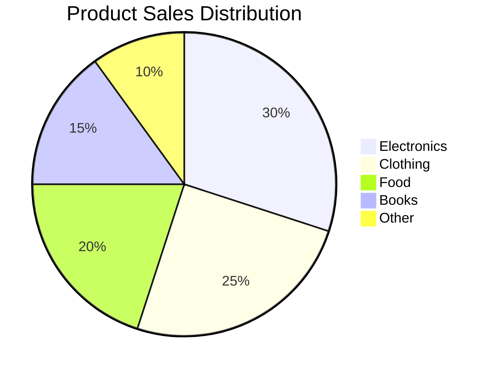

<!--
mode: auto
tools: vscode-markdown, mermaid-preview
-->

# Basic Data Visualization Template

Create a data visualization diagram showing data patterns and insights with these specifications:

## Requirements

- Chart type: [pie/bar/line/combination]
- Data complexity: [simple/multiple series]
- Visualization purpose: [comparison/trend/distribution]

## Components

Define the following:
1. Data series: [list datasets]
2. Labels: [axis and data labels]
3. Legend: [series descriptions]
4. Scales: [value ranges]

## Styling Guidelines

- Use clear data labels
- Show proper axis scales
- Include meaningful colors
- Add descriptive title

## Expected Output

A complete Mermaid data visualization showing the data representation.

## Example Format

## Additional Context

Specify any data formatting, scale requirements, or visual preferences.
