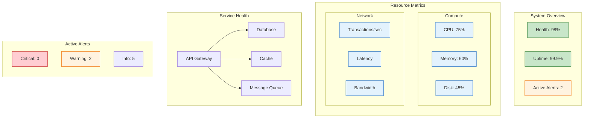

<!--
mode: auto
tools: vscode-markdown, mermaid-preview
-->

# 📊 System Monitoring Dashboard Template

Create a comprehensive monitoring dashboard showing system health and metrics.

## Requirements

- Monitoring scope: [application/infrastructure/full-stack]
- Update frequency: [real-time/interval-based]
- Alert levels: [info/warning/critical]
- Visualization types: [metrics/logs/traces]

## Components

Define the following:
1. System Metrics
   - Resource utilization
   - Performance metrics
   - Error rates
   - Business KPIs

2. Health Indicators
   - Service status
   - Dependency health
   - SLA compliance
   - Response times

3. Alert Management
   - Threshold definitions
   - Notification rules
   - Escalation paths
   - On-call rotations

4. Trend Analysis
   - Historical data
   - Pattern detection
   - Capacity planning
   - Forecasting

## Styling Guidelines

- Color code by severity
- Group related metrics
- Show threshold lines
- Indicate alert states
- Highlight anomalies

## Expected Output

A detailed Mermaid diagram showing the monitoring dashboard layout.

## Example Format

## Additional Context

1. Metric Collection
   - Data sources
   - Collection intervals
   - Retention policies
   - Aggregation rules

2. Alert Configuration
   - Threshold levels
   - Alert conditions
   - Notification channels
   - Response procedures

3. Dashboard Organization
   - Layout structure
   - Metric grouping
   - Time ranges
   - Refresh rates

4. User Experience
   - Navigation flow
   - Drill-down paths
   - Filter options
   - Export capabilities

5. Integration Points
   - Data sources
   - Alert systems
   - Ticketing systems
   - Communication tools
