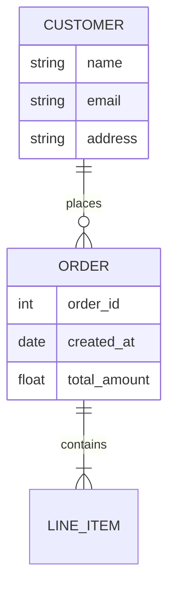

<!--
mode: auto
tools: vscode-markdown, mermaid-preview
-->

# Basic Entity Relationship Diagram Template

Create an ERD showing the database structure and relationships with these specifications:

## Requirements

- Database scope: [single table/multiple tables/full schema]
- Relationship types: [one-to-one/one-to-many/many-to-many]
- Notation style: [Chen/Crow's Foot/UML]

## Components

Define the following:
1. Entities: [list main tables/entities]
2. Attributes: [list key fields]
3. Primary/Foreign Keys: [specify key fields]
4. Relationships: [describe connections between entities]

## Styling Guidelines

- Use clear entity names
- Show proper attribute types
- Include cardinality markers
- Group related entities together

## Expected Output

A complete Mermaid ERD showing the database structure and relationships.

## Example Format

## Additional Context

Specify any database constraints, indexing requirements, or special considerations.
