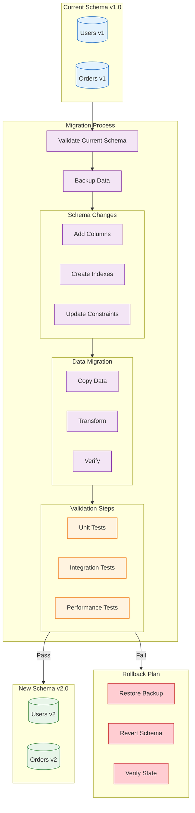

<!--
mode: auto
tools: vscode-markdown, mermaid-preview
-->

# 🗃️ Database Schema Evolution Template

Create a comprehensive diagram showing database schema changes and migration strategies.

## Requirements

- Database type: [relational/NoSQL/hybrid]
- Migration scope: [table/schema/database]
- Compatibility: [backward/forward/both]
- Deployment strategy: [rolling/blue-green/canary]

## Components

Define the following:
1. Schema Changes
   - Table modifications
   - Column changes
   - Index updates
   - Constraint changes

2. Migration Steps
   - Pre-migration checks
   - Data transformation
   - Validation steps
   - Rollback procedures

3. Version Management
   - Schema versions
   - Code dependencies
   - API compatibility
   - Client updates

4. Data Handling
   - Data copying
   - Temporary tables
   - Data validation
   - Cleanup procedures

## Styling Guidelines

- Color code by change type
- Show migration sequence
- Indicate validation points
- Mark critical steps
- Highlight rollback paths

## Expected Output

A detailed Mermaid diagram showing the schema evolution process.

## Example Format

## Additional Context

1. Migration Planning
   - Impact assessment
   - Downtime requirements
   - Resource needs
   - Timeline planning

2. Testing Strategy
   - Unit testing
   - Integration testing
   - Performance testing
   - Data validation

3. Rollback Planning
   - Trigger conditions
   - Recovery procedures
   - Data preservation
   - Service restoration

4. Communication Plan
   - Stakeholder notification
   - Maintenance windows
   - Progress updates
   - Issue escalation

5. Documentation
   - Schema changes
   - Migration steps
   - Validation criteria
   - Rollback procedures
