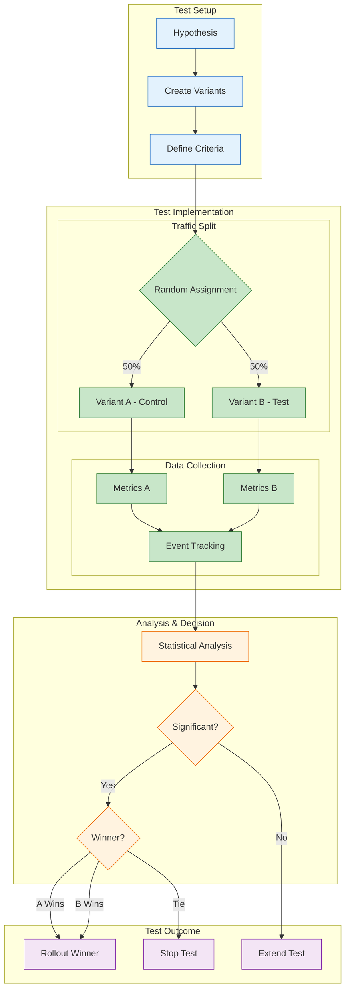

<!--
mode: auto
tools: vscode-markdown, mermaid-preview
-->

# 🔄 A/B Testing Flow Template

Create a comprehensive diagram showing A/B testing workflow and analysis.

## Requirements

- Test scope: [UI/backend/full-stack]
- Target audience: [all users/segment/percentage]
- Metrics: [conversion/engagement/performance]
- Duration: [fixed/dynamic]

## Components

Define the following:
1. Test Setup
   - Hypothesis definition
   - Variant creation
   - Traffic allocation
   - Control group

2. Implementation
   - Feature toggles
   - User segmentation
   - Data collection
   - Analytics setup

3. Monitoring
   - Real-time metrics
   - Statistical analysis
   - Error tracking
   - User feedback

4. Decision Making
   - Success criteria
   - Statistical significance
   - Roll-out strategy
   - Rollback plan

## Styling Guidelines

- Color code by variant
- Show user flows
- Indicate measurement points
- Mark decision gates
- Highlight winning path

## Expected Output

A detailed Mermaid diagram showing the A/B testing process.

## Example Format

## Additional Context

1. Test Design
   - Hypothesis formulation
   - Sample size calculation
   - Duration estimation
   - Success metrics

2. Implementation Details
   - Feature flags
   - User targeting
   - Data tracking
   - Error handling

3. Analysis Setup
   - Statistical methods
   - Confidence levels
   - Segment analysis
   - Bias detection

4. Decision Framework
   - Success thresholds
   - Rollout criteria
   - Stakeholder communication
   - Documentation needs

5. Best Practices
   - Single variable testing
   - Adequate sample size
   - Test isolation
   - Monitoring plan
