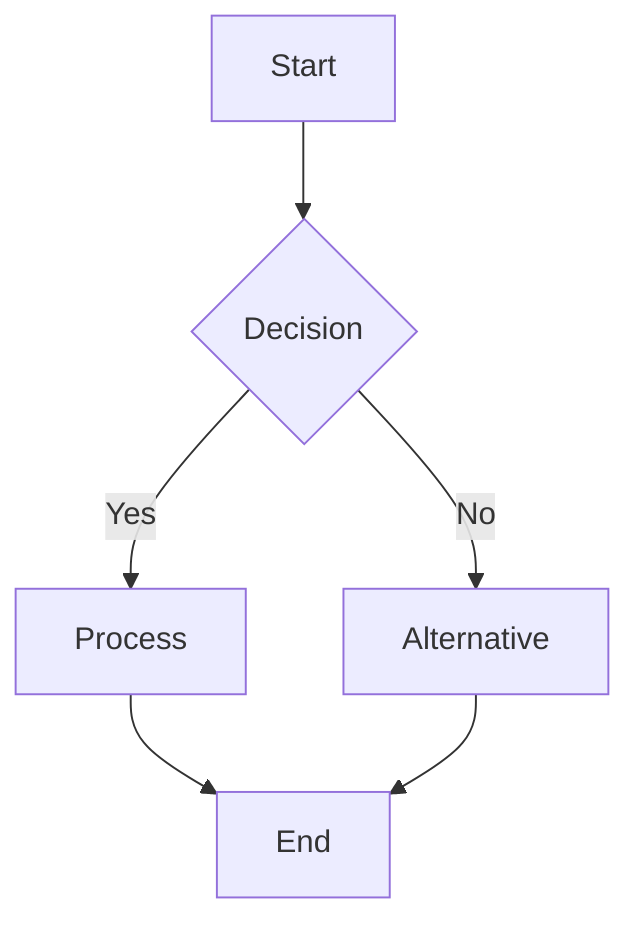

<!--
mode: auto
tools: vscode-markdown, mermaid-preview
-->

# Basic Flowchart Template

Create a clear flowchart diagram with the following specifications:

## Requirements

- Orientation: [TD (top-down) / LR (left-right)]
- Complexity level: [basic/intermediate/complex]
- Purpose: [describe the process or workflow to diagram]

## Components

List the main components to include:
1. Start point: [description]
2. Process steps: [list main steps]
3. Decision points: [list decisions]
4. End point(s): [description]

## Styling Guidelines

- Use consistent node shapes for similar types of steps
- Apply meaningful colors for different node types
- Include descriptive labels
- Group related items using subgraphs if needed

## Expected Output

A complete Mermaid flowchart diagram that clearly shows the process flow.

## Example Format

## Additional Context

Describe any specific requirements or constraints for the diagram.
