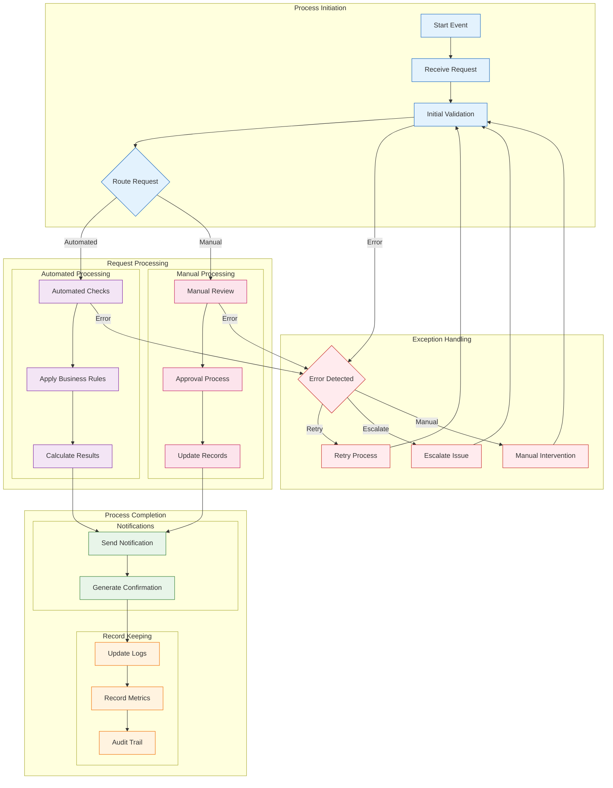

<!--
mode: auto
tools: vscode-markdown, mermaid-preview
-->

# 🏢 Business Process Modeling Template

Create a comprehensive diagram modeling business processes, workflows, and decision points.

## Requirements

1. Process Components
   - Activities
   - Decisions
   - Events
   - Gateways

2. Process Flow
   - Sequence flows
   - Message flows
   - Event triggers
   - Exception paths

3. Process Actors
   - Roles
   - Systems
   - Departments
   - External entities

4. Process Metrics
   - KPIs
   - SLAs
   - Measurements
   - Outcomes

## Components

Define the following:

1. Core Elements
   - Start/end events
   - Activities/tasks
   - Decision points
   - Process paths

2. Supporting Elements
   - Documentation
   - Resources
   - Systems
   - Data stores

3. Control Elements
   - Business rules
   - Validations
   - Approvals
   - Notifications

4. Monitoring Elements
   - Performance metrics
   - Quality checks
   - Status tracking
   - Results capture

## Styling Guidelines

- Group by process phase
- Show actor swimlanes
- Indicate decision points
- Mark critical paths
- Highlight exceptions

## Example Format

## Additional Context

1. Process Design
   - Process objectives
   - Process scope
   - Process boundaries
   - Process interfaces

2. Performance Measures
   - Process efficiency
   - Process quality
   - Process compliance
   - Process outcomes

3. Process Integration
   - System integration
   - Data integration
   - Role integration
   - External integration

4. Process Documentation
   - Process maps
   - Work instructions
   - Role descriptions
   - Training materials

5. Best Practices
   - Process optimization
   - Exception handling
   - Change management
   - Continuous improvement
