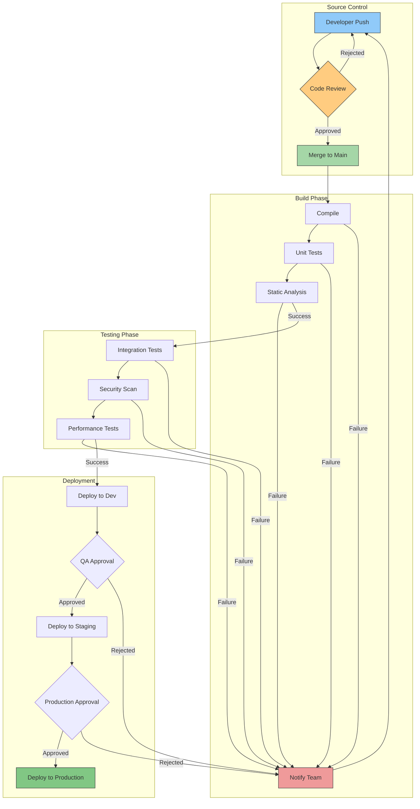

<!--
mode: auto
tools: vscode-markdown, mermaid-preview
-->

# 🔄 CI/CD Pipeline Flowchart Template

Create a detailed flowchart showing the continuous integration and deployment pipeline.

## Requirements

- Pipeline type: [basic/advanced/enterprise]
- Environment stages: [dev/staging/prod]
- Automation level: [partial/full]
- Security requirements: [basic/advanced]

## Components

Define the following:
1. Source Control
   - Branch strategies
   - Code review points
2. Build Process
   - Compilation steps
   - Unit tests
   - Code analysis
3. Testing Phases
   - Integration tests
   - Security scans
   - Performance tests
4. Deployment Stages
   - Environment promotions
   - Approval gates
   - Rollback procedures

## Styling Guidelines

- Color code by stage type
- Use distinct shapes for different steps
- Show parallel processes
- Indicate manual checkpoints
- Highlight failure paths

## Expected Output

A complete Mermaid flowchart showing the CI/CD pipeline.

## Example Format

## Additional Context

- Include monitoring points
- Note required approvals
- Document quality gates
- Specify SLA metrics
- List notification triggers
- Include artifact storage
- Document compliance checks
