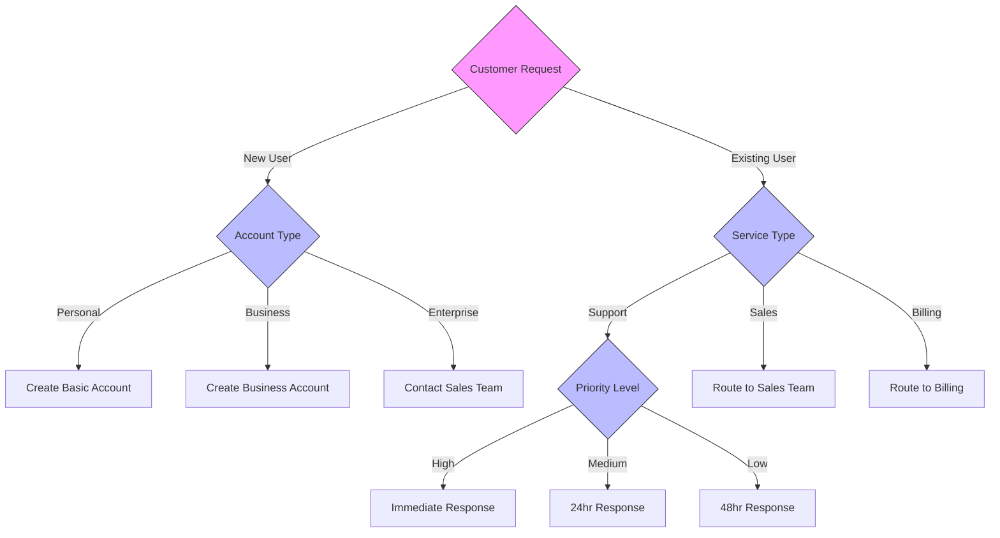

<!--
mode: auto
tools: vscode-markdown, mermaid-preview
-->

# 🔄 Decision Tree Flowchart Template

Create a decision tree flowchart for complex decision-making processes.

## Requirements

- Decision type: [business/technical/operational]
- Complexity: [2-3 levels/4+ levels]
- Outcome types: [binary/multiple]
- Branch conditions: [specify criteria]

## Components

Define the following:
1. Initial question/condition
2. Decision nodes with criteria
3. Branch paths
4. Terminal outcomes
5. Probability values (optional)

## Styling Guidelines

- Use diamond shapes for decisions
- Rectangle shapes for outcomes
- Color code by decision type
- Include probability percentages
- Add descriptive edge labels

## Expected Output

A complete Mermaid decision tree showing the decision-making process.

## Example Format

## Additional Context

- Include success/failure probabilities
- Add time estimates for each path
- Note resource requirements
- Highlight critical decision points
