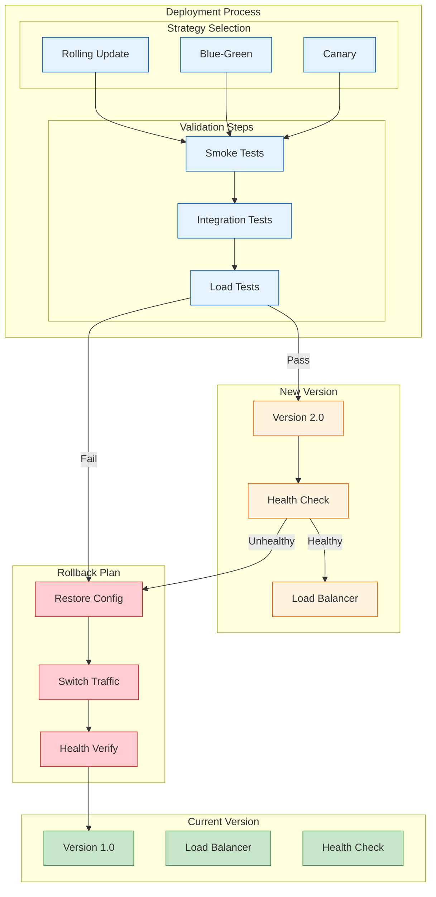

<!--
mode: auto
tools: vscode-markdown, mermaid-preview
-->

# 🚀 Deployment Strategy Patterns Template

Create a comprehensive diagram showing different deployment strategies and patterns.

## Requirements

- Strategy type: [rolling/blue-green/canary]
- Environment: [cloud/on-premise/hybrid]
- Scale: [small/medium/large]
- Risk level: [low/medium/high]

## Components

Define the following:
1. Deployment Types
   - Strategy patterns
   - Traffic routing
   - Version management
   - Rollback procedures

2. Infrastructure Setup
   - Load balancers
   - Service discovery
   - Health checks
   - Monitoring points

3. Release Process
   - Version control
   - Build pipeline
   - Testing stages
   - Approval gates

4. Validation Steps
   - Health checks
   - Smoke tests
   - Performance tests
   - User acceptance

## Styling Guidelines

- Color code by deployment stage
- Show traffic routing
- Indicate health status
- Mark verification points
- Highlight rollback paths

## Expected Output

A detailed Mermaid diagram showing deployment strategies.

## Example Format

## Additional Context

1. Strategy Selection
   - Risk assessment
   - Downtime requirements
   - Resource needs
   - Rollback capability

2. Validation Requirements
   - Testing strategy
   - Success criteria
   - Performance baselines
   - Monitoring setup

3. Rollback Planning
   - Trigger conditions
   - Data handling
   - State management
   - Communication plan

4. Infrastructure Setup
   - Load balancing
   - Service discovery
   - Health monitoring
   - Traffic routing

5. Operational Considerations
   - Monitoring strategy
   - Alert configuration
   - Documentation needs
   - Team coordination
