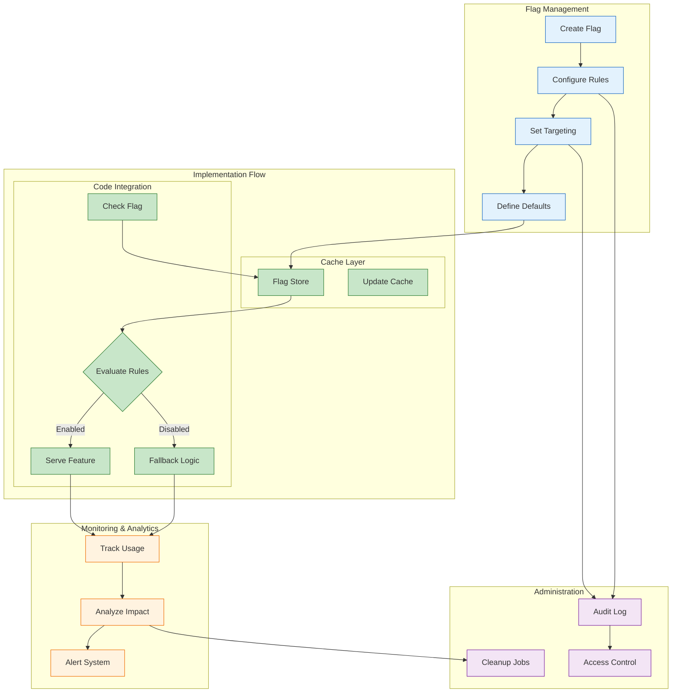

<!--
mode: auto
tools: vscode-markdown, mermaid-preview
-->

# 🚩 Feature Flag Implementation Flow Template

Create a comprehensive diagram showing feature flag management and implementation flow.

## Requirements

- Flag scope: [UI/backend/full-stack]
- Environment: [development/staging/production]
- Target type: [user/account/percentage]
- Evaluation: [simple/rule-based/complex]

## Components

Define the following:
1. Flag Management
   - Flag definition
   - Configuration
   - Targeting rules
   - Override settings

2. Implementation Flow
   - Code integration
   - Rule evaluation
   - Default behavior
   - Fallback handling

3. Monitoring System
   - Usage tracking
   - Performance impact
   - Error logging
   - Analytics data

4. Administration
   - Access control
   - Audit logging
   - Change management
   - Flag cleanup

## Styling Guidelines

- Color code by flag state
- Show evaluation flow
- Indicate decision points
- Mark monitoring points
- Highlight critical paths

## Expected Output

A detailed Mermaid diagram showing the feature flag implementation.

## Example Format

## Additional Context

1. Flag Design
   - Naming conventions
   - Flag types
   - Default values
   - Cleanup strategy

2. Implementation Details
   - SDK integration
   - Caching strategy
   - Performance impact
   - Error handling

3. Monitoring Setup
   - Usage metrics
   - Performance tracking
   - Error reporting
   - Impact analysis

4. Administration
   - Access levels
   - Audit requirements
   - Change tracking
   - Cleanup process

5. Best Practices
   - Testing strategy
   - Gradual rollout
   - Emergency switches
   - Documentation
