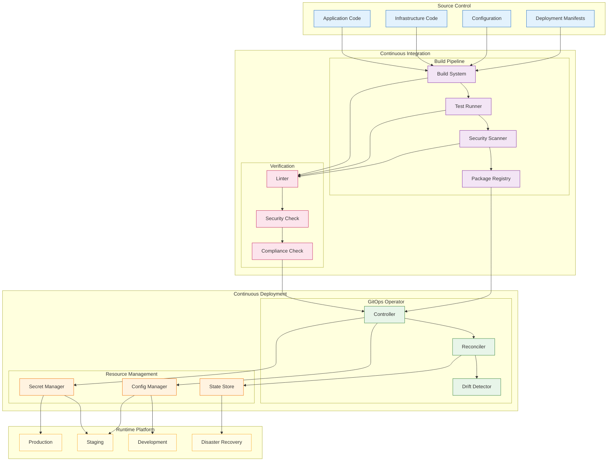

<!--
mode: auto
tools: vscode-markdown, mermaid-preview
-->

# 🔄 GitOps Workflow Template

Create a comprehensive diagram showing GitOps workflow for continuous deployment and infrastructure management.

## Requirements

1. Source Control
   - Application code
   - Infrastructure code
   - Configuration files
   - Deployment manifests

2. Automation Components
   - CI pipeline
   - CD operators
   - State reconciliation
   - Drift detection

3. Environment Management
   - Development
   - Staging
   - Production
   - Disaster recovery

4. Monitoring & Control
   - Deployment status
   - System health
   - Audit logging
   - Rollback procedures

## Components

Define the following:

1. Git Components
   - Application repository
   - Infrastructure repository
   - Environment configs
   - Deployment manifests

2. CI Pipeline Components
   - Build system
   - Test runners
   - Security scanning
   - Artifact registry

3. CD Components
   - GitOps operator
   - Config manager
   - Secret manager
   - State store

4. Platform Components
   - Kubernetes clusters
   - Service mesh
   - Monitoring stack
   - Logging system

## Styling Guidelines

- Group by workflow stage
- Show automation flows
- Indicate sync points
- Mark verification steps
- Highlight security checks

## Example Format

## Additional Context

1. GitOps Principles
   - Declarative configuration
   - Version controlled
   - Automated operations
   - Continuous reconciliation

2. Implementation Strategy
   - Repository structure
   - Branch strategies
   - Pull request flows
   - Review processes

3. Security Considerations
   - Secrets management
   - Access controls
   - Audit requirements
   - Compliance checks

4. Operational Procedures
   - Deployment strategies
   - Rollback procedures
   - Disaster recovery
   - Incident response

5. Best Practices
   - Infrastructure as code
   - Configuration management
   - Environment parity
   - Monitoring and observability
