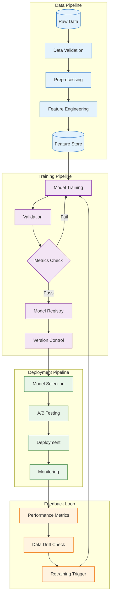

<!--
mode: auto
tools: vscode-markdown, mermaid-preview
-->

# 🤖 Machine Learning Pipeline Template

Create a comprehensive diagram showing the ML pipeline from data ingestion to model deployment.

## Requirements

- Pipeline type: [training/inference/both]
- Model type: [classification/regression/deep learning]
- Deployment target: [cloud/edge/hybrid]
- Monitoring needs: [basic/advanced]

## Components

Define the following:
1. Data Flow
   - Data sources
   - Preprocessing steps
   - Feature engineering
   - Data validation

2. Model Pipeline
   - Training process
   - Validation steps
   - Model evaluation
   - Version control

3. Deployment Flow
   - Model serving
   - A/B testing
   - Monitoring
   - Feedback loops

4. Infrastructure
   - Computing resources
   - Storage systems
   - Orchestration tools
   - Monitoring systems

## Styling Guidelines

- Color code pipeline stages
- Show data transformations
- Indicate validation points
- Mark monitoring touchpoints
- Highlight feedback loops

## Expected Output

A detailed Mermaid flowchart showing the complete ML pipeline.

## Example Format

## Additional Context

1. Data Management
   - Data versioning
   - Data quality metrics
   - Storage requirements
   - Privacy considerations

2. Model Management
   - Model versioning
   - Performance metrics
   - Resource requirements
   - Serving strategies

3. Monitoring Requirements
   - Performance monitoring
   - Data drift detection
   - Resource utilization
   - Alert thresholds

4. Compliance & Governance
   - Model documentation
   - Audit trails
   - Access controls
   - Compliance checks

5. Automation Points
   - CI/CD integration
   - Automated testing
   - Deployment automation
   - Monitoring automation
