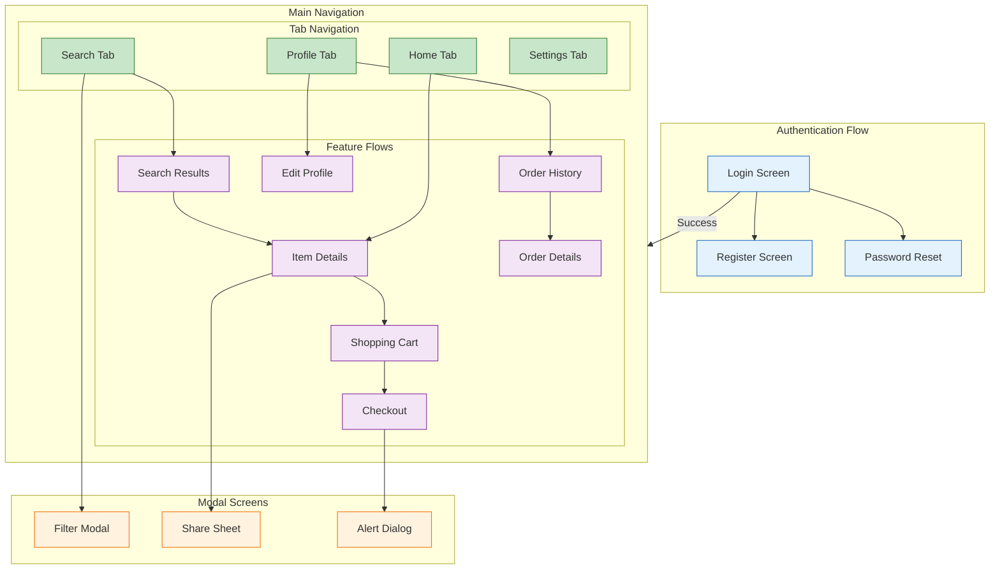

<!--
mode: auto
tools: vscode-markdown, mermaid-preview
-->

# 📱 Mobile App Navigation Flow Template

Create a comprehensive diagram showing mobile app navigation and screen flows.

## Requirements

- App type: [native/hybrid/web]
- Navigation pattern: [tab/drawer/stack]
- Authentication: [required/optional]
- Deeplink support: [yes/no]

## Components

Define the following:
1. Screen Hierarchy
   - Main screens
   - Sub-screens
   - Modal dialogs
   - Bottom sheets

2. Navigation Patterns
   - Tab navigation
   - Stack navigation
   - Drawer menu
   - Modal flows

3. User Flows
   - Authentication
   - Onboarding
   - Core features
   - Settings

4. State Management
   - Screen states
   - Navigation state
   - Data persistence
   - Cache handling

## Styling Guidelines

- Color code by flow type
- Show navigation hierarchy
- Indicate gestures
- Mark authentication points
- Highlight main paths

## Expected Output

A detailed Mermaid diagram showing the app navigation structure.

## Example Format

## Additional Context

1. Navigation Architecture
   - Navigation patterns
   - Routing configuration
   - Deep linking
   - Screen transitions

2. User Experience
   - Gesture handling
   - Loading states
   - Error handling
   - Accessibility

3. State Management
   - Navigation state
   - Screen parameters
   - Data persistence
   - Cache strategy

4. Performance
   - Screen preloading
   - Memory management
   - Transition animations
   - Background behavior

5. Technical Considerations
   - Platform differences
   - Navigation libraries
   - State persistence
   - Analytics tracking
