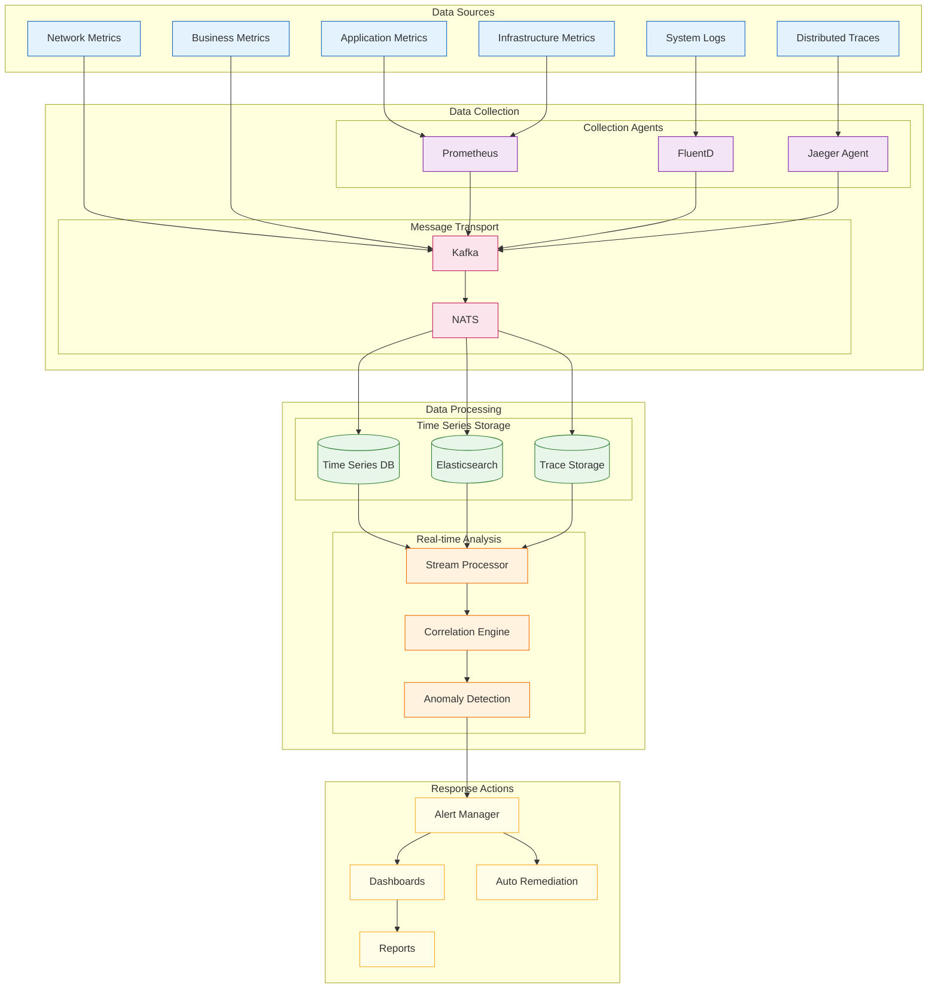

<!--
mode: auto
tools: vscode-markdown, mermaid-preview
-->

# 📊 Performance Monitoring Flow Template

Create a comprehensive diagram showing the flow of performance monitoring data and analysis.

## Requirements

1. Data Collection
   - Metrics sources
   - Log aggregation
   - Tracing points
   - Health checks

2. Processing Pipeline
   - Data ingestion
   - Stream processing
   - Data enrichment
   - Aggregation logic

3. Analysis Systems
   - Metrics analysis
   - Anomaly detection
   - Alert correlation
   - Trend analysis

4. Response Actions
   - Alert routing
   - Automated remediation
   - Escalation paths
   - Feedback loops

## Components

Define the following:

1. Instrumentation
   - Application metrics
   - Infrastructure metrics
   - Network metrics
   - Business metrics

2. Collection & Transport
   - Metric collectors
   - Log shippers
   - Trace agents
   - Event buses

3. Processing & Storage
   - Time-series DB
   - Log analytics
   - Trace storage
   - OLAP systems

4. Analysis & Action
   - Monitoring tools
   - Alerting systems
   - Dashboards
   - Runbooks

## Styling Guidelines

- Group by processing stage
- Show data flow directions
- Indicate processing latency
- Mark critical paths
- Highlight alerting points

## Example Format

## Additional Context

1. Monitoring Strategy
   - Golden signals (latency, traffic, errors, saturation)
   - Custom business metrics
   - SLO/SLI tracking
   - Capacity planning

2. Data Management
   - Retention policies
   - Data aggregation
   - Sampling strategies
   - Storage optimization

3. Analysis Methods
   - Statistical analysis
   - Machine learning
   - Pattern recognition
   - Correlation rules

4. Response Procedures
   - Alert prioritization
   - Runbook automation
   - Escalation policies
   - Incident management

5. Best Practices
   - Monitoring as code
   - Alert tuning
   - Dashboard standardization
   - Metric naming conventions
