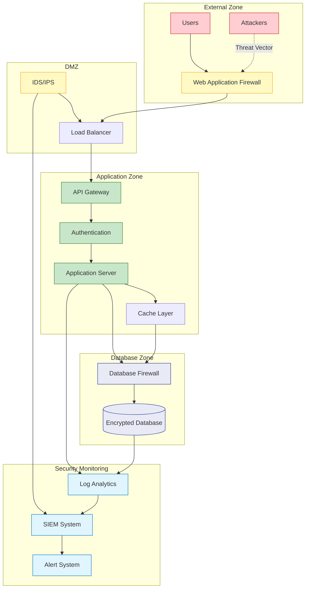

<!--
mode: auto
tools: vscode-markdown, mermaid-preview
-->

# 🔒 Security Analysis Flow Template

Create a comprehensive security analysis diagram showing threat modeling and security controls.

## Requirements

- Analysis scope: [application/infrastructure/organization]
- Security framework: [STRIDE/MITRE ATT&CK/OWASP]
- Risk levels: [low/medium/high/critical]
- Control types: [preventive/detective/corrective]

## Components

Define the following:
1. Threat Vectors
   - Entry points
   - Attack surfaces
   - Vulnerabilities
   - Risk ratings

2. Security Controls
   - Access controls
   - Monitoring systems
   - Incident response
   - Recovery procedures

3. Data Flow
   - Data classification
   - Encryption points
   - Trust boundaries
   - Data handling

4. Compliance Requirements
   - Regulatory controls
   - Audit points
   - Documentation
   - Reporting

## Styling Guidelines

- Color code by risk level
- Show trust boundaries
- Indicate control points
- Mark sensitive data flows
- Highlight critical assets

## Expected Output

A detailed Mermaid diagram showing the security analysis flow.

## Example Format

## Additional Context

1. Threat Modeling
   - Attack scenarios
   - Threat actors
   - Impact assessment
   - Likelihood analysis

2. Security Controls
   - Authentication methods
   - Authorization levels
   - Encryption standards
   - Monitoring systems

3. Incident Response
   - Detection methods
   - Response procedures
   - Recovery plans
   - Communication flow

4. Compliance Requirements
   - Regulatory standards
   - Audit requirements
   - Documentation needs
   - Reporting formats

5. Security Testing
   - Penetration testing
   - Vulnerability scanning
   - Security reviews
   - Compliance audits
