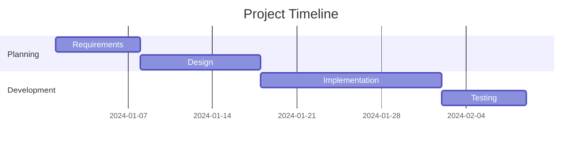

<!--
mode: auto
tools: vscode-markdown, mermaid-preview
-->

# Basic Gantt Chart Template

Create a Gantt chart showing project timeline and tasks with these specifications:

## Requirements

- Project scope: [single phase/multiple phases]
- Timeline range: [days/weeks/months]
- Detail level: [high-level/detailed]

## Components

Define the following:
1. Tasks: [list main activities]
2. Durations: [specify timeframes]
3. Dependencies: [list task relationships]
4. Milestones: [list key events]

## Styling Guidelines

- Use clear task descriptions
- Show proper task dependencies
- Include section groupings
- Mark critical milestones

## Expected Output

A complete Mermaid Gantt chart showing the project schedule.

## Example Format

## Additional Context

Specify any scheduling constraints, resource allocation, or critical path requirements.
