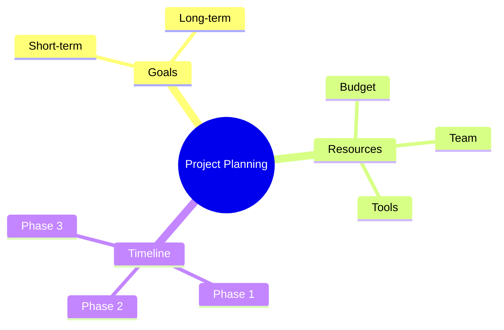

<!--
mode: auto
tools: vscode-markdown, mermaid-preview
-->

# Basic Mind Map Template

Create a mind map showing hierarchical relationships and connections with these specifications:

## Requirements

- Map scope: [single topic/multiple topics]
- Hierarchy levels: [specify depth]
- Branch style: [radial/tree/organic]

## Components

Define the following:
1. Central topic: [main concept]
2. Main branches: [primary categories]
3. Sub-topics: [detail items]
4. Cross-connections: [if needed]

## Styling Guidelines

- Use concise topic names
- Maintain consistent level hierarchy
- Include meaningful branch organization
- Use colors for different categories

## Expected Output

A complete Mermaid mind map showing the concept hierarchy.

## Example Format

## Additional Context

Specify any organizational requirements, category relationships, or visualization preferences.
