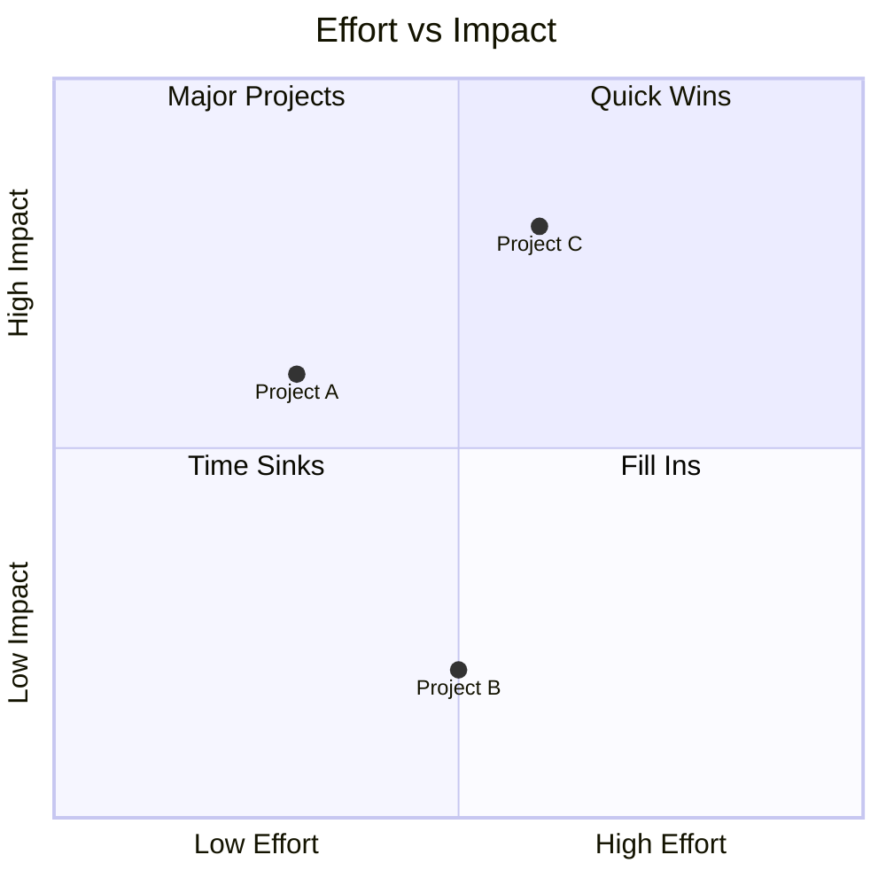

<!--
mode: auto
tools: vscode-markdown, mermaid-preview
-->

# Basic Quadrant Chart Template

Create a quadrant chart for decision making or analysis with these specifications:

## Requirements

- Analysis type: [priority/impact/strategy]
- Axes labels: [specify x and y dimensions]
- Point distribution: [balanced/focused]

## Components

Define the following:
1. Quadrant labels: [specify 4 categories]
2. Data points: [list items to plot]
3. Axis scales: [define measurement]
4. Title and legend: [chart identification]

## Styling Guidelines

- Use clear quadrant descriptions
- Show proper point placement
- Include meaningful data labels
- Use colors to distinguish categories

## Expected Output

A complete Mermaid quadrant chart showing the analysis.

## Example Format

## Additional Context

Specify any analysis criteria, measurement scales, or decision thresholds.
