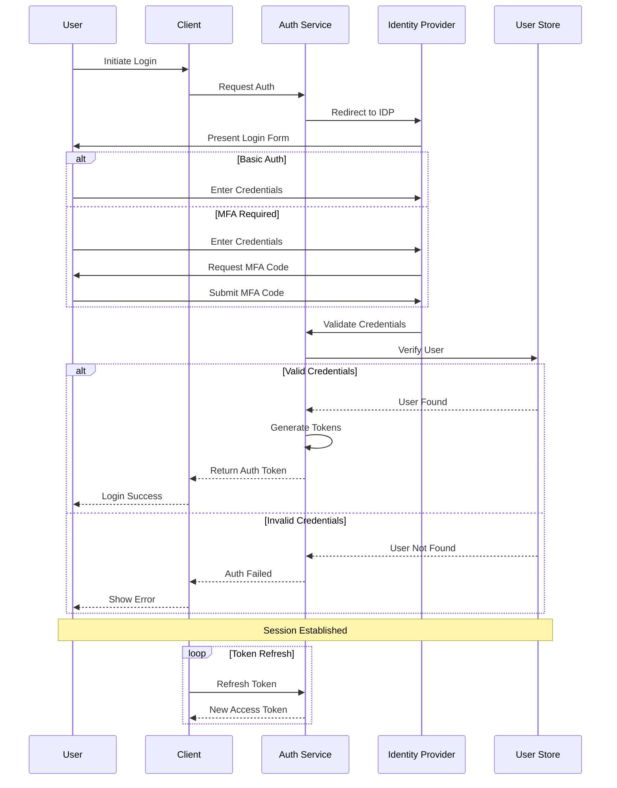

<!--
mode: auto
tools: vscode-markdown, mermaid-preview
-->

# 🔐 User Authentication Flow Template

Create a comprehensive diagram showing authentication and authorization flows.

## Requirements

- Auth type: [OAuth/OIDC/Custom]
- Flow type: [login/registration/password-reset]
- Security level: [basic/MFA/advanced]
- Session management: [stateful/stateless]

## Components

Define the following:
1. Authentication Steps
   - User input
   - Credential validation
   - Token generation
   - Session creation

2. Authorization Process
   - Role assignment
   - Permission checks
   - Access control
   - Token validation

3. Security Features
   - MFA handling
   - Rate limiting
   - Brute force protection
   - Session management

4. Error Handling
   - Invalid credentials
   - Account lockout
   - Token expiration
   - System errors

## Styling Guidelines

- Color code by security level
- Show validation points
- Indicate user interactions
- Mark security checks
- Highlight error paths

## Expected Output

A detailed Mermaid sequence diagram showing the authentication flow.

## Example Format

## Additional Context

1. Security Requirements
   - Password policies
   - Token configuration
   - Session timeouts
   - IP restrictions

2. User Experience
   - Error messages
   - Progress indicators
   - Remember me
   - Social login

3. Compliance
   - Data protection
   - Audit logging
   - Privacy controls
   - Regulatory requirements

4. Technical Implementation
   - Token formats
   - Storage methods
   - Encryption
   - Protocol details

5. Edge Cases
   - Account recovery
   - Session hijacking
   - Concurrent logins
   - System outages
