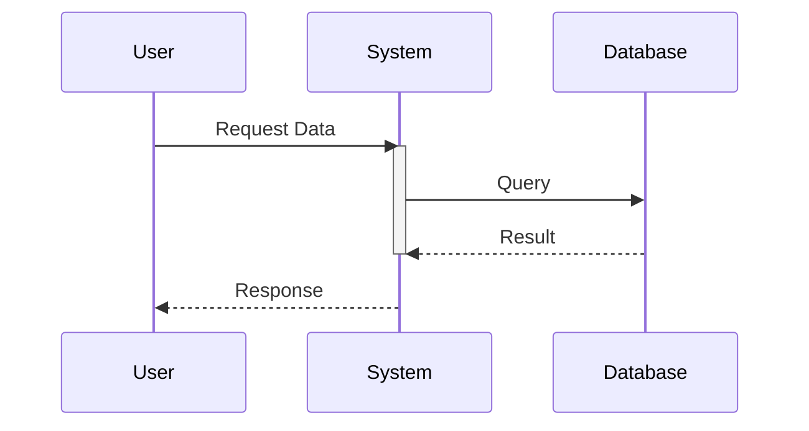

<!--
mode: auto
tools: vscode-markdown, mermaid-preview
-->

# Basic Sequence Diagram Template

Create a sequence diagram showing interactions between system components with these specifications:

## Requirements

- Timeline: [linear/parallel/complex]
- Number of actors: [specify number]
- Interaction type: [synchronous/asynchronous/both]

## Components

Define the following:
1. Participants: [list all actors/systems]
2. Messages: [list key interactions]
3. Alternative flows: [list any conditional paths]
4. Notes or annotations: [specify any needed explanations]

## Styling Guidelines

- Use descriptive participant names
- Keep message descriptions concise but clear
- Include activation boxes for long-running operations
- Group related sequences when appropriate

## Expected Output

A complete Mermaid sequence diagram showing the interaction flow.

## Example Format

## Additional Context

Describe any specific timing, concurrency, or other requirements for the interactions.
